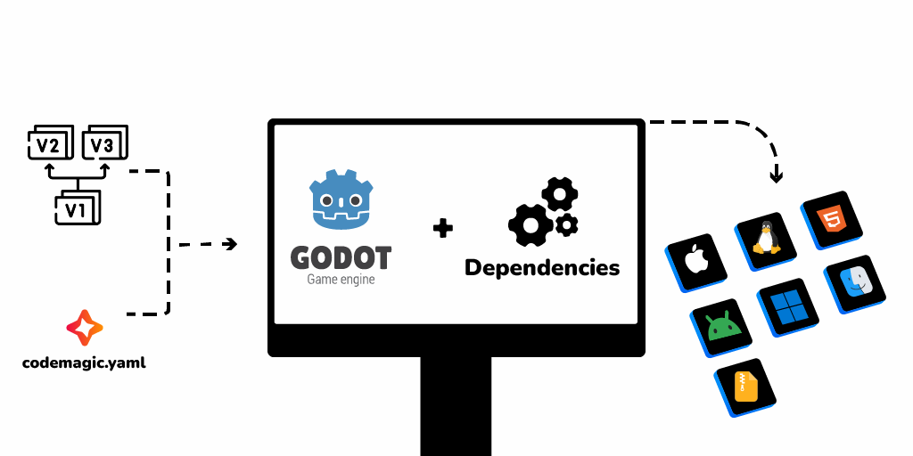

# Vue d'ensemble du processus {#process-overview}

 

Nous installerons Godot et ses modèles d'exportation sur une machine de Codemagic, ainsi que les éventuelles dépendances nécessaires. L'exportation sera automatisée à l'aide d'un fichier `codemagic.yaml` qui exécutera Godot en ligne de commande.  
Toutes les informations d'exportation non stockées dans le fichier `export_presets.cfg`, telles que les informations d'identification, seront récupérées à l'aide de variables d'environnement.

- Apprenez-en plus sur l'utilisation de Godot en ligne de commande avec les tutoriels [Godot 4 en ligne de commande](https://docs.godotengine.org/fr/latest/tutorials/editor/command_line_tutorial.html) et [Godot 3 en ligne de commande](https://docs.godotengine.org/fr/3.6/tutorials/editor/command_line_tutorial.html).
- Apprenez-en plus sur les variables d'environnement dans un fichier `codemagic.yaml` avec [Configuration de variables d'environnement](https://docs.codemagic.io/yaml-basic-configuration/configuring-environment-variables/)s
- Apprenez en plus sur ce qu'est un fichier `codemagic.yaml`avec [Utilisation d'un fichier codemagic.yaml](https://docs.codemagic.io/yaml-basic-configuration/yaml-getting-started/)

Tous les tutoriels sur ce site utilisent la machine gratuite mise à disposition par Codemagic : un Mac mini Apple Silicon M2. Le plan gratuit offre 500 minutes d'utilisation par mois.

- Apprenez-en plus sur la machine que nous utiliserons dans [Spécifications MacOS](https://docs.codemagic.io/specs-macos/xcode-16-2/)
- Consultez la liste de machines disponibles dans [Instances de machines](https://docs.codemagic.io/yaml-basic-configuration/yaml-getting-started/#instance-type)
- Consultez les [tarifs de Codemagic](https://codemagic.io/pricing/)

## Configuration du dépôt {#repository-configuration}

**Vous aurez besoin d'un service d'hébergement de dépôt** tel que GitHub ou GitLab pour héberger votre projet Godot. Vous aurez également besoin d'un fichier `codemagic.yaml` que vous placerez à la racine de votre dépôt. Le fichier `codemagic.yaml` est nécessaire pour la configuration des flux de travail avec Codemagic.

- Consultez ce [Guide de démarrage](https://docs.codemagic.io/yaml-basic-configuration/yaml-getting-started/) pour en apprendre plus sur les fichiers `codemagic.yaml`.
- Consultez [Ajouter des applications](https://docs.codemagic.io/getting-started/adding-apps/) pour lier votre dépôt à Codemagic.

## Configuration du projet Godot {#project-configuration}

**Vous n'aurez pas besoin d'installer les modèles d'exportation de Godot sur votre machine locale.** Nous n'utilserons que le fichier `export_presets.cfg` généré par Godot car ce fichier contient vos configurations d'exportation.  
**Toutefois, vous devrez configurer votre projet comme si vous souhaitiez faire une exportation sur votre machine locale.**

Avec Godot 4, les informations confidentielles comme les mots de passe de certificats ne sont plus stockée dans les préréglages d'exportation. Elles sont stockée dans un fichier nommé `export_credentials.cfg` présent dans le dossier `.godot`  
Le fichier `export_credentials.cfg` ne devrait normalement pas être présent dans votre dépôt pour des [raisons de sécurité](https://docs.godotengine.org/fr/latest/tutorials/export/exporting_projects.html#configuration-files). De ce fait, il n'est pas nécessaire de fournir des informations confidentielles dans votre préréglage d'exportation.  
Ces informations ne figurerons pas dans le fichier `export_preset.cfg`. Nous les récupérerons donc à l'aide de variables d'environnement sur la machine de compilation.

En fonction du flux de travail que vous souhaitez mettre en place, vous pourriez être ammené(e) à définir des informations de signature de code/d'application. Le script d'automatisation n'y accèdera que via les variables d'environnement. Il ne lira pas le contenu réel des variables et ne le partagera pas avec des tiers.

- Apprenez-en plus sur les variables d'environnement dans un fichier `codemagic.yaml` avec [Configuration de variables d'environnement](https://docs.codemagic.io/yaml-basic-configuration/configuring-environment-variables/)

## Dépendances {#dependencies}

Pour exporter votre projet vers certaines platforme tels qu'Android et iOS, Godot requiert un certain nombre d'outils externes.  
Certains de ces outils sont préinstallés sur les machines de compilation de Codemagic. **Vous n'aurez pas à les installer vous même**.  

Ces outils préinstallés incluent: [Les SDK Android](https://developer.android.com/studio), [Gradle](https://gradle.org/), [Java](https://www.oracle.com/java/technologies/java-se-glance.html) et bien d'autres.  
Tout outil ou logiciel manquant sera automatiquement téléchargé et installé sur la machine de compilation de Codemagic.

- Vous pouvez consulter la liste complète des outils et logiciels installés sur les machines de Codemagic dans [Intégrations](https://codemagic.io/integrations/).
- Consultez également la liste des autres outils installés sur la machine que nous utiliserons tout au long des tutoriels dans [Autres outils pré-installés sur machine MacOS](https://docs.codemagic.io/specs-macos/xcode-16-2/#other-pre-installed-tools)

