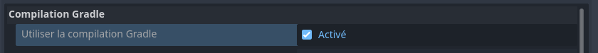
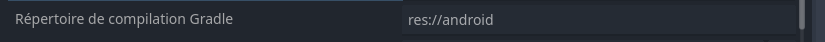

# Flux de travail Android {#android-workflow}

<br>

Cette page présente un cas d'utilisation de Codemagic pour l'exportation d'un projet Godot vers Android. Nous n'aborderons ni les règles d'écriture, ni la composition ou encore le fonctionnement d'un fichier `codemagic.yaml`.

- Vous pouvez sauter le tutoriel et récupérer le fichier de configuration dans [Récapitulatif](#overview)
- Apprenez en plus sur ce qu'est un fichier `codemagic.yaml`avec [Utilisation d'un fichier codemagic.yaml](https://docs.codemagic.io/yaml-basic-configuration/yaml-getting-started/)
- Apprennez à configurer votre projet Godot et votre dépôt dans [Vue d'ensemble du processus](../process-overview.md).


Image par Codemagic, utilisée sous licence [CC BY-ND 4.0](https://creativecommons.org/licenses/by-nd/4.0/). Voir [galerie](https://codemagic.io/gallery/)


## Exigences {#requirements}

- Un éditeur de texte
- Le fichier de configuration des flux de travail. (Voir [Configuration des flux de travail](./workflow-configuration.md))


[Les SDK Android](https://developer.android.com/studio), [Gradle](https://gradle.org/), [Java](https://www.oracle.com/java/technologies/java-se-glance.html) requis pour l'exportation de projets Godot vers Android sont déjà installés sur toutes les machines de Codemagic. Tout autre outil ou logiciel requis pour l'exportation sera automatiquement téléchargé et installé sur la machine de compilation.

- Consultez la liste complète des outils et logiciels installés sur les machines de Codemagic dans [Intégrations](https://codemagic.io/integrations/).
- Consultez également la liste des autres outils installés sur la machine que nous utiliserons tout au long des tutoriels dans [Outils pré-installés sur machine macOS](https://docs.codemagic.io/specs-macos/xcode-16-2/#other-pre-installed-tools)


Comme expliqué dans [Configuration du projet](../process-overview.md#project-configuration), vous devez configurer votre projet pour l'exportation comme si vous souhaitiez faire une exportation sur votre machine locale.
- Consultez le [Guide d'exportation Android](https://docs.godotengine.org/fr/stable/tutorials/export/exporting_for_android.html) afin de configurer votre projet Godot pour l'export vers Android


## Configuration

Nous devons créer un nouveau flux de travail dans lequel nous définirons des variables qui lui sont propres. Ajoutez le code suivant à votre fichier `codemagic.yaml`, juste après la section `definitions` :

```yaml
workflows:
  flux-godot-android:
    name: Exportation pour Android
    max_build_duration: 120
    instance_type: mac_mini_m2
    working_directory: /Users/builder/Downloads
    
    environment:
      java: 17
      vars:
        <<: *variables_godot
        FICHIER_DE_SORTIE: test.apk
        NOM_DU_PREREGLAGE: Android
```

Assurez-vous que votre fichier ressemble à ceci :

```yaml
definitions: ...

workflows: # [!code ++]
  flux-godot-android: ... # [!code ++]
```

<br>

Vous souvenez-vous de notre [fichier de configuration de flux](./workflow-configuration.md#minimal-configuration#minimal-configuration) ? Nous utilisons les opérateurs `<<` et `*` pour réutiliser ses sections.  

- Pour en savoir plus sur les sections réutilisables dans un fichier `codemagic.yaml` consultez [Réutilisation de sections](https://docs.codemagic.io/yaml-basic-configuration/yaml-getting-started/#reusing-sections)

- Consultez l'ensemble des variables réutilisées dans [Configuration de base](./workflow-configuration.md#minimal-configuration#minimal-configuration)

Voici une description des variables que nous avons définies :

| Variable           | Description
| ------------------ | --------------------------------------------------------------------------- |
| FICHIER_DE_SORTIE  | Le nom du fichier exporté. Format : `<NOM_PROJET>.<EXTENSION>`. L'extension du fichier de sortie doit correspondre à celle utilisée par le processus d'exportation de Godot. Voir [Exporter à partir de la ligne de commande](https://docs.godotengine.org/fr/latest/tutorials/export/exporting_projects.html#exporting-from-the-command-line) |
| NOM_DU_PREREGLAGE | Le nom du préréglage d'exportation qui sera utilisé pour exporter votre projet. |


- Apprenez-en plus sur les variables d'environnement dans un fichier `codemagic.yaml` avec [Configuration de variables d'environnement](https://docs.codemagic.io/yaml-basic-configuration/configuring-environment-variables/)


## Remarque {#note}

**Android exige que toutes ses applications soient signées numériquement avec une clé de signature pour être installées ou mises à jour sur un appareil**.  
Nous configurerons alors une clé de signature de débogage (`debug keystore`) et/ou une clé de signature de publication (`release keystore`) afin de signer votre projet exporté. 

- Apprenez-en plus sur la signature d'application avec l'article [Signature d'application](https://source.android.com/docs/security/features/apksigning?hl=fr)

Avant de créer une clé de signature, nous devons compléter notre fichier de configuration. Ajoutez le code suivant votre section `flux-godot-android` :

```yaml
scripts:
  - *installation_godot
  - *installation_modeles_exportation
  - *exportation_projet
  - *collecte_fichiers

artifacts:
  - *recuperation_exportation
```

Assurez-vous alors que votre flux ressemble mainten/ant à ceci :

```yaml
flux-godot-android:
  ...
  environment: ...
  scripts: ... # [!code ++]
  artifacts: ... # [!code ++]
```

Et voilà !, il ne nous reste plus qu'à configurer nos clés de signature.  

**Tutoriels clés de signature**

| Clé                                                  | Tutoriel                                           |
| ---------------------------------------------------- | -------------------------------------------------- |
| Utiliser une clé de débogage générée automatiquement | [Aller au tutoriel](#clé-de-débogage-auto-générée) |
| Utiliser une clé de débogage existante               | [Aller au tutoriel](#clé-de-débogage)              |
| Utiliser une clé de publication existante            | [Aller au tutoriel](#clé-de-publication)           |


## Clé de débogage auto-générée {#self-generated-debug-keystore}

Nous créerons une clé de débogage(`debug keystore`) sur la machine de compilation pour signer votre projet exporté. Vous pourrez, une fois le processus achevé, télécharger la clé de débogage avec le projet exporté.   
- Consultez [Créer une clé de signature](https://gist-github-com.translate.goog/henriquemenezes/70feb8fff20a19a65346e48786bedb8f?_x_tr_sl=en&_x_tr_tl=fr&_x_tr_hl=fr&_x_tr_pto=sge) pour en apprendre plus sur la création de clé de signature pour Android.

Ajoutez la section suivante au champs `scripts` de `flux-godot-android`, avant la section `&exportation_projet` :

```yaml
- name: Configuration de l'exportation
  script: |
    export CHEMIN_DEBUG_KEYSTORE=$REPERTOIRE_EXPORTATION/debug.keystore
    keytool -genkeypair -v \
    -keystore $CHEMIN_DEBUG_KEYSTORE \
    -storepass android \
    -alias androiddebugkey \
    -keypass android \
    -keyalg RSA \
    -validity 10000 \
    -dname "CN=Android Debug, O=Android, C=US"

    echo "GODOT_ANDROID_KEYSTORE_DEBUG_PATH=$CHEMIN_DEBUG_KEYSTORE" >> $CM_ENV
    echo "GODOT_ANDROID_KEYSTORE_DEBUG_USER=androiddebugkey" >> $CM_ENV
    echo "GODOT_ANDROID_KEYSTORE_DEBUG_PASSWORD=android" >> $CM_ENV
    echo "ANDROID_HOME=$ANDROID_SDK_ROOT" >> $CM_ENV
```

Assurez-vous que votre section `scripts` ressemble mainten/ant à ceci :

```yaml
scripts:
  ...
  - *installation_modeles_exportation ...
  - name: Configuration de l'exportation ... # [!code ++]
  - *exportation_projet ...
```

<br>

La nouvelle section est divisée en 2 parties :

- Premièrement, nous définissons une variable (`CHEMIN_DEBUG_KEYSTORE`) pour définir l'emplacement de la clé de débogage sur la machine de compilation. Ensuite, nous créons la clé de débogage à cet emplacement avec `androiddebugkey` comme alias et `android` comme mot de passe. Notez que le mot de passe d'alias et le mot de passe de la clé doivent être identiques (Voir [Exportation pour GooglePlayStore](https://docs.godotengine.org/fr/stable/tutorials/export/exporting_for_android.html#exporting-for-google-play-store)).
Apprenez à [créer une clée de débogage](https://gist-github-com.translate.goog/henriquemenezes/70feb8fff20a19a65346e48786bedb8f?_x_tr_sl=en&_x_tr_tl=fr&_x_tr_hl=fr&_x_tr_pto=sge) pour signer votre apk.


- Deuxièmement, nous enregistrons certaines variables d'environnement de Godot en tant que variables d'environnement globales de la machine de compilation. Cela permettra à Godot d'utiliser ces variables convenablement. Les variables d'environnement de Godot sont utilisées pour définir des options d'exportation sans avoir à ouvrir l'éditeur de Godot. Au cours de l'exportation, ces variables remplacerons les valeurs définies dans le menu d'exportation.  
Nous enregistrons également le chemin des SDK Android, mais avec la variable `ANDROID_HOME`. Godot 4 utilise cette variable d'environnement pour trouver les SDK Android s'ils ne sont pas spécifiés dans les paramètres de l'éditeur.  

- Consultez les [Variables d'environnement Android](https://docs.godotengine.org/fr/stable/tutorials/export/exporting_for_android.html#environment-variables) pour plus d'informations sur les variables utilisées.

Nous n'avons pas spécifié le chemin de Java car Godot le trouvera automatiquement avec la variable d'environnement `JAVA_HOME`. Cette variable est intégrée aux machines de compilation de Codemagic.  
- Consultez la [liste des variables d'environnement intégrées](https://docs.codemagic.io/yaml-basic-configuration/environment-variables/) aux machines de Codemagic.

<br>

Et voilà ! il ne nous reste plus qu'à lancer une nouvelle compilation(`build`) pour exporter votre projet. Vous pouvez pour ce faire, utiliser l'interface de Codemagic, ou des évènements affectant votre dépôt tels que les push.

- Consultez [Exécution automatique](https://docs.codemagic.io/yaml-running-builds/starting-builds-automatically/) pour automatiser l'exécution de votre configuration Codemagic.
- Consultez également [Notifications d'exécution](https://docs.codemagic.io/yaml-notification/email/) pour obtenir une notification vous informant du résultat de l'exécution de votre configuration Codemagic.

Vous pouvez mainten/ant <a href="/codemagic-godot-pipeline/templates/fr/android-workflow-auto-debug-signed.yaml" download="codemagic.yaml">Télécharger le fichier de configuration</a> pour exporter votre projet avec une clé de débogage automatiquement générée.

Si vous disposez d'une clé de débogage et que vous souhaitez l'utiliser plutôt que de générer une nouvelle clé à chaque exportation, consultez [Clé de Débogage](#debug-keystore). Si vous disposez également d'une clé de publication consultez [Clé de publication](#release-keystore).


## Clé de débogage {#debug-keystore}

Nous utiliserons les variables suivantes pour transférer et utiliser votre clé de débogage(`debug keystore`) sur la machine de compilation. Ces variables contiendront votre clé de débogage ainsi que les informations qui lui sont associées telles que l'alias et le mot de passe.

- Consultez les [Variables d'environnement Android](https://docs.godotengine.org/fr/stable/tutorials/export/exporting_for_android.html#environment-variables) pour plus d'informations sur certaines des variables utilisées.

| Nom de la variable                  |	Valeur de la variable                                  |	Groupe              |
| ----------------------------------- | ------------------------------------------------------ | -------------------- |
| CLE_DE_DEBOGAGE	                    | Votre clé de débogage encodé en [base64](https://fr.wikipedia.org/wiki/Base64) | identifiants_android |
| GODOT_ANDROID_KEYSTORE_DEBUG_PASSWORD | Le mot de passe de votre alias.<br> Le mot de passe d'alias et le mot de passe de la clé doivent être identiques, voir [Exportation pour GooglePlay](https://docs.godotengine.org/fr/stable/tutorials/export/exporting_for_android.html#exporting-for-google-play-store) | identifiants_android |
| GODOT_ANDROID_KEYSTORE_DEBUG_USER   | L'alias de votre clé                                   | identifiants_android |

Ajoutez ces variables avec l'interface de Codemagic (soit en tant que variables d'application, soit en tant que variables d'équipe), en veillant à cliquer sur `Secure` pour que ces données sensibles soient cryptées.
- Apprenez à stocker ces variables à l'aide de l'interface de Codemagic en regardant cette vidéo :

<div style="position: relative; padding-bottom: 56.25%; height: 0; overflow: hidden;">
    <iframe width="897" height="504" src="https://www.youtube.com/embed/7pAxVFe66hI?start=37" title="Environment variables and groups with codemagic.yaml" frameborder="0" allow="accelerometer; autoplay; clipboard-write; encrypted-media; gyroscope; picture-in-picture; web-share" referrerpolicy="strict-
origin-when-cross-origin" style="position: absolute; top:0; left: 0; width: 100%; height: 100%;" allowfullscreen></iframe>
</div>

- Apprenez-en plus sur les variables d'environnement dans Codemagic avec [Configuration de variables d'environnement](https://docs.codemagic.io/yaml-basic-configuration/configuring-environment-variables/)
- Apprenez à stocker des fichiers dans des variables d'environnement avec [Stockage de fichiers binaires](https://docs.codemagic.io/yaml-basic-configuration/configuring-environment-variables/#storing-binary-files)
- Si vous n'avez pas de PC, vous pouvez utiliser un site internet comme [base64.guru](https://base64.guru/converter/encode/text) ou [base64encode](https://www.base64encode.org/) pour encoder votre clé de débogage au format base64.  

<br>

Pour utiliser les variables définies dans l'interface de Codemagic, nous devons ajouter leur groupe de variable (ici `identifiants_android`) à notre fichier de configuration (`codemagic.yaml`).  
Pour ajouter le groupe de variables à notre flux de travail, localisez la section `envrironment` à l'intérieur de `flux-godot-android`, et ajoutez-y la section suivante :

```yaml
groups:
  - identifiants_android
```

Assurez-vous alors que votre flux de travail ressemble mainten/ant à ceci :

```yaml
flux-godot-android:
  ...
  environment:
    groups: # [!code ++]
      - identifiants_android # [!code ++]
    ...
```

:::tip Astuce
Si la section `groups` existe déjà dans votre script, ajoutez-y simplement la ligne `- identifiants_android`
:::

<br>

Nous devons mainten/ant configurer nos variables pour permettre à Godot de les trouver et de les utiliser. Dans la section `scripts` de votre `flux-godot-anroid`, juste avant la section `exportation_projet`, ajoutez la section suivante :

```yaml
- name: Configuration de l'exportation
  script: |
    export CHEMIN_DEBUG_KEYSTORE=/tmp/debug.keystore 
    echo $CLE_DE_DEBOGAGE | base64 --decode > $CHEMIN_DEBUG_KEYSTORE

    echo "GODOT_ANDROID_KEYSTORE_DEBUG_PATH=$CHEMIN_DEBUG_KEYSTORE" >> $CM_ENV
    echo "ANDROID_HOME=$ANDROID_SDK_ROOT" >> $CM_ENV
```

Assurez-vous que votre section `scripts` ressemble mainten/ant à ceci :

```yaml
scripts:
  ...
  - *installation_modeles_exportation ...
  - name: Configuration de l'exportation ... # [!code ++]
  - *exportation_projet ...
```

<br>

La nouvelle section est divisée en 2 parties :

- Premièrement, nous définissons une variable (`CHEMIN_DEBUG_KEYSTORE`) pour définir l'emplacement de la clé de débogage sur la machine de compilation. Ensuite, nous décodons votre fichier à cet emplacement. (**Votre clé de débogage est stocké dans le dossier temporaire de la machine de compilation**)

- Deuxièmement, nous enregistrons certaines variables d'environnement de Godot en tant que variables d'environnement globales de la machine de compilation. Cela permettra à Godot d'utiliser ces variables convenablement. Les variables d'environnement de Godot sont utilisées pour définir des options d'exportation sans avoir à ouvrir l'éditeur de Godot. Au cours de l'exportation, ces variables remplacerons les valeurs définies dans le menu d'exportation.  
Nous enregistrons également le chemin des SDK Android, mais avec la variable `ANDROID_HOME`, car Godot 4 utilise cette variable d'environnement pour trouver les sdk Android s'ils ne sont pas spécifiés dans les paramètres de l'éditeur.  

- Consultez les [Variables d'environnement Android](https://docs.godotengine.org/fr/stable/tutorials/export/exporting_for_android.html#environment-variables) pour plus d'informations sur les variables utilisées.

Nous n'avons pas spécifié le chemin de Java car Godot le trouvera automatiquement avec la variable d'environnement `JAVA_HOME` déjà définie dans toutes les machines de Codemagic.  
- Consultez la [liste des variables d'environnement intégrées](https://docs.codemagic.io/yaml-basic-configuration/environment-variables/) aux machines de Codemagic.

<br>

Et voilà ! il ne nous reste plus qu'à lancer une nouvelle compilation(`build`) pour exporter votre projet. Vous pouvez pour ce faire, utiliser l'interface de Codemagic, ou des évènements affectant votre dépôt tels que les push.

- Consultez [Exécution automatique](https://docs.codemagic.io/yaml-running-builds/starting-builds-automatically/) pour automatiser l'exécution de votre configuration Codemagic.
- Consultez également [Notifications d'exécution](https://docs.codemagic.io/yaml-notification/email/) pour obtenir une notification vous informant du résultat de l'exécution de votre configuration Codemagic.


Vous pouvez mainten/ant <a href="/codemagic-godot-pipeline/templates/fr/android-workflow-debug-signed.yaml" download="codemagic.yaml">Télécharger le fichier de configuration</a> pour utiliser votre clé de débogage sur une machine de compilation.


## Clé de publication {#release-keystore}

Le processus est très similaire à celui décrit dans [Clé de débogage](#clé-de-débogage), nous ne le détaillerons donc pas à nouveau. Assurez-vous de consulter [Clé de débogage](#clé-de-débogage) pour transférer et utiliser votre clé de publication(`release keystore`) sur la machine de compilation.  
Voici les changements que vous devez effectuer :

<br>

1. **Variables d'environnement**

Nous utiliserons les variables suivantes pour transférer et utiliser votre clé de publication(`release keystore`) sur la machine de compilation.

| Nom de la variable                  |	Valeur de la variable                                  |	Groupe              |
| ----------------------------------- | ------------------------------------------------------ | -------------------- |
| GODOT_ANDROID_KEYSTORE_RELEASE	      | Votre clé de débogage encodé en `base64` | identifiants_android |
| GODOT_ANDROID_KEYSTORE_RELEASE_USER   | Le mot de passe votre alias.<br> Le mot de passe d'alias et le mot de passe de la clé doivent être identiques, voir [Exportation pour GooglePlay](https://docs.godotengine.org/fr/stable/tutorials/export/exporting_for_android.html#exporting-for-google-play-store) | identifiants_android |
| GODOT_ANDROID_KEYSTORE_RELEASE_USER   | L'alias de votre clé                                   | identifiants_android |

<br>

2. **Script: `Configuration de l'exportation`**

Dans votre script `Configuration de l'exportation`, ajoutez le code suivant :

```yaml
export CHEMIN_RELEASE_KEYSTORE=/tmp/release.keystore 
echo $GODOT_ANDROID_KEYSTORE_RELEASE | base64 --decode > $CHEMIN_RELEASE_KEYSTORE

echo "GODOT_ANDROID_KEYSTORE_RELEASE_PATH=$CHEMIN_RELEASE_KEYSTORE" >> $CM_ENV
echo "ANDROID_HOME=$ANDROID_SDK_ROOT" >> $CM_ENV
```

Cette étape est similaire à celle utilisée pour récupérer votre clé de débogage. Consultez [Clé de débogage](#clé-de-débogage) pour plus d'informations. Les variables sont exactement les mêmes sauf qu'elles ne se terminent pas par `DEBUG` mais par `RELEASE`.

<br>

Et voilà ! il ne nous reste plus qu'à lancer une nouvelle compilation(`build`) pour exporter votre projet. Vous pouvez pour ce faire, utiliser l'interface de Codemagic, ou des évènements affectant votre dépôt tels que les push.

- Consultez [Exécution automatique](https://docs.codemagic.io/yaml-running-builds/starting-builds-automatically/) pour automatiser l'exécution de votre configuration Codemagic.
- Consultez également [Notifications d'exécution](https://docs.codemagic.io/yaml-notification/email/) pour obtenir une notification vous informant du résultat de l'exécution de votre configuration Codemagic.

Vous pouvez mainten/ant <a href="/codemagic-godot-pipeline/templates/fr/android/android-workflow-release-signed.yaml" download="codemagic.yaml">Télécharger le fichier de configuration</a> pour utiliser votre clé de publication sur une machine de compilation.


## Compilation Gradle {#gradle-builds}

<h3>Partie 1</h3>

Pour utiliser la compilation Gradle sur la machine de compilation, assurez-vous d'activer l'option Gradle sur votre machine locale.  


Vous devez conserver le répertoire par défaut utilisé pour la compilation Gradle(`res://android`). La configuration que nous utiliserons utilise ce répertoire.


**Vous n'avez pas besoin d'installer un modèle de compilation Android sur votre machine locale**. L'installation sera configurée sur la machine de compilation.  
Cependant, **si votre projet utilise des bibliothèques Android**, assurez-vous que le répertoire `android/plugins` soit présent dans votre dépôt. Sinon, vos bibliothèques ne seront pas disponibles sur la machine de compilation. Vous devrez alors écrire un script qui les téléchargera et les installera dans le bon répertoire avant l'exportation.

<br>

Parfois, lorsque vous utilisez la compilation Gradle, il est nécessaire de personnaliser le fichier `AndroidManifest.xml`. Celà est particulièrement utile lorsque vous intégrez des modules Android comme [AdMob](https://admob.google.com/home/) à votre projet Godot.

- Apprenez-en plus sur les fichiers manifeste avec [Présentation du fichier manifeste d'application](https://developer.android.com/guide/topics/manifest/manifest-intro?hl=fr)

Pour appliquer votre configuration XML personnalisée sur la machine de compilation, nous utiliserons la variable d'environnement suivante :

:::tip Astuce
Si vous ne prévoyez pas d'utiliser un fichier `AndroidManifest.xml` personnalisé, vous n'avez pas besoin de définir cette variable.
:::

| Nom de la variable     | Valeur de la vairable                                                                          | Groupe  |
| ---------------------- | ---------------------------------------------------------------------------------------------- | ------- |
| MANIFESTE_ANDROID      | Votre fichier manifeste encodé en [base64](https://fr.wikipedia.org/wiki/Base64) | android |

Créez cette variable avec l'interface de Codemagic (soit en tant que variables d'application, soit en tant que variables d'équipe), en veillant à cliquer sur `Secure` pour crypter la variable.
- Apprenez à stocker cette variable à l'aide de l'interface de Codemagic en regardant cette vidéo :

<div style="position: relative; padding-bottom: 56.25%; height: 0; overflow: hidden;">
    <iframe width="897" height="504" src="https://www.youtube.com/embed/7pAxVFe66hI?start=37" title="Environment variables and groups with codemagic.yaml" frameborder="0" allow="accelerometer; autoplay; clipboard-write; encrypted-media; gyroscope; picture-in-picture; web-share" referrerpolicy="strict-
origin-when-cross-origin" style="position: absolute; top:0; left: 0; width: 100%; height: 100%;" allowfullscreen></iframe>
</div>

- Apprenez-en plus sur les variables d'environnement dans Codemagic avec [Configuration de variables d'environnement](https://docs.codemagic.io/yaml-basic-configuration/configuring-environment-variables/)
- Apprenez à stocker des fichiers dans des variables d'environnement avec [Stockage de fichiers binaires](https://docs.codemagic.io/yaml-basic-configuration/configuring-environment-variables/#storing-binary-files)
- Si vous n'avez pas de PC, vous pouvez utiliser un site internet comme [base64.guru](https://base64.guru/converter/encode/text) ou [base64encode](https://www.base64encode.org/) pour encoder votre clé de débogage au format base64. 


Pour utiliser cette variable, nous devons ajouter son groupe de variable (ici `android`) à notre fichier de configuration (`codemagic.yaml`).  
Pour ajouter le groupe de variable à notre flux de travail, localisez la section `envrironment` à l'intérieur de `flux-godot-android`, et ajoutez la section suivante :

```yaml
groups:
  - android
```

Assurez-vous alors que votre flux de travail ressemble mainten/ant à ceci :

```yaml
flux-godot-android:
  ...
  environment:
    groups: # [!code ++]
      - android # [!code ++]
    ...
```

:::tip Astuce
Si la section `groups` est déjà présente, ajoutez simplement la ligne `- android` à la section.
:::

<br>

Avant d'installer un modèle de compilation Android dans votre projet, nous devons préparer notre environnement. Tout d'abord, nous devons déterminer l'emplacement exacte des modèles d'exportation de Godot sur la machine de compilation. Nous aurons également besoin de récupérer la version des modèles d'exportation.  
Pour ce faire, nous allons mettre à jour la section `&installation_modeles_exportation` en définissant des variables d'environnement globales pour référencer les valeurs recherchées.

Localisez la section `&installation_modeles_exportation` dans le champ `scripts` de la section `definitions` en haut de votre fichier `codemagic.yaml`. Ajoutez-y les lignes suivantes :

```yaml
echo "CHEMIN_MODELES_EXPORTATION=$CHEMIN_MODELES" >> $CM_ENV
echo "VERSION_MODELES_EXPORTATION=$VERSION_MODELES" >> $CM_ENV
```

Assurez-vous alors que votre section `&installation_modeles_exportation` ressemble mainten/ant à ceci :

```yaml
export CHEMIN_MODELES=${DOSSIER_TEMPLATES}/$VERSION_MODELES
mkdir -p "$CHEMIN_MODELES" && mv templates/* "$CHEMIN_MODELES"
rmdir templates
echo "CHEMIN_MODELES_EXPORTATION=$CHEMIN_MODELES" >> $CM_ENV # [!code ++]
echo "VERSION_MODELES_EXPORTATION=$VERSION_MODELES" >> $CM_ENV # [!code ++]
...
```

Et voilà ! Nous avons définis des variables d'environnement globales sur la machine de compilation.  
- `CHEMIN_MODELES_EXPORTATION` contient le chemin complet des modèles d'exportation de Godot sur cette machine de compilation(ex: `~/Library/Application Support/Godot/export_templates/4.4.stable`).  
- `VERSION_MODELES_EXPORTATION` stocke la version de votre modèle d'exportation. Cette version sera utilisée par Godot pendant la construction. (ex: `4.4.1-stable`)

<br>

<h3>Partie 2</h3>

Nous pouvons mainten/ant installer un modèle de compilation Android dans votre projet. Ajoutez la section suivante au champs `scripts` de `flux-godot-android`, avant la section `&exportation_projet` :

```yaml
- name: Configuration de l'exportation
  script: |
    cd $REPERTOIRE_PROJET

    mkdir -p android/build
    unzip -o -d android/build "$CHEMIN_MODELES_EXPORTATION/android_source.zip"
    touch android/build/.gdignore
    echo "$VERSION_MODELES_EXPORTATION" > android/.build_version
    echo $MANIFESTE_ANDROID | base64 --decode > android/build/AndroidManifest.xml
```

Assurez-vous alors que votre section `scripts` ressemble mainten/ant à ceci :

```yaml
scripts:
  ...
  - *installation_modeles_exportation ...
  - name: Configuration de l'exportation ... # [!code ++]
  - *exportation_projet ...
```
:::tip Astuce
Si la section `Configuration de l'exportation` est déjà présente dans votre fichier, fusionnez simplement le contenu de sa section `script` avec le contenu de la section `script` existante.
:::

<br>

Le nouveau script installe un modèle de compilation Android dans votre projet. De plus, le script remplace le fichier `AndroidManifest.xml` du modèle par votre fichier `AndroidManifest.xml` personnalisé. Si vous n'avez pas défini la variable `MANIFESTE_ANDROID`, supprimez simplement la dernière ligne du script.
(`echo $MANIFESTE_ANDROID | base64 --decode > android/build/AndroidManifest.xml`)

<br>

Et voilà, nous avons installé un modèle de compilation Android dans votre projet.  
Il ne nous reste plus qu'à lancer une nouvelle compilation(`build`) pour exporter votre projet. Vous pouvez pour ce faire, utiliser l'interface de Codemagic, ou des évènements affectant votre dépôt tels que les push.

- Consultez [Exécution automatique](https://docs.codemagic.io/yaml-running-builds/starting-builds-automatically/) pour automatiser l'exécution de votre configuration Codemagic.
- Consultez également [Notifications d'exécution](https://docs.codemagic.io/yaml-notification/email/) pour obtenir une notification vous informant du résultat de l'exécution de votre configuration Codemagic.

Vous pouvez mainten/ant <a href="/codemagic-godot-pipeline/templates/fr/android-workflow-gradle-build.yaml" download="codemagic.yaml">Télécharger le fichier de configuration</a> pour exporter votre projet avec la compilation Gradle.


## Récapitulatif {#overview}

Voici un résumé de ce que nous avons couvert sur cette page en utilisant une machine de compilation de Codemagic:
- Exportation d'un projet Godot vers Android en utilisant une clé de débogage généré automatiquement
- Exportation d'un projet Godot vers Android en utilisant votre propre clé de débogage
- Exportation d'un projet Godot vers Android en utilisant votre propre clé de publication
- Exportation d'un projet Godot vers Android en utilisant la compilation Gradle

**Tableau de téléchargement**

| Fichier    | Contenu                                  | Tutoriel |
| ---------- | ---------------------------------------- | -------- |
| <a href="/codemagic-godot-pipeline/templates/fr/android/android-workflow-auto-debug-signed.yaml" download="codemagic.yaml">Télécharger</a> | Configuration d'une clé de débogage auto-généré | [Aller au tutoriel](#self-generated-debug-keystore) |
| <a href="/codemagic-godot-pipeline/templates/fr/android/android-workflow-debug-signed.yaml" download="codemagic.yaml">Télécharger</a>      | Configuration d'une clé de débogage             | [Aller au tutoriel](#debug-keystore) |
| <a href="/codemagic-godot-pipeline/templates/fr/android/android-workflow-release-signed.yaml" download="codemagic.yaml">Télécharger</a>    | Configuration d'une clé de publication           | [Aller au tutoriel](#release-keystore) |
| <a href="/codemagic-godot-pipeline/templates/fr/android/android-workflow.yaml" download="codemagic.yaml">Télécharger</a>                   | Configuration d'une clé de débogage et d'une clé de publication | [Aller au tutoriel](#debug-keystore) |
| <a href="/codemagic-godot-pipeline/templates/fr/android/android-workflow-gradle-builds.yaml" download="codemagic.yaml">Télécharger</a> | Configuration de la compilation Gradle | [Aller au tutoriel](#gradle-builds) |

:::warning Attention !!!
Pour utiliser efficacement ces scripts, veuillez vous reporter aux tutoriels correspondants.  
Les scripts de ce site sont généraux et s'adapteront à la plupart des cas d'utilisation. Néanmoins, des ajustements spécifiques à votre projet peuvent s'avérer nécessaires.  
Notez que certains scripts dépendent de variables d'environnement qui doivent être définies via l'interface de Codemagic. Sans elles, certains scripts ne fonctionneront pas.
:::

<br>

Ressources optionnelles pour vous aider à affiner votre configuration :
- [Mise en cache](https://docs.codemagic.io/knowledge-codemagic/caching/)
- [Exécution automatique](https://docs.codemagic.io/yaml-running-builds/starting-builds-automatically/)
- [Notifications d'exécution](https://docs.codemagic.io/yaml-notification/email/)
- [Déploiements](https://docs.codemagic.io/yaml-publishing/google-play/)
- [Utilisation de modèles d'exportation personnalisés](./using-custom-export-templates.md)


## Obtenir de l'aide et de l'assistance {#getting-help-and-support}

Si vous avez une question technique ou si vous avez besoin d'aide pour résoudre un problème particulier, vous pouvez obtenir de l'aide dans la [discussion de communauté GitHub](https://github.com/sabinayo/codemagic-godot-pipeline/discussions).