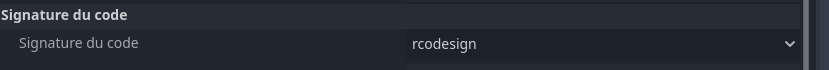
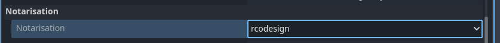

# Flux de travail macOS {#macos-workflow}

<br>

Cette page présente un cas d'utilisation de Codemagic pour l'exportation d'un projet Godot vers macOS. Nous n'aborderons ni les règles d'écriture, ni la composition ou encore le fonctionnement d'un fichier `codemagic.yaml`.

- Vous pouvez sauter le tutoriel et récupérer le fichier de configuration dans [Récapitulatif](#overview)
- Apprenez en plus sur ce qu'est un fichier `codemagic.yaml`avec [Utilisation d'un fichier codemagic.yaml](https://docs.codemagic.io/yaml-basic-configuration/yaml-getting-started/)
- Apprennez à configurer votre projet Godot et votre dépôt dans [Vue d'ensemble du processus](../process-overview.md).


Image par Codemagic, utilisée sous licence [CC BY-ND 4.0](https://creativecommons.org/licenses/by-nd/4.0/). Voir [galerie](https://codemagic.io/gallery/)


## Exigences {#requirements}

- Un éditeur de texte
- Le fichier de configuration des flux de travail. (Voir [Configuration des flux de travail](./workflow-configuration.md))

Comme expliqué dans [Configuration du projet](../process-overview.md#project-configuration), vous devez configurer votre projet pour l'exportation comme si vous souhaitiez faire une exportation sur votre machine locale.
- Consultez le [Guide d'exportation macOS](https://docs.godotengine.org/fr/stable/tutorials/export/exporting_for_macos.html) afin de configurer votre projet Godot pour l'export vers macOS


## Configuration

Nous devons créer un nouveau flux de travail dans lequel nous définirons des variables qui lui sont propres. Ajoutez le code suivant à votre fichier `codemagic.yaml`, juste après la section `definitions` :

```yaml
workflows:
  flux-godot-macos:
    name: Exportation macOS
    max_build_duration: 120
    instance_type: mac_mini_m2
    working_directory: /Users/builder/Downloads
    
    environment:
      vars:
        <<: *variables_godot
        FICHIER_DE_SORTIE: test.zip
        NOM_DU_PREREGLAGE: macOS
```

Assurez-vous que votre fichier ressemble à ceci :

```yaml
definitions: ...

workflows: # [!code ++]
  flux-godot-macos: ... # [!code ++]
```

<br>

Vous souvenez-vous de notre [fichier de configuration de flux](./workflow-configuration.md#configuration-de-base) ? Nous utilisons les opérateurs `<<` et `*` pour réutiliser ses sections.  

- Pour en savoir plus sur les sections réutilisables dans un fichier `codemagic.yaml` consultez [Réutilisation de sections](https://docs.codemagic.io/yaml-basic-configuration/yaml-getting-started/#reusing-sections)

- Consultez l'ensemble des variables réutilisées dans [Configuration de base](./workflow-configuration.md#configuration-de-base)

Voici une description des variables que nous avons définies :

| Variable           | Description
| ------------------ | --------------------------------------------------------------------------- |
| FICHIER_DE_SORTIE  | Le nom du fichier exporté. Format : `<NOM_PROJET>.<EXTENSION>`. L'extension du fichier de sortie doit correspondre à celle utilisée par le processus d'exportation de Godot. Voir [Exporter à partir de la ligne de commande](https://docs.godotengine.org/fr/latest/tutorials/export/exporting_projects.html#exporting-from-the-command-line) |
| NOM_DU_PREREGLAGE | Le nom du préréglage d'exportation qui sera utilisé pour exporter votre projet. |

- Apprenez-en plus sur les variables d'environnement dans un fichier `codemagic.yaml` avec [Configuration de variables d'environnement](https://docs.codemagic.io/yaml-basic-configuration/configuring-environment-variables/)

<br>

Nous devons mainten/ant compléter notre fichier de configuration. Ajoutez le code suivant dans votre section `flux-godot-macos`.:

```yaml
scripts:
  - *installation_godot
  - *installation_modeles_exportation
  - *exportation_projet
  - *collecte_fichiers

artifacts:
  - *recuperation_exportation
```

Assurez-vous alors que votre flux ressemble mainten/ant à ceci :

```yaml
flux-godot-macos:
  ...
  environment: ...
  scripts: ... # [!code ++]
  artifacts: ... # [!code ++]
```

Et voilà ! il ne nous reste plus qu'à lancer une nouvelle compilation(`build`) pour exporter votre projet. Vous pouvez pour ce faire, utiliser l'interface de Codemagic, ou des évènements affectant votre dépôt tels que les push.

- Consultez [Exécution automatique](https://docs.codemagic.io/yaml-running-builds/starting-builds-automatically/) pour automatiser l'exécution de votre configuration Codemagic.
- Consultez également [Notifications d'exécution](https://docs.codemagic.io/yaml-notification/email/) pour obtenir une notification vous informant du résultat de l'exécution de votre configuration Codemagic.

Vous pouvez mainten/ant <a href="/codemagic-godot-pipeline/templates/fr/macos/macos-workflow-unsigned.yaml" download="codemagic.yaml">Télécharger le fichier de configuration</a> pour exporter votre projet vers macOS.


## Configurer rcodesign {#configure-rcodesign}

<h3>Partie 1</h3>

Assurez d'avoir configuré l'option [rcodesign](https://docs.godotengine.org/fr/4.x/classes/class_editorexportplatformwindows.html#class-editorexportplatformwindows-property-codesign-enable) dans le préréglage d'exportation. Vous n'avez pas besoin de fournir les informations demandées car elles ne seront pas sauvegardées dans votre fichier `export_presets.cfg`. A la place, ces informations seront sauvegardées dans le fichier [export_credentials](https://docs.godotengine.org/fr/latest/tutorials/export/exporting_projects.html#configuration-files) qui ne devrais normalement pas être présent dans votre dépôt pour des raisons de sécurité.  


- Apprenez-en plus sur l'utilisation de rcodesign dans Godot avec [Options de signatures](https://docs.godotengine.org/fr/latest/tutorials/export/exporting_for_macos.html#signing-options)

<br>

Nous utiliserons les variables suivantes pour transférer et utiliser votre certicicat et ou votre fichier de provisioning sur la machine de compilation.
- Consultez les [Variables d'environnement macOS](https://docs.godotengine.org/fr/stable/tutorials/export/exporting_for_macos.html#environment-variables) ainsi que [EditorExportPlatformMacOS](https://docs.godotengine.org/fr/latest/classes/class_editorexportplatformmacos.html#class-editorexportplatformmacos) pour plus d'informations sur certaines des variables utilisées.

| Nom de la variable             |	Valeur de la variable          |	Groupe             |
| ------------------------------ | ------------------------------- | ------------------- |
| NOM_FICHIER_CERTIFICAT  	 | Le nom de votre fichier de certificat avec son extension. | identifiants_apple |
| GODOT_MACOS_CODESIGN_CERTIFICATE_FILE	| Votre certificat encodé en [base64](https://fr.wikipedia.org/wiki/Base64). | identifiants_apple |
| GODOT_MACOS_CODESIGN_CERTIFICATE_PASSWORD | Le mot de passe du certificat. | identifiants_apple |
| NOM_FICHIER_DE_PROVISIONING | Le nom de votre fichier de provisioning avec son extension. | identifiants_apple |
| GODOT_MACOS_CODESIGN_PROVISIONING_PROFILE | Votre fichier de provisioning encodé en [base64](https://fr.wikipedia.org/wiki/Base64) | identifiants_apple |

Ajoutez ces variables avec l'interface de Codemagic (soit en tant que variables d'application, soit en tant que variables d'équipe), en veillant à cliquer sur `Secure` pour que ces données sensibles soient cryptées.
- Apprenez à stocker ces variables à l'aide de l'interface de Codemagic en regardant cette vidéo :

<div style="position: relative; padding-bottom: 56.25%; height: 0; overflow: hidden;">
    <iframe width="897" height="504" src="https://www.youtube.com/embed/7pAxVFe66hI?start=37" title="Environment variables and groups with codemagic.yaml" frameborder="0" allow="accelerometer; autoplay; clipboard-write; encrypted-media; gyroscope; picture-in-picture; web-share" referrerpolicy="strict-
origin-when-cross-origin" style="position: absolute; top:0; left: 0; width: 100%; height: 100%;" allowfullscreen></iframe>
</div>

- Apprenez-en plus sur les variables d'environnement dans Codemagic avec [Configuration de variables d'environnement](https://docs.codemagic.io/yaml-basic-configuration/configuring-environment-variables/)
- Apprenez à stocker des fichiers dans des variables d'environnement avec [Stockage de fichiers binaires](https://docs.codemagic.io/yaml-basic-configuration/configuring-environment-variables/#storing-binary-files)
- Si vous n'avez pas de PC, vous pouvez utiliser un site internet comme [base64.guru](https://base64.guru/converter/encode/text) ou [base64encode](https://www.base64encode.org/) pour encoder votre clé de débogage au format base64.  

<br>

Pour utiliser les variables définies dans l'interface de Codemagic, nous devons ajouter leur groupe de variable (ici `identifiants_apple`) à notre fichier de configuration (`codemagic.yaml`).  
Pour ajouter le groupe de variables à notre flux de travail, localisez la section `envrironment` à l'intérieur de `flux-godot-macos`, et ajoutez-y la section suivante :

```yaml
groups:
  - identifiants_apple
```

Assurez-vous alors que votre flux de travail ressemble mainten/ant à ceci :

```yaml
flux-godot-macos:
  ...
  environment:
    groups: # [!code ++]
      - identifiants_apple # [!code ++]
    ...
```

:::tip Astuce
Si la section `groups` existe déjà dans votre script, ajoutez-y simplement la ligne `- identifiants_apple`
:::

<br>

Nous devons mainten/ant configurer nos variables pour permettre à Godot de les trouver et de les utiliser. Nous créeron un nouveau script avant le script d'exportation (`*exportation_du_project`). Ajoutez les lignes suivantes dans la section `scripts` de `godot-macos-workflow` :

```yaml
- name: Configuration de l'exportation
  script: |
    export CHEMIN_IDENTIFIANT=/tmp/$GODOT_MACOS_CODESIGN_CERTIFICATE_FILE_NAME
    echo $GODOT_MACOS_CODESIGN_CERTIFICATE_FILE | base64 --decode > $CHEMIN_IDENTIFIANT
    echo "GODOT_MACOS_CODESIGN_CERTIFICATE_FILE=$CHEMIN_IDENTIFIANT" >> $CM_ENV

    export CHEMIN_IDENTIFIANT=/tmp/$GODOT_MACOS_CODESIGN_PROVISIONING_PROFILE_NAME
    echo $GODOT_MACOS_CODESIGN_PROVISIONING_PROFILE | base64 --decode > $CHEMIN_IDENTIFIANT
    echo "GODOT_MACOS_CODESIGN_PROVISIONING_PROFILE=$CHEMIN_IDENTIFIANT" >> $CM_ENV
```

Assurez-vous alors que votre section `scripts` ressemble mainten/ant à ceci :

```yaml
scripts:
  ...
  - *installation_modeles_exportation ...
  - name: Configuration de l'exportation ... # [!code ++]
  - *exportation_du_project ...
```

Qu'avons-nous fait ?

Pour votre fichier de provisioning et votre certificat :
- Tout d'abord, nous définissons une variable (`CHEMIN_IDENTIFIANT`) pour spécifier l'emplacement de stockage de votre fichier sur la machine de compilation.
- Ensuite, nous décodons votre fichier à cet emplacement. Puis, nous mettons à jour la variable conten/ant le fichier encodé pour qu'elle pointe vers le chemin du fichier décodé. Nous le faisons car Godot s'attend à un chemin de fichier plutôt qu'à des données brutes encodées.
- Enfin, nous enregistrons la variable conten/ant le chemin du certificat/fichier de provisioning en tant que variable d'environnement globale sur la machine de compilation. De cette manière, Godot pourra y accéder et l'utiliser pendant l'exportation.

<br>

<h3>Partie 2</h3>

Nous devons mainten/ant installer rcodesign sur la machine de construction. Pour accélérer le processus, nous utiliserons un binaire pré-construit.
- Les binaires de rcodesign peuvent être trouvés sur la [page de Publications GitHub](https://github.com/indygreg/apple-platform-rs/releases/).
- Si votre machine de compilation n'est pas un MacOS, consultez [PyOxidizer](https://github.com/indygreg/PyOxidizer/releases) à la place.

Ajoutez le code suivant à la fin de votre section `Configuration de l'exportation` : :

```yaml
export FICHIER=apple-codesign-0.29.0-macos-universal.tar.gz
export URL=https://github.com/indygreg/apple-platform-rs/releases/download/apple-codesign%2F0.29.0/$FICHIER
curl -L "$URL" -o "$FICHIER" && unzip "$FICHIER"
rm $FICHIER
export CHEMIN_RCODESIGN=$(pwd)/$FICHIER
export VERSION_PARAMETRES=$(echo "$VERSION_GODOT" | awk -F'[.-]' '{
    if ($1 == 3) print "3";
    else if ($2 == 0) print $1;
    else print $1"."$2
}')
export PARAMETRES_GODOT=$REPERTOIRE_DONNEES_EDITEUR/editor_settings-${VERSION_PARAMETRES}.tres
cat <<EOF > "$PARAMETRES_GODOT"
[gd_resource type="EditorSettings"]

[resource]
export/macos/rcodesign = "$CHEMIN_RCODESIGN"
EOF
```

Ce script télécharge et installe un binaire Rcodesign sur la machine de compilation, puis stocke le chemin du binaire dans une variable. Enfin, le script enregistre le chemin du binaire dans les paramètres de Godot, en créant le fichier de paramètres à l'endroit où Godot s'attend à le trouver.

Pour créer le fichier de paramètres, le script extrait la version du fichier utilisée par Godot (`4.<VERSION_MINEURE>.tres` pour Godot 4 ou `3.tres` pour Godot 3). La version du fichier de paramètres est extraite à partir de la variable `VERSION_GODOT`, grâce à un outil de traitement de texte comme [awk](https://www.geeksforgeeks.org/awk-command-unixlinux-examples/).  

- Apprenez-en plus sur le traitement de texte avec `awk` grâce à [Commande awk dans Unix/Linux avec des exemples](https://www.geeksforgeeks.org/awk-command-unixlinux-examples/)


Et voilà ! il ne nous reste plus qu'à lancer une nouvelle compilation(`build`) pour exporter votre projet. Vous pouvez pour ce faire, utiliser l'interface de Codemagic, ou des évènements affectant votre dépôt tels que les push.

- Consultez [Exécution automatique](https://docs.codemagic.io/yaml-running-builds/starting-builds-automatically/) pour automatiser l'exécution de votre configuration Codemagic.
- Consultez également [Notifications d'exécution](https://docs.codemagic.io/yaml-notification/email/) pour obtenir une notification vous informant du résultat de l'exécution de votre configuration Codemagic.

Vous pouvez mainten/ant <a href="/codemagic-godot-pipeline/templates/fr/macos/macos-workflow-rcodesign.yaml" download="codemagic.yaml">Télécharger le fichier de configuration</a> pour exporter une application macOS avec rcodesign configuré sur une machine de compilation.


## Configurer la notarisation {#configure-notarization}

**La notarisation requiert rcodesign pour fonctionner**. Assurez-vous d'avoir suivis le [Tutoriel de configuration de rcodesign](#configure-rcodesign) avant de continuer.

Assurez vous également d'avoir configuré l'option [Notarisation](https://docs.godotengine.org/fr/4.x/classes/class_editorexportplatformmacos.html#class-editorexportplatformmacos-property-notarization-notarization) sur rcodesign dans le préréglage d'exportation. Vous n'avez pas besoin de fournir les informations demandées car elles ne seront pas sauvegardées dans votre fichier `export_presets.cfg`. A la place, ces informations seront sauvegardées dans le fichier [export_credentials](https://docs.godotengine.org/fr/latest/tutorials/export/exporting_projects.html#configuration-files) qui ne devrais normalement pas être présent dans votre dépôt pour des raisons de sécurité.  


- Apprenez-en plus sur la notarisation dans Godot avec [Options de Notarisation](https://docs.godotengine.org/fr/latest/tutorials/export/exporting_for_macos.html#notarization-options)


Nous utiliserons les variables suivantes pour récupérer vos informations de notarisation.
- Consultez les [Variables d'environnement macOS](https://docs.godotengine.org/fr/stable/tutorials/export/exporting_for_macos.html#environment-variables) ainsi que [EditorExportPlatformMacOS](https://docs.godotengine.org/fr/latest/classes/class_editorexportplatformmacos.html#class-editorexportplatformmacos) pour plus d'informations sur certaines des variables utilisées.

| Nom de la variable    |	Valeur de la variable  | Groupe            |
| --------------------- | ---------------------- | ----------------- |
| NOM_CLE_API_DE_NOTARISATION    | Le nom (plus l'extension) de votre fichier de clé d'émetteur API Apple App Store Connect. | identifiants_apple |
| GODOT_MACOS_NOTARIZATION_API_KEY	         | Votre fichier de clé d'émetteur API Apple App Store Connect. encodé en [base64](https://fr.wikipedia.org/wiki/Base64) | identifiants_apple |
| GODOT_MACOS_NOTARIZATION_API_UUID	         | L'UUID de l'émetteur de l'API Apple App Store Connect.  | identifiants_apple |
| GODOT_MACOS_NOTARIZATION_API_KEY_ID        | L'identifiant de la clé d'émetteur de l'API Apple App Store Connect.  | identifiants_apple |
| GODOT_MACOS_NOTARIZATION_APPLE_ID_NAME     | Nom de compte Apple ID (adresse e-mail).         | identifiants_apple |
| GODOT_MACOS_NOTARIZATION_APPLE_ID_PASSWORD | Mot de passe spécifique à l'application Apple ID | identifiants_apple |

Ajoutez ces variables avec l'interface de Codemagic (soit en tant que variables d'application, soit en tant que variables d'équipe), en veillant à cliquer sur `Secure` pour que ces données sensibles soient cryptées.
- Apprenez à stocker ces variables à l'aide de l'interface de Codemagic en regardant cette vidéo :

<div style="position: relative; padding-bottom: 56.25%; height: 0; overflow: hidden;">
    <iframe width="897" height="504" src="https://www.youtube.com/embed/7pAxVFe66hI?start=37" title="Environment variables and groups with codemagic.yaml" frameborder="0" allow="accelerometer; autoplay; clipboard-write; encrypted-media; gyroscope; picture-in-picture; web-share" referrerpolicy="strict-
origin-when-cross-origin" style="position: absolute; top:0; left: 0; width: 100%; height: 100%;" allowfullscreen></iframe>
</div>

- Apprenez-en plus sur les variables d'environnement dans Codemagic avec [Configuration de variables d'environnement](https://docs.codemagic.io/yaml-basic-configuration/configuring-environment-variables/)

<br>

Nous devons mainten/ant configurer nos variables pour permettre à Godot de les trouver et de les utiliser. Ajoutez les lignes suivantes à la fin de la section `Configuration de l'exportation` :

```yaml
export CHEMIN_FICHIER_API=/tmp/$NOM_CLE_API_DE_NOTARISATION
echo $GODOT_MACOS_NOTARIZATION_API_KEY | base64 --decode > $CHEMIN_FICHIER_API
echo "GODOT_MACOS_NOTARIZATION_API_KEY=$CHEMIN_FICHIER_API" >> $CM_ENV
```

Assurez-vous que votre section `scripts` ressemble mainten/ant à ceci :

```yaml
scripts:
  ...
  - *installation_modeles_exportation ...
  - name: Configuration de l'exportation
    ...
    EOF
    export CHEMIN_FICHIER_API=/tmp/$NOM_CLE_API_DE_NOTARISATION # [!code ++]
    ... # [!code ++]
  - *exportation_projet ...
```

Qu'avons-nous fait ?

- Tout d'abord, nous définissons une variable (`CHEMIN_FICHIER_API`) pour spécifier l'emplacement de stockage de votre fichier API sur la machine de compilation.
- Ensuite, nous décodons votre fichier à cet emplacement. Puis, nous mettons à jour la variable conten/ant le fichier encodé pour qu'elle pointe vers le chemin du fichier décodé. Nous le faisons car Godot s'attend à un chemin de fichier plutôt qu'à des données brutes encodées.
- Enfin, nous enregistrons la variable conten/ant le chemin du fichier API en tant que variable d'environnement globale sur la machine de compilation. De cette manière, Godot pourra y accéder et l'utiliser pendant l'exportation.

<br>

Et voilà ! il ne nous reste plus qu'à lancer une nouvelle compilation(`build`) pour exporter votre projet. Vous pouvez pour ce faire, utiliser l'interface de Codemagic, ou des évènements affectant votre dépôt tels que les push.

- Consultez [Exécution automatique](https://docs.codemagic.io/yaml-running-builds/starting-builds-automatically/) pour automatiser l'exécution de votre configuration Codemagic.
- Consultez également [Notifications d'exécution](https://docs.codemagic.io/yaml-notification/email/) pour obtenir une notification vous informant du résultat de l'exécution de votre configuration Codemagic.

Vous pouvez mainten/ant <a href="/codemagic-godot-pipeline/templates/fr/macos/macos-workflow-notarization.yaml" download="codemagic.yaml">Télécharger le fichier de configuration</a> pour exporter une application macOS avec la notarisation sur une machine de compilation.


## Récapitulatif {#overview}

Voici un résumé de ce que nous avons couvert sur cette page :
- Exportation d'un projet Godot vers macOS
- Exportation d'un projet Godot vers macOS en utilisant rcodesign
- Exportation d'un projet Godot vers macOS en utilisant la notarisation

**Tableau de téléchargement**

| Fichier      | Contenu       | Tutoriels        |
| ------------ | ------------- | ---------------- |
| <a href="/codemagic-godot-pipeline/templates/fr/macos/macos-workflow-unsigned.yaml" download="codemagic.yaml">Télécharger</a>     | Configuration d'une exportation macOS non signée avec Godot. | [Allez au tutoriel](#configuration) |
| <a href="/codemagic-godot-pipeline/templates/fr/macos/macos-workflow-rcodesign.yaml" download="codemagic.yaml">Télécharger</a>    | Configuration d'une exportation macOS avec rcodesign. | [Allez au tutoriel](#configure-rcodesign) |
| <a href="/codemagic-godot-pipeline/templates/fr/macos/macos-workflow-notarization.yaml" download="codemagic.yaml">Télécharger</a> | Configuration de la notarisation pour l'exportation macOS avec Godot. | [Allez au tutoriel](#configure-notarization) |

:::warning Attention !!!
Pour utiliser efficacement ces scripts, veuillez vous reporter aux tutoriels correspondants.  
Les scripts de ce site sont généraux et s'adapteront à la plupart des cas d'utilisation. Néanmoins, des ajustements spécifiques à votre projet peuvent s'avérer nécessaires.  
Notez que certains scripts dépendent de variables d'environnement qui doivent être définies via l'interface de Codemagic. Sans elles, certains scripts ne fonctionneront pas.
:::

Ressources optionnelles pour vous aider à affiner votre configuration :
- [Mise en cache](https://docs.codemagic.io/knowledge-codemagic/caching/)
- [Exécution automatique](https://docs.codemagic.io/yaml-running-builds/starting-builds-automatically/)
- [Notifications d'exécution](https://docs.codemagic.io/yaml-notification/email/)
- [Déploiements](https://docs.codemagic.io/yaml-publishing/google-play/)
- [Utilisation de modèles d'exportation personnalisés](./using-custom-export-templates.md)


## Obtenir de l'aide et de l'assistance {#help-and-support}

Si vous avez une question technique ou si vous avez besoin d'aide pour résoudre un problème particulier, vous pouvez obtenir de l'aide dans la [discussion de communauté GitHub](https://github.com/sabinayo/codemagic-godot-pipeline/discussions).