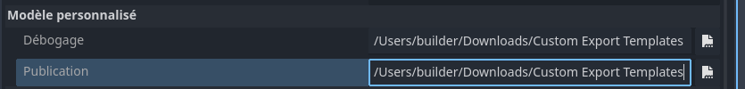

# Utilisation de modèles d'exportation personnalisés {#using-custom-export-templates}

<br>

Cette page présente un cas d'utilisation de Codemagic pour l'exportation d'un projet Godot en utilisant des modèles d'exportation personnalisés. Nous n'aborderons ni les règles d'écriture, ni la composition ou encore le fonctionnement d'un fichier `codemagic.yaml`.

- Apprenez en plus sur ce qu'est un fichier `codemagic.yaml`avec [Utilisation d'un fichier codemagic.yaml](https://docs.codemagic.io/yaml-basic-configuration/yaml-getting-started/)


Image par Codemagic, utilisée sous licence [CC BY-ND 4.0](https://creativecommons.org/licenses/by-nd/4.0/). Voir [galerie](https://codemagic.io/gallery/)


## Exigences {#requirements}

Pour utiiser vos propres modèles d'exportation, vous devrez les empaqueter dans un fichier `zip` et les héberger en ligne. Nous utiliserons l'URL de ce fichier pour télécharger et installer vos modèles sur la machine de compilation. Cela permettra à votre projet Godot d'être exporté en utilisant vos modèles d'exportation personnalisés.

**Assurez-vous d'empaqueter vos modèles d'exportation dans un fichier `zip` et de l'héberger en ligne.** 
Le fichier `zip` doit uniquement contenir les modèles d'exportation. Une fois décompressé, seuls les modèles doivent êtres obtenus et non un dossier.  
Pour héberger votre fichier, vous pouvez utiliser un service d'hébergement de fichiers gratuit comme [SwissTransfer](https://www.swisstransfer.com/).

**Dans les options d'exportation, assurez-vous de définir le chemin vers les modèles d'exportation personnalisés avec** : `/Users/builder/Downloads/Custom Export Templates`. C'est le répertoire dans lequel les modèles d'exportation seront stockés sur la machine de compilation.



Ce tutoriel assume que vous disposez d'un fichier de configuration(`codemagic.yaml`). Ce fichier permettant d'exporter un projet Godot pour une quelconque plateforme. Si vous ne disposer pas de fichier de configuration, consultez alors le tableau suivant. Ce tableau vous permettra peut être de trouver un fichier de configuration adapté à vos besoins :

| Tutoriels 1                                                                  | Turoriels 2                                                                  |
| ---------------------------------------------------------------------------- | ---------------------------------------------------------------------------- |
| [Exportation vers Android](../workflows/android-workflow.md)                 | [Exportation vers macOS](../workflows/macos-workflow.md)                     |
| [Exportation vers iOS](../workflows/ios-workflow.md)                         | [Exportation vers Windows Desktop](../workflows/windows-desktop-workflow.md) |
| [Exportation vers le Web](../workflows/web-workflow.md)                      | [Exportation vers Linux](../workflows/linux-workflow.md)                     |


## Processus {#process}

Nous devons récupérer et installer vos modèles d'exportation personnalisés sur la machine de compilation. Nous utiliserons une variable d'environnement pour récupérer l'URL de téléchargement. Dans la section `environnement` de votre flux de travail, ajoutez la variable suivante:

| Nom de la variable      | Description                                      |
| ----------------------- | ------------------------------------------------ |
| URL_MODELES_EXPORTATION | L'URL où vos modèles personnalisés sont hébergés |

- Apprenez-en plus sur les variables d'environnement dans un fichier `codemagic.yaml` avec [Configuration de variables d'environnement](https://docs.codemagic.io/yaml-basic-configuration/configuring-environment-variables/)

Assurez vous que votre flux de travail ressemble mainten/ant à ceci :

```yaml
mon-flux:
  environment:
    vars:
      ...
      URL_MODELES_EXPORTATION: https://url-de-téléchargement # [!code ++]
```

<br>

Aussi, juste avant le script d'exportation de votre projet, ajoutez le script suivant :

```yaml
- name: Configuration des modèles d'exportation
  script: |
    cd ~Downloads
    mkdir "Custom Export Templates"
    export FICHIER=templates.zip
    curl -L "$URL_MODELES_EXPORTATION" -o "$FICHIER" && unzip "$FICHIER"
    rm $FICHIER
```

Assurez-vous alors que votre section `scripts` ressemble mainten/ant à ceci :

```yaml
scripts:
  ...
  - name: Configuration des modèles d'exportation ... # [!code ++]
  - *exportation_projet ...
```

Ce script télécharge vos modèles d'exportation et les extrais dans le dossier `/Users/builder/Downloads/Custom Export Templates`.

<br>

Et voilà ! il ne nous reste plus qu'à lancer une nouvelle compilation(`build`) pour exporter votre projet. Vous pouvez pour ce faire, utiliser l'interface de Codemagic, ou des évènements affectant votre dépôt tels que les push.

Ressources optionnelles pour vous aider à affiner votre configuration :
- [Mise en cache](https://docs.codemagic.io/knowledge-codemagic/caching/)
- [Exécution automatique](https://docs.codemagic.io/yaml-running-builds/starting-builds-automatically/)
- [Notifications d'exécution](https://docs.codemagic.io/yaml-notification/email/)
- [Déploiements](https://docs.codemagic.io/yaml-publishing/google-play/)
- [Compiler des modèles d'exportation pour Godot avec Codemagic](./compiling.md)


## Remarque {#note}

Si vous utilisé(e) une [clée de cryptage](https://docs.godotengine.org/fr/latest/contributing/development/compiling/compiling_with_script_encryption_key.html) avec vos modèles d'exportation, assurez vous de définir la variable `GODOT_SCRIPT_ENCRYPTION_KEY` en tant que variable d'environnement conten/ant votre clé de cryptage. Sinon Godot ne pourra pas correctement crypter vos données lors de l'exportation.

- Apprenez-en plus sur les variables d'environnement dans un fichier `codemagic.yaml` avec [Configuration de variables d'environnement](https://docs.codemagic.io/yaml-basic-configuration/configuring-environment-variables/)
- Consultez [Utilisation d'une clée de crytage](https://docs.godotengine.org/fr/latest/contributing/development/compiling/compiling_with_script_encryption_key.html) pour en apprendre plus sur le cryptage de vos exportations avec Godot.


## Obtenir de l'aide et de l'assistance {#getting-help-and-support}

Si vous avez une question technique ou si vous avez besoin d'aide pour résoudre un problème particulier, vous pouvez obtenir de l'aide dans la [discussion de communauté GitHub](https://github.com/sabinayo/codemagic-godot-pipeline/discussions).