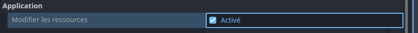
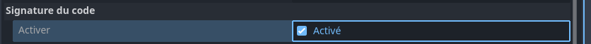
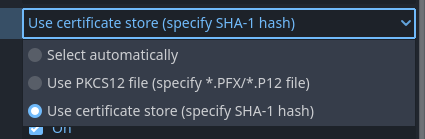

# Flux de travail Windows Desktop {#windows-desktop-workflow}

<br>

Cette page présente un cas d'utilisation de Codemagic pour l'exportation d'un projet Godot vers Windows. Nous n'aborderons ni les règles d'écriture, ni la composition ou encore le fonctionnement d'un fichier `codemagic.yaml`.

- Vous pouvez sauter le tutoriel et récupérer le fichier de configuration dans [Récapitulatif](#overview)
- Apprenez en plus sur ce qu'est un fichier `codemagic.yaml`avec [Utilisation d'un fichier codemagic.yaml](https://docs.codemagic.io/yaml-basic-configuration/yaml-getting-started/)
- Apprennez à configurer votre projet Godot et votre dépôt dans [Vue d'ensemble du processus](../process-overview.md).


Image par Codemagic, utilisée sous licence [CC BY-ND 4.0](https://creativecommons.org/licenses/by-nd/4.0/). Voir [galerie](https://codemagic.io/gallery/)


## Exigences {#requirements}

- Un éditeur de texte
- Le fichier de configuration des flux de travail. (Voir [Configuration des flux de travail](./workflow-configuration.md))

Comme expliqué dans [Configuration du projet](../process-overview.md#project-configuration), vous devez configurer votre projet pour l'exportation comme si vous souhaitiez faire une exportation sur votre machine locale.
- Consultez le [Guide d'exportation Windows](https://docs.godotengine.org/fr/stable/tutorials/export/exporting_for_android.html) afin de configurer votre projet Godot pour l'export vers Windows


## Configuration minimale {#minimal-configuration}

Nous devons créer un nouveau flux de travail dans lequel nous définirons des variables qui lui sont propres. Ajoutez le code suivant à votre fichier `codemagic.yaml`, juste après la section `definitions` :

```yaml
workflows:
  flux-godot-windows-desktop:
    name: Exportation vers Windows Desktop
    max_build_duration: 120
    instance_type: mac_mini_m2
    working_directory: /Users/builder/Downloads
    
    environment:
      vars:
        <<: *variables_godot
        FICHIER_DE_SORTIE: test.exe
        NOM_DU_PREREGLAGE: Windows Desktop
        URL_RCEDIT: https://github.com/electron/rcedit/releases/download/v2.0.0/rcedit-x64.exe
```

Assurez-vous que votre fichier ressemble mainten/ant à ceci :

```yaml
definitions: ...

workflows: # [!code ++]
  flux-godot-window-desktop: ... # [!code ++]
```

<br>

Vous souvenez-vous de notre [fichier de configuration de flux](./workflow-configuration.md#configuration-de-base) ? Nous utilisons les opérateurs `<<` et `*` pour réutiliser ses sections.  

- Pour en savoir plus sur les sections réutilisables dans un fichier `codemagic.yaml` consultez [Réutilisation de sections](https://docs.codemagic.io/yaml-basic-configuration/yaml-getting-started/#reusing-sections)

- Consultez l'ensemble des variables réutilisées dans [Configuration de base](./workflow-configuration.md#configuration-de-base)

Voici une description des variables que nous avons définies :

| Variable           | Description
| ------------------ | --------------------------------------------------------------------------- |
| FICHIER_DE_SORTIE  | Le nom du fichier exporté. Format : `<NOM_PROJET>.<EXTENSION>`. L'extension du fichier de sortie doit correspondre à celle utilisée par le processus d'exportation de Godot. Voir [Exporter à partir de la ligne de commande](https://docs.godotengine.org/fr/latest/tutorials/export/exporting_projects.html#exporting-from-the-command-line) |
| NOM_DU_PREREGLAGE | Le nom du préréglage d'exportation qui sera utilisé pour exporter votre projet. |
| URL_RCEDIT        | L'URL de téléchargement de [rcedit](https://github.com/electron/rcedit)         |

- Apprenez-en plus sur les variables d'environnement dans un fichier `codemagic.yaml` avec [Configuration de variables d'environnement](https://docs.codemagic.io/yaml-basic-configuration/configuring-environment-variables/)

<br>

Nous devons mainten/ant compléter notre fichier de configuration. Ajoutez le code suivant dans votre section `flux-godot-windows-desktop`.:

```yaml
scripts:
  - *installation_godot
  - *installation_modeles_exportation
  - *exportation_projet
  - *collecte_fichiers

artifacts:
  - *recuperation_exportation
```

Assurez-vous alors que votre flux ressemble mainten/ant à ceci :

```yaml
flux-godot-windows-desktop:
  ...
  environment: ...
  scripts: ... # [!code ++]
  artifacts: ... # [!code ++]
```

Et voilà ! il ne nous reste plus qu'à lancer une nouvelle compilation(`build`) pour exporter votre projet. Vous pouvez pour ce faire, utiliser l'interface de Codemagic, ou des évènements affectant votre dépôt tels que les push.

- Consultez [Exécution automatique](https://docs.codemagic.io/yaml-running-builds/starting-builds-automatically/) pour automatiser l'exécution de votre configuration Codemagic.
- Consultez également [Notifications d'exécution](https://docs.codemagic.io/yaml-notification/email/) pour obtenir une notification vous informant du résultat de l'exécution de votre configuration Codemagic.

Vous pouvez mainten/ant <a href="/codemagic-godot-pipeline/templates/fr/windows/windows-desktop-workflow-simple-export.yaml" download="codemagic.yaml">Télécharger le fichier de configuration</a> pour exporter votre projet vers Windows.


## Configuration additionnelle {#additional-configuration}

Les configurations qui suivent (rcedit et la signature d'application windows) nécessitent toutes les 2, une modification du fichier de sauvegarde de l'éditeur de Godot. Nous configurerons donc un script de base pour ces deux configurations.  
Ce script devra s'exécuter avant le script d'exportation(`*exportation_projet`). Sinon, il ne pourra pas influencer le processus d'exportation.  
Ajoutez le code suivant à la section `scripts` de `flux-godot-windows-desktop` :

```yaml
- name: Configuration de l'exportation
  script: |
    export VERSION_PARAMETRES=$(echo "$VERSION_GODOT" | awk -F'[.-]' '{
        if ($1 == 3) print "3";
        else if ($2 == 0) print $1;
        else print $1"."$2
    }')
    export PARAMETRES_GODOT=${REPERTOIRE_DONNEES_EDITEUR}/editor_settings-${VERSION_PARAMETRES}.tres
    cat <<EOF > "$PARAMETRES_GODOT"
    [gd_resource type="EditorSettings"]

    [resource]
    EOF
```

Assurez vous que votre section `scripts` ressemble mainten/ant à ceci :

```yaml
scripts:
  ...
  - *installation_modeles_exportation ...
  - name: Configuration de l'exportation ... # [!code ++]
  - *exportation_projet ...
```

Ce script génère le fichier de paramètres de l'éditeur Godot.  
Pour cela, il extrait la version du fichier utilisée par Godot (`4.<VERSION_MINEURE>.tres` pour Godot 4 ou `3.tres` pour Godot 3). La version du fichier de paramètres est extraite à partir de la variable `VERSION_GODOT`, grâce à un outil de traitement de texte comme [awk](https://www.geeksforgeeks.org/awk-command-unixlinux-examples/).  
Deuxièmement, le script stocke le fichier de paramètres à l'emplacement où Godot s'attend à le trouver.

- Apprenez-en plus sur le traitement de texte avec `awk` grâce à [Commande awk dans Unix/Linux avec des exemples](https://www.geeksforgeeks.org/awk-command-unixlinux-examples/)


## Configuration de rcedit {#rcedit-configuration}

rcedit n'est pas requis pour l'exportation vers Windows avec Godot. rcedit est un logiciel qui permet d'éditer les ressources d'un fichier `exe` telles que l'icône et les métadonnées.
- Consultez [Changer l'icone de l'application pour windows](https://docs.godotengine.org/fr/4.x/tutorials/export/changing_application_icon_for_windows.html#changing-the-file-icon) pour en apprendre plus sur l'usage de rcedit dans Godot.

Avant de continuer, assurez-vous d'avoir la [Configuration additionnelle](#configuration-additionnelle) dans votre fichier de configuration.
Assurez vous également d'avoir activé l'option [Modifier les ressources](https://docs.godotengine.org/fr/4.x/classes/class_editorexportplatformwindows.html#class-editorexportplatformwindows-property-application-modify-resources) dans le préréglage d'exportation.  


<br>

Pour installer rcedit, nous ajouterons quelques ligne à notre script `Configuration de l'exportation`. Juste au début du script, ajoutez les lignes suivantes :

```yaml
softwareupdate --install-rosetta --agree-to-license
brew install --cask wine-stable
curl -L "$URL_RCEDIT" -o "rcedit-x64.exe"
chmod +x rcedit-x64.exe
export CHEMIN_RCEDIT=$(pwd)/rcedit-x64.exe
export CHEMIN_WINE=$(which wine)
```

Assurez-vous alors que votre script ressemble mainten/ant à ceci :

```yaml
softwareupdate --install-rosetta --agree-to-license ... # [!code ++]
export VERSION_PARAMETRES=$(echo "$VERSION_GODOT" | awk -F'[.-]' '{ ...
```

Que font les nouvelles lignes ?  
Puisque nous utilisons un Mac et que [rcedit](https://github.com/electron/rcedit) est un exécutable Windows, nous le téléchargeons (`curl -L "$URL_RCEDIT" -o "rcedit-x64.exe"`) et l'exécutons avec [Wine](https://www.winehq.org/) (installé via `brew install --cask wine-stable`). Nous nous assurons ensuite que rcedit est exécutable sur cette machine de compilation via `chmod +x rcedit-x64.exe`.  
Comme wine-stable est construit pour Intel macOS, il nécessite [Rosetta 2](https://fr.wikipedia.org/wiki/Rosetta_(logiciel)). Nous installons donc Rosetta sur la machine de construction via `softwareupdate --install-rosetta --agree-to-license`.  
Nous définissons ensuite les variables d'environnement `CHEMIN_RCEDIT` et `CHEMIN_WINE` qui contiennent respectivement les chemins d'accès de rcedit et wine sur la machine compilation. Ces variables seront utilisés pour permettre à Godot de localiser et d'utiliser rcedit.

Pour permettre à Godot d'utiliser `CHEMIN_RCEDIT` et `CHEMIN_WINE`, nous devons compléter le fichier de paramètre de l'éditeur de Godot. Ajoutez les lignes suivantes en dessous de la partie `[resource]` du script :

```yaml
export/windows/rcedit = "$CHEMIN_RCEDIT"
export/windows/wine = "$CHEMIN_WINE"
```

Assurez-vous alors que votre section `[resource]` ressemble mainten/ant à ceci :

```yaml
[resource]
export/windows/rcedit = "$CHEMIN_RCEDIT" # [!code ++]
export/windows/wine = "$CHEMIN_WINE" # [!code ++]
EOF
```

Ces deux lignes sont équivalentes aux options situés dans l'interface de l'éditeur de Godot. Elles spécifient le chemin vers `rcedit` et `wine` sur la machine de compilation.

<br>

Et voilà ! il ne nous reste plus qu'à lancer une nouvelle compilation(`build`) pour exporter votre projet. Vous pouvez pour ce faire, utiliser l'interface de Codemagic, ou des évènements affectant votre dépôt tels que les push.

- Consultez [Exécution automatique](https://docs.codemagic.io/yaml-running-builds/starting-builds-automatically/) pour automatiser l'exécution de votre configuration Codemagic.
- Consultez également [Notifications d'exécution](https://docs.codemagic.io/yaml-notification/email/) pour obtenir une notification vous informant du résultat de l'exécution de votre configuration Codemagic.

Vous pouvez mainten/ant <a href="/codemagic-godot-pipeline/templates/fr/windows/windows-desktop-workflow-rcedit-config.yaml" download="codemagic.yaml">Télécharger le fichier de configuration</a> pour utiliser rcedit sur une machine de compilation.

<h3>Remarque</h3>

**Ne vous inquiétez pas si vous voyez des messages d'erreur concernant Wine au cours de l'exportation. Ces erreurs sont courantes lors de l'exécution d'outils Windows dans un environnement sans interface graphique. Elles signalent un manque de composants graphiques. Ces composants ne sont pas nécessaires pour les opérations en ligne de commande. Elles n'affectent pas la fonctionnalité ou le résultat du processus.**

::: details Cliquez pour voir des exemples de messages d'erreur
rcedit (/Users/builder/Downloads/builds/windows/test.tmp): wine: created the configuration directory '/Users/builder/.wine'
002c:fixme:actctx:parse_depend_manifests Could not find dependent assembly L"Microsoft.Windows.Common-Controls" (6.0.0.0)
004c:fixme:actctx:parse_depend_manifests Could not find dependent assembly L"Microsoft.Windows.Common-Controls" (6.0.0.0)
0054:fixme:actctx:parse_depend_manifests Could not find dependent assembly L"Microsoft.Windows.Common-Controls" (6.0.0.0)
004c:err:winediag:nodrv_CreateWindow Application tried to create a window, but no driver could be loaded.
004c:err:winediag:nodrv_CreateWindow L"The explorer process failed to start."
004c:err:systray:initialize_systray Could not create tray window
004c:err:ole:StdMarshalImpl_MarshalInterface Failed to create ifstub, hr 0x80004002
004c:err:ole:CoMarshalInterface Failed to marshal the interface {6d5140c1-7436-11ce-8034-00aa006009fa}, hr 0x80004002
004c:err:ole:apartment_get_local_server_stream Failed: 0x80004002
002c:err:winediag:nodrv_CreateWindow Application tried to create a window, but no driver could be loaded.
002c:err:winediag:nodrv_CreateWindow L"The graphics driver is missing. Check your build!"
0054:err:winediag:nodrv_CreateWindow Application tried to create a window, but no driver could be loaded.
0054:err:winediag:nodrv_CreateWindow L"The graphics driver is missing. Check your build!"
0054:err:ole:apartment_createwindowifneeded CreateWindow failed with error 1400
0054:err:ole:apartment_createwindowifneeded CreateWindow failed with error 1400
0054:err:ole:apartment_createwindowifneeded CreateWindow failed with error 1400
0054:err:ole:StdMarshalImpl_MarshalInterface Failed to create ifstub, hr 0x80070578
0054:err:ole:CoMarshalInterface Failed to marshal the interface {6d5140c1-7436-11ce-8034-00aa006009fa}, hr 0x80070578
0054:err:ole:apartment_get_local_server_stream Failed: 0x80070578
0054:err:ole:start_rpcss Failed to open RpcSs service
0044:err:winediag:nodrv_CreateWindow Application tried to create a window, but no driver could be loaded.
0044:err:winediag:nodrv_CreateWindow L"The graphics driver is missing. Check your build!"
0094:err:winediag:nodrv_CreateWindow Application tried to create a window, but no driver could be loaded.
0094:err:winediag:nodrv_CreateWindow L"The graphics driver is missing. Check your build!"
0094:err:setupapi:SetupDefaultQueueCallbackW copy error 1812 L"@C:\\windows\\system32\\drivers\\wineusb.sys,-1" -> L"C:\\windows\\inf\\wineusb.inf"
0094:fixme:file:NtLockFile I/O completion on lock not implemented yet
0094:fixme:ntdll:NtQuerySystemInformation info_class SYSTEM_PERFORMANCE_INFORMATION
009c:err:environ:init_peb starting L"Z:\\Applications\\Wine Stable.app\\Contents\\Resources\\wine\\share\\wine\\mono\\wine-mono-9.4.0\\support\\removeuserinstalls-x86.exe" in experimental wow64 mode
00a4:err:environ:init_peb starting L"Z:\\Applications\\Wine Stable.app\\Contents\\Resources\\wine\\share\\wine\\mono\\wine-mono-9.4.0\\support\\installinf-x86.exe" in experimental wow64 mode
0094:fixme:msi:internal_ui_handler internal UI not implemented for message 0x0b000000 (UI level = 1)
0094:fixme:msi:internal_ui_handler internal UI not implemented for message 0x0b000000 (UI level = 1)
00fc:err:environ:init_peb starting L"C:\\windows\\syswow64\\rundll32.exe" in experimental wow64 mode
00fc:fixme:msg:pack_message msg 14 (WM_ERASEBKGND) not supported yet
00fc:err:winediag:nodrv_CreateWindow Application tried to create a window, but no driver could be loaded.
00fc:err:winediag:nodrv_CreateWindow L"The graphics driver is missing. Check your build!"
0104:err:environ:init_peb starting L"C:\\windows\\syswow64\\iexplore.exe" in experimental wow64 mode
002c:err:setupapi:do_file_copyW Unsupported style(s) 0x10
0118:err:ntoskrnl:ZwLoadDriver failed to create driver L"\\Registry\\Machine\\System\\CurrentControlSet\\Services\\winebth": c00000e5
002c:err:setupapi:SetupDiInstallDevice Failed to start service L"winebth" for device L"ROOT\\WINE\\WINEBTH", error 1359.
002c:err:setupapi:SetupDiInstallDevice Failed to control service L"winebth" for device L"ROOT\\WINE\\WINEBTH", error 1062.
002c:err:setupapi:do_file_copyW Unsupported style(s) 0x10
0140:err:setupapi:do_file_copyW Unsupported style(s) 0x10
0140:err:setupapi:do_file_copyW Unsupported style(s) 0x10
014c:err:hid:handle_DeviceMatchingCallback Ignoring HID device 0x7fa19780a150 (vid 05ac, pid 8106): not a joystick or gamepad
014c:err:hid:handle_DeviceMatchingCallback Ignoring HID device 0x7fa197809410 (vid 05ac, pid 8105): not a joystick or gamepad
0024:fixme:kernelbase:AppPolicyGetProcessTerminationMethod FFFFFFFFFFFFFFFA, 000000000011FE80
:::


## Signature de Code {#code-signing}

Avant de continuer, assurez-vous d'avoir la [Configuration additionnelle](#additional-configuration) dans votre fichier de configuration.
Assurez vous également d'avoir activé l'option [Signature de code](https://docs.godotengine.org/fr/4.x/classes/class_editorexportplatformwindows.html#class-editorexportplatformwindows-property-codesign-enable) dans le préréglage d'exportation.


Pour signer votre projet, nous devons configurer un outil de [Signature de code](https://fr.wikipedia.org/wiki/Signature_de_code). Nous utilisons un Mac pour ce tutoriel. Pour signer une application Windows avec Godot sur un système d'exploitation autre que Windows, nous devons utiliser [osslsigncode](https://github.com/mtrojnar/osslsigncode). Si vous utiliser la machine de compilation Windows de Codemagic, utilisez [SignTool](https://learn.microsoft.com/fr-fr/dotnet/fr/amework/tools/signtool-exe) à la place.
- Apprenez à créer un certificat pour votre application Windows avec [Création d'un certificat de signature de package](https://learn.microsoft.com/fr/windows/msix/package/create-certificate-package-signing)
- Apprenez-en plus sur la signature de code pour Windows dans Godot avec [Signature d'application Windows](https://docs.godotengine.org/fr/4.x/tutorials/export/exporting_for_windows.html#code-signing)


Ajoutez les lignes suivantes au début de votre section `Configuration de l'exportation` :

```yaml
brew install osslsigncode
export CHEMIN_OUTIL_DE_SIGNATURE=$(which osslsigncode)
```

Assurez vous ensuite que votre section ressemble mainten/ant à ceci :

```yaml
brew install osslsigncode # [!code ++]
export CHEMIN_OUTIL_DE_SIGNATURE=$(which osslsigncode) # [!code ++]
export SETTINGS_VERSION=$(echo "$GODOT_VERSION" | awk -F'[.-]' '{ ...
```

Les 2 nouvelles lignes installent osslsigncode sur la machine de compilation et stockent le chemin d'accès de osslsigncode dans une variable nommée `CHEMIN_OUTIL_DE_SIGNATURE`. Pour compléter l'installation d'osslsigncode, nous devons mainten/ant ajouter son chemin d'accès dans le fichier de paramètre de l'éditeur de Godot. Pour ce faire, ajoutez la ligne suivante juste en dessous de la partie `[resource]` du script :

```yaml
export/windows/signtool = "$CHEMIN_OUTIL_DE_SIGNATURE"
```

Assurez vous alors que votre partie `[resource]` ressemble mainten/ant à ceci :

```yaml
[resource]
export/windows/signtool = "$CHEMIN_OUTIL_DE_SIGNATURE" # [!code ++]
EOF
```

Et voilà ! Il ne nous reste plus qu'à configurer votre certificat de signature de code sur la machine de compilation.

<br>

Nous utiliserons les variables suivantes pour transférer et utiliser votre certicicat afin de signer votre application.  
- Consultez les [Variables d'environnement Windows](https://docs.godotengine.org/fr/stable/tutorials/export/exporting_for_windows.html#environment-variables) pour plus d'informations sur certaines des variables utilisées.


| Variable name                        |	Variable value                                 |	Group                  |
| ------------------------------------ | ----------------------------------------------- | ----------------------- |
| NOM_FICHIER_CERTIFICAT	             | Le nom du fichier de certificat avec son extension.(ex: `cert.pfx`) | identifiants_windows |
| GODOT_WINDOWS_CODESIGN_IDENTITY	     | Votre certificat encodé en [base64](https://fr.wikipedia.org/wiki/Base64) | identifiants_windows |
| GODOT_WINDOWS_CODESIGN_IDENTITY_TYPE | Le type d'identité utilisé pour la signature(Soit `0`, `1` ou `2`). | identifiants_windows |
| GODOT_WINDOWS_CODESIGN_PASSWORD      | Le mot de passe de votre certificat               | identifiants_windows |

Pour `GODOT_WINDOWS_CODESIGN_IDENTITY_TYPE` : `0`, `1` et `2` correspondent respectivements aux options `Select automatically`, `Use PKC12 file (specify *.PFX/*.P12 file)` et `Use certificate store (specify SHA-1 hash)`.


Ajoutez ces variables avec l'interface de Codemagic (soit en tant que variables d'application, soit en tant que variables d'équipe), en veillant à cliquer sur `Secure` pour que ces données sensibles soient cryptées.
- Apprenez à stocker ces variables à l'aide de l'interface de Codemagic en regardant cette vidéo :

<div style="position: relative; padding-bottom: 56.25%; height: 0; overflow: hidden;">
    <iframe width="897" height="504" src="https://www.youtube.com/embed/7pAxVFe66hI?start=37" title="Environment variables and groups with codemagic.yaml" frameborder="0" allow="accelerometer; autoplay; clipboard-write; encrypted-media; gyroscope; picture-in-picture; web-share" referrerpolicy="strict-
origin-when-cross-origin" style="position: absolute; top:0; left: 0; width: 100%; height: 100%;" allowfullscreen></iframe>
</div>

- Apprenez-en plus sur les variables d'environnement dans Codemagic avec [Configuration de variables d'environnement](https://docs.codemagic.io/yaml-basic-configuration/configuring-environment-variables/)
- Apprenez à stocker des fichiers dans des variables d'environnement avec [Stockage de fichiers binaires](https://docs.codemagic.io/yaml-basic-configuration/configuring-environment-variables/#storing-binary-files)
- Si vous n'avez pas de PC, vous pouvez utiliser un site internet comme [base64.guru](https://base64.guru/converter/encode/text) ou [base64encode](https://www.base64encode.org/) pour encoder votre clé de débogage au format base64.  

<br>

Pour utiliser les variables définies dans l'interface de Codemagic, nous devons ajouter leur groupe de variable (ici `identifiants_windows`) à notre fichier de configuration (`codemagic.yaml`).  
Pour ajouter le groupe de variables à notre flux de travail, localisez la section `envrironment` à l'intérieur de `flux-godot-windows-desktop`, et ajoutez-y la section suivante :

```yaml
groups:
  - identifiants_windows
```

Assurez-vous alors que votre flux de travail ressemble mainten/ant à ceci :

```yaml
flux-godot-windows-desktop:
  ...
  environment:
    groups: # [!code ++]
      - identifiants_windows # [!code ++]
    ...
```

:::tip Astuce
Si la section `groups` existe déjà dans votre script, ajoutez-y simplement la ligne `- identifiants_windows`
:::

<br>

Nous devons mainten/ant configurer nos variables pour permettre à Godot de les trouver et de les utiliser. Ajoutez les lignes suivantes à la fin de la section `Configuration de l'exportation` :

```yaml
export CHEMIN_CERTIFICAT=/tmp/$NOM_FICHIER_CERTIFICAT
echo $GODOT_WINDOWS_CODESIGN_IDENTITY | base64 --decode > $CHEMIN_CERTIFICAT
echo "GODOT_WINDOWS_CODESIGN_IDENTITY=$CHEMIN_CERTIFICAT" >> $CM_ENV
```

Assurez-vous que votre section `scripts` ressemble mainten/ant à ceci :

```yaml
scripts:
  ...
  - *installation_modeles_exportation ...
  - name: Configuration de l'exportation
    ...
    EOF
    export CHEMIN_CERTIFICAT=/tmp/$NOM_FICHIER_CERTIFICAT ... # [!code ++]
  - *exportation_projet ...
```

<br>

Qu'avons-nous fait ?

- Tout d'abord, nous définissons une variable (`CHEMIN_CERTIFICAT`) pour spécifier l'emplacement de stockage de votre certificat sur la machine de compilation.
- Ensuite, nous décodons votre fichier à cet emplacement. Puis, nous mettons à jour la variable conten/ant le fichier encodé pour qu'elle pointe vers le chemin du fichier décodé. Nous le faisons car Godot s'attend à un chemin de fichier plutôt qu'à des données brutes encodées.
- Enfin, nous enregistrons la variable conten/ant le chemin du certificat en tant que variable d'environnement globale sur la machine de compilation. De cette manière, Godot pourra y accéder et l'utiliser pendant l'exportation.

<br>

Et voilà ! il ne nous reste plus qu'à lancer une nouvelle compilation(`build`) pour exporter votre projet. Vous pouvez pour ce faire, utiliser l'interface de Codemagic, ou des évènements affectant votre dépôt tels que les push.

- Consultez [Exécution automatique](https://docs.codemagic.io/yaml-running-builds/starting-builds-automatically/) pour automatiser l'exécution de votre configuration Codemagic.
- Consultez également [Notifications d'exécution](https://docs.codemagic.io/yaml-notification/email/) pour obtenir une notification vous informant du résultat de l'exécution de votre configuration Codemagic.

Vous pouvez mainten/ant <a href="/codemagic-godot-pipeline/templates/fr/windows/windows-desktop-workflow-signed.yaml" download="codemagic.yaml">Télécharger le fichier de configuration</a> pour exporter une application Windows signée sur une machine de compilation.


## Récapitulatif {#overview}

Voici un résumé de ce que nous avons couvert sur cette page en utilisant une machine de compilation de Codemagic:
- Exportation d'un projet Godot vers Windows
- Exportation d'un projet Godot vers Windows en utilisant rcedit
- Exportation d'un projet Godot vers Windows avec signature de code

**Tableau de téléchargement**

| Fichier                      | Contenu                          | Tutoriels                        |
| ---------------------------- | --------------------------------- | -------------------------------- |
| <a href="/codemagic-godot-pipeline/templates/fr/windows/windows-desktop-workflow-unsigned.yaml" download="codemagic.yaml">Télécharger</a> | Configuration d'une exportation Windows non signée avec Godot | [Aller au tutoriel](#minimal-configuration) |
| <a href="/codemagic-godot-pipeline/templates/fr/windows/windows-desktop-workflow-rcedit-config.yaml" download="codemagic.yaml">Télécharger</a> | Configuration de rcedit pour l'exportation Windows avec Godot | [Aller au tutoriel](#rcedit-configuration) |
| <a href="/codemagic-godot-pipeline/templates/fr/windows/windows-desktop-workflow-signed.yaml" download="codemagic.yaml">Télécharger</a> | Configuration de la signature de code pour l'exportation Windows avec Godot | [Aller au tutoriel](#code-signing) |

:::warning Attention !!!
Pour utiliser efficacement ces scripts, veuillez vous reporter aux tutoriels correspondants.  
Les scripts de ce site sont généraux et s'adapteront à la plupart des cas d'utilisation. Néanmoins, des ajustements spécifiques à votre projet peuvent s'avérer nécessaires.  
Notez que certains scripts dépendent de variables d'environnement qui doivent être définies via l'interface de Codemagic. Sans elles, certains scripts ne fonctionneront pas.
:::

<br>

Ressources optionnelles pour vous aider à affiner votre configuration :
- [Mise en cache](https://docs.codemagic.io/knowledge-codemagic/caching/)
- [Exécution automatique](https://docs.codemagic.io/yaml-running-builds/starting-builds-automatically/)
- [Notifications d'exécution](https://docs.codemagic.io/yaml-notification/email/)
- [Déploiements](https://docs.codemagic.io/yaml-publishing/google-play/)
- [Utilisation de modèles d'exportation personnalisés](./using-custom-export-templates.md)


## Obtenir de l'aide et de l'assistance {#getting-help-and-support}

Si vous avez une question technique ou si vous avez besoin d'aide pour résoudre un problème particulier, vous pouvez obtenir de l'aide dans la [discussion de communauté GitHub](https://github.com/sabinayo/codemagic-godot-pipeline/discussions).