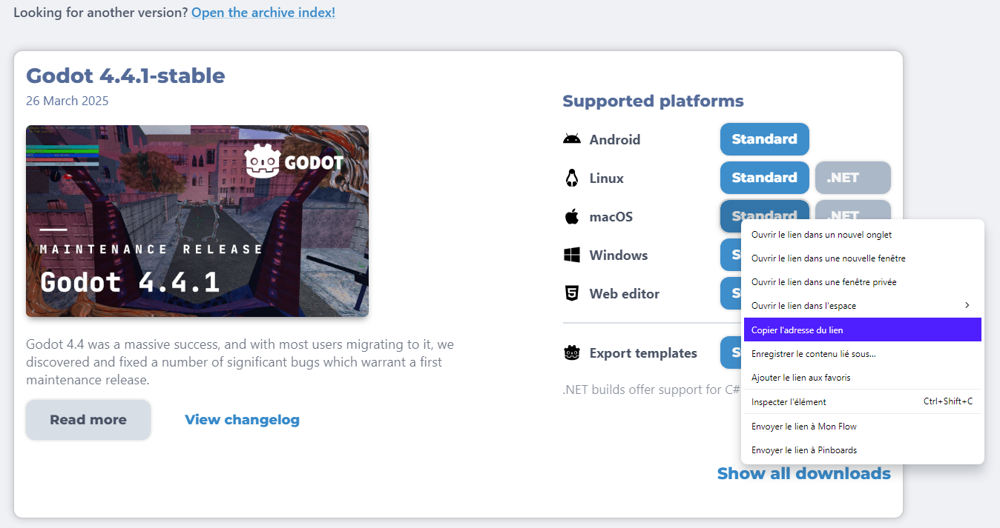

# Configuration des flux de travail {#workflow-configuration}

<br>

Cette page détaille la création d'un fichier de configuration réutilisable pour l'exportation de projets Godot avec Codemagic. Ce fichier sera utilisé dans tous les flux de travail à venir. Il permettra d'accélérer le développement et d'éviter la duplication de configuration. Nous n'aborderons ni les règles d'écriture, ni la composition ou encore le fonctionnement d'un fichier `codemagic.yaml`.

- Vous pouvez sauter le tutoriel et récupérer le fichier de configuration dans [Récapitulatif](#overview)
- Apprennez à configurer votre projet Godot et votre dépôt dans [Vue d'ensemble du processus](../process-overview.md).
- Apprenez-en plus sur ce qu'est un fichier `codemagic.yaml` avec [Utilisation d'un fichier codemagic.yaml](https://docs.codemagic.io/yaml-basic-configuration/yaml-getting-started/)
- Apprenez-en plus sur les sections réutilisables dans un fichier `codemagic.yaml` avec [Réutilisation de sections](https://docs.codemagic.io/yaml-basic-configuration/yaml-getting-started/#reusing-sections)


Image par Codemagic, utilisée sous licence [CC BY-ND 4.0](https://creativecommons.org/licenses/by-nd/4.0/). Voir [galerie](https://codemagic.io/gallery/)


## Exigences {#requirements}

- Un éditeur de texte


## Configuration minimale {#minimal-configuration}

Pour rendre notre script propre et réutilisable, nous utiliserons des variables d'environnement pour référencer certaines données.  

- Pour en savoir plus sur les variables d'environnement dans un fichier `codemagic.yaml`, consultez [Configuration de variables d'environnement](https://docs.codemagic.io/yaml-basic-configuration/configuring-environment-variables/)

:::tip Astuce
Les noms de variables utilisés dans ce guide sont arbitraires exeptés ceux utilisés par Godot. (Ceux-ci seront précisés).  
N'hésitez pas à les renommer comme bon vous semble.
:::

Ouvrez un éditeur de texte, créez un fichier appelé `codemagic.yaml`, et collez le code suivant:

```yaml
definitions:
  environment:
    environnement_godot:
      vars: &variables_godot
        VERSION_GODOT: 4.4.1-stable
        TYPE_EXPORTATION: debug
        REPERTOIRE_EXPORTATION: /Users/builder/Downloads/builds/
        URL_GODOT: https://github.com/godotengine/godot-builds/releases/download
        GODOT: Godot.app/Contents/MacOS/Godot
        REPERTOIRE_PROJET: /Users/builder/clone
        REPERTOIRE_DONNEES_EDITEUR: /Users/builder/Library/Application Support/Godot
        REPERTOIRE_MODELES_EXPORTATION: $REPERTOIRE_DONNEES_EDITEUR/export_templates
```

Tous nos flux de travail sont basés sur cette structure. Toute section définie sous `definitions` sera réutilisée dans d'autres flux de travail.  
- Apprenez en plus plus sur la section `definitions` avec [Aide mémoire fichier codemagic.yaml](https://docs.codemagic.io/codemagic-yaml-cheatsheet.html)

<br>

Voici une description des variables définies.

| Variable                   | Description                                                             |
| -------------------------- | ----------------------------------------------------------------------- |
| VERSION_GODOT              | La version de Godot utilisée par votre projet.                          |
| TYPE_EXPORTATION           | Le type d'exportation. Soit `debug`, `release` ou `pack`. Voir [Exporter depuis la ligne de commande](https://docs.godotengine.org/fr/latest/tutorials/export/exporting_projects.html#exporting-from-the-command-line) |
| REPERTOIRE_EXPORTATION     | Le chemin absolue du dossier où le projet exporté sera stocké sur la machine de compilation. |
| URL_GODOT                  | L'URL de téléchargement de Godot.                                         |
| GODOT                      | Le chemin où se trouvera Godot sur la machine de compilation une fois son archive décompressée. |
| REPERTOIRE_PROJET              | Le chemin où se trouve votre dépôt sur cet la machine de compilation.         |
| REPERTOIRE_DONNEES_EDITEUR     | Le chemin absolu du dossier dans lequel Godot stocke ses données sur la machine de compilation. Voir [Données de l'éditeur](https://docs.godotengine.org/fr/latest/tutorials/io/data_paths.html#editor-data-paths) |
| REPERTOIRE_MODELES_EXPORTATION | Le répertoire dans lequel Godot stocke ses modèles d'exportation sur cet ordinateur. Voir [Données de l'éditeur](https://docs.godotengine.org/fr/latest/tutorials/io/data_paths.html#editor-data-paths) |

- Apprenez-en plus sur les variables d'environnement dans un fichier `codemagic.yaml` avec [Configuration de variables d'environnement](https://docs.codemagic.io/yaml-basic-configuration/configuring-environment-variables/)


:::warning Attention !
Si vous avez défini certaines de ces variables à l'aide de l'interface de Codemagic, veillez à supprimer leur définition dans le script. Sinon, les variables du script remplacerons celle définies via l'interface de Codemagic.
:::


Lorsque vous utilisez Godot 3, il peut être risqué d'ajouter votre fichier `export_preset.cfg` à votre dépôt. Ce fichier peut parfois contenir des informations sensibles telles que les mots de passe ou des clé API. Dans ce cas, nous utiliserons l'interface de Codemagic pour sécuriser vos données.  
Vous n'aurez pas besoin de placer le fichier `export_preset.cfg` dans votre dépôt. Nous le crypterons et le transférerons sur la machine de compilation grâce à une variable d'environnement. Votre fichier sera déchiffré lorsque nécessaire. De cette manière, personne n'aura accès à vos données.

- Apprenez à stocker des fichiers dans des variables d'environnement avec [Stockage de fichiers binaires](https://docs.codemagic.io/yaml-basic-configuration/configuring-environment-variables/#storing-binary-files)
- Apprenez-en plus sur les variables d'environnement dans Codemagic avec [Configuration de variables d'environnement](https://docs.codemagic.io/yaml-basic-configuration/configuring-environment-variables/)
- Si vous n'avez pas de PC, vous pouvez utiliser un site internet comme [base64.guru](https://base64.guru/converter/encode/text) ou [base64encode](https://www.base64encode.org/) pour encoder votre clé de débogage au format base64.


## Installation de Godot {#install-godot}

Mainten/ant que nous avons configuré notre environnement, il ne nous reste plus qu'à ajouter l'automatisation.  
- Consultez [Scripts](https://docs.codemagic.io/yaml-basic-configuration/yaml-getting-started/#scripts) pour en savoir plus sur les scripts dans un fichier `codemagic.yaml`.

Ouvrez votre fichier `codemagic.yaml` et ajoutez à la section `definitions` le code suivant :

```yaml
scripts:
  - &installation_godot
    name: Installation de Godot
    script: |
      export FICHIER=Godot_v${VERSION_GODOT}_macos.universal.zip
      export URL=${URL_GODOT}/${VERSION_GODOT}/${FICHIER}
      curl -L "$URL" -o "$FICHIER" && unzip "$FICHIER"
      rm "$FICHIER"
      echo Le fichier "$FICHIER" à été téléchargé à partir de l'url: "$URL"
```

Assurez vous alors que votre fichier resemble mainten/ant à ceci :

```yaml
definitions:
  environment: ...
  scripts: ... # [!code ++]
```

<br>

Qu'avons nous fait ?

Nous avons créer 2 variables: `FICHIER` and `URL`.  
`FICHIER` pointe vers le binaire/l'exécuatable de l'éditeur Godot situé à l'URL `URL_GODOT` correspondant à la version `VERSION_GODOT` et adapté à l'ordinateur offert par Codemagic(macos.universal.zip).
`URL` pointe vers l'adresse où l'archive de Godot peut être trouvée sur Internet.  
Nous téléchargeons ensuite l'archive puis la décompressons (`curl -L "$URL" -o "$FICHIER" && unzip "$FICHIER"`) avant de supprimer l'archive car nous n'en n'aurons plus besoin.  
En toute fin, nous affichons un résumé de ce qui a été fait dans la console de l'ordinateur offet par Codemagic.

- Afin de déterminer quel fichier vous devrez télécharger pour l'ordinateur que vous utiliserez avec Codemagic, rendez vous dans les [archives de Godot](https://godotengine.org/download/archive/), sélectionnez la version adaptée à votre système, faites un clique droit avec la souris puis copier l'url.  



## Modèles d'exportation {#install-export-templates}

Nous devons installé les modèles d'exportation de Godot sur la machine de compilation. Sans eux, Godot ne pourra pas exporter votre projet. Ajoutez le code suivant à votre section `scripts` :

```yaml
- &installation_modeles_exportation
  name: Installation des modèles d'exportation
  script: |
    export FICHIER=Godot_v${VERSION_GODOT}_export_templates.tpz
    export URL=${URL_GODOT}/${VERSION_GODOT}/${FICHIER}
    curl -L "$URL" -o "$FICHIER" && unzip "$FICHIER"
    rm "$FICHIER"

    export VERSION_MODELES=$(echo "$VERSION_GODOT" | sed 's/-/./')
    export CHEMIN_MODELES=${REPERTOIRE_MODELES_EXPORTATION}/$VERSION_MODELES
    mkdir -p "$CHEMIN_MODELES" && mv templates/* "$CHEMIN_MODELES"
    rmdir templates
    
    mkdir -p "$REPERTOIRE_EXPORTATION"
    echo "$REPERTOIRE_EXPORTATION" was created at $(pwd)
    echo "Modèles d'exportation installés à: " $CHEMIN_MODELES
    echo "$FICHIER" a été téléchargé à partir de "$URL".
```

Assurez vous que votre section `scripts` à resemble maiten/ant à ceci :

```yaml
scripts:
  - &installation_godot ...
  - &installation_modeles_exportation ... # [!code ++]
```

<br>

Décomposons ce script ! Il est divisé en 3 parties :

1. Tout d'abord, comme précédemment, nous définissons 2 variables `FICHIER` et `URL` pour localiser et télécharger le fichier cible. `FICHIER` pointe vers les modèles d'exportation Godot situés à `URL_GODOT` pour la `VERSION_GODOT` donnée. `URL` pointe vers l'url où l'archive des modèles d'exportation Godot peut être trouvée sur internet.

2. Deuxièmement, nous récupérons le nom du dossier des modèles d'exportation. Nous créons ensuite ce dossier et nous déplaçons les fichiers de modèles dans ce dossier, car c'est l'endroit où Godot s'attend à trouver les modèles d'exportation sur la machine en cours d'utilisation.

3. Enfin, nous créons le répertoire d'exportation où le projet exporté se trouvera sur cette machine, et nous affichons un résumé de ce que nous avons fait dans la console de la machine en cours d'utilisation.


## Exporter le projet {#export-project}

Mainten/ant que les modèles d'exportation sont installé, nous devons configurer le script d'exportation. Ce scipt se chargera d'exporter votre projet avec Godot en ligne de commande. Les instructions de la ligne de commande de Godot 4 sont différentes de celles de Godot 3. Pour l'entièreté des tutoriels nous utiliserons Godot 4.

- Apprenez-en plus sur l'utilisation de Godot en ligne de commande avec le [tutoriel Godot 4 en ligne de commande](https://docs.godotengine.org/fr/4.x/tutorials/editor/command_line_tutorial.html) et le [tutoriel Godot 3 en ligne de commande](https://docs.godotengine.org/fr/3.x/tutorials/editor/command_line_tutorial.html).

Ajoutez la section suivante à votre section `scripts`:

```yaml
- &exportation_projet
  name: Exportation du Projet
  script: |
    export CHEMIN_EXPORTATION=$REPERTOIRE_EXPORTATION/$FICHIER_DE_SORTIE
    "$GODOT" --headless --path "$REPERTOIRE_PROJET" --export-$TYPE_EXPORTATION "$NOM_DU_PREREGLAGE" "$CHEMIN_EXPORTATION"
    echo "command: " $GODOT "--headless --path" $REPERTOIRE_PROJET "--export-"$TYPE_EXPORTATION "$NOM_DU_PREREGLAGE" $CHEMIN_EXPORTATION
```

<br>

Si vous avez crypté et stocké votre fichier `export_presets.cfg` dans une variable d'environnement, alors nous sommes au bon endroit pour le décrypter. Ajoutez simplement la commande suivante au début de la section `script` de `exportation_projet` (en supposant que votre fichier soit stocké dans la variable `PREREGLAGES_EXPORTATION`) :

```yaml
echo $PREREGLAGES_EXPORTATION | base64 --decode > $REPERTOIRE_PROJET/export_presets.cfg
```
Cette commande décryptera et créera le fichier `export_presets.cfg` à la racine de votre projet sur la machine en cours d'utilisation.

<br>

Assurez vous que votre section `scripts` resemble maiten/ant à ceci:

```yaml
scripts:
  ...
  - &installation_modeles_exportation ...
  - &exportation_projet ... # [!code ++]
```

Le script `exportation_projet` crée une variable appelée `CHEMIN_EXPORTATION` qui pointe vers le chemin où votre projet sera exporté.  
Il exporte ensuite le projet en utilisant la configuration que vous avez défini, qui est votre `TYPE_EXPORTATION` et votre `NOM_DU_PREREGLAGE`.(`FICHIER_DE_SORTIE` et `NOM_DU_PREREGLAGE` seront définies ultérieurement pour chaque flux de travail.)  
Le script affiche en toute fin, la commande complète utilisée pour exporter votre projet dans la console de la machine en cours d'utilisation.


## Collecte des fichiers {#collect-exported-files}

Nous pouvons mainten/ant passer au dernier script réutilisable : le script de collecte de fichier. Sans ce script, vous ne pourrez pas télécharger votre projet exporté. Ajoutez le code suivant à votre section `scripts` pour collecter les fichiers exportés par Godot :

```yaml
- &collecte_fichiers
  name: Collecte des fichiers
  script: |
    zip -r "$REPERTOIRE_EXPORTATION/Godot_v${VERSION_GODOT}-${NOM_DU_PREREGLAGE}_export.zip" $REPERTOIRE_EXPORTATION
```

Assurez vous alors que votre section `scripts` ressemble mainten/ant à ceci:

```yaml
scripts:
  ...
  - &exportation_projet ...
  - &collecte_fichiers ... # [!code ++]
```

Ce script collecte tous les fichiers d'exportation générés par Godot et les rassemble dans un fichier zip.  
Le fichier zip résultant sera nommé en utilisant votre version de Godot et le nom de votre préréglage d'exportation. (e.g. `Godot_v4.4.1-stable-Android_export.zip`)  
Pour télécharger ce fichier, nous devons encore faire une chose: **l'enregistrer comme artéfact téléchageable.**

<br>

Ajoutez la section suivante à votre section `definitions` :

```yaml
artifacts:
  - &recuperation_exportation $REPERTOIRE_EXPORTATION/*.zip
```

Assurez vous alors que le contenu de votre fichier ressemble mainten/ant à ceci :

```yaml
definitions:
  environment: ...
  scripts: ...
  artifacts: ... # [!code ++]
```

Et voilà tout est prêt ! Vous avez mainten/ant un fichier réutilisable pour l'exportation de vos projets Godot. Vous verez bientôt à quel point il est pratique de l'utiliser.


## Récapitulatif {#overview}

Voici un résumé de ce que nous avons couvert sur cette page :
- Création d'un fichier `codemagic.yaml` réutilisable pour automatiser les exportations de projets Godot sur une machine de compilation (Mac M2).

| Fichier | Contenu | Tutoriel |
| ------- | ------- | -------- |
| <a href="/codemagic-godot-pipeline/templates/fr/workflow-configuration.yaml" download="codemagic.yaml">Télécharger</a> | Configuration de base utilisée dans tous les tutoriels de ce site | [Aller au tutoriel](#workflow-configuration) |


## Flux de travail {#sample-workflows}

Voici quelques liens qui pourraient vous aider à atteindre vos objectifs avec ce site :

| Groupe 1                                                        | Groupe 2                                                         |
| ------------------------------------------------------------------ | ------------------------------------------------------------------- |
| [Exportation vers Android](../workflows/android-workflow.md)       | [Exportation vers macOS](../workflows/macos-workflow.md)            |
| [Exportation vers iOS](../workflows/ios-workflow.md)               | [Flux tout en un](../workflows/all-in-one-workflow.md)              |
| [Exportation vers le Web](../workflows/web-workflow.md)            | [Exporter avec des modèles personnalisés](./using-custom-export-templates.md) |
| [Exportation vers Windows Desktop](../workflows/windows-desktop-workflow.md) | [Compiler Godot et/ou ses modèles d'exportation](./compiling.md)       |
| [Exportation vers Linux](../workflows/linux-workflow.md)           | [Centre de téléchargement](../download-center.md) |

