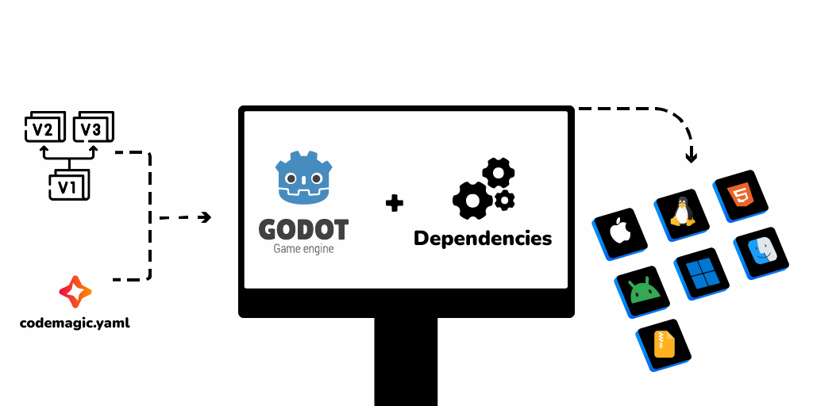

# Process overview

 

We'll install Godot and the export templates on a Codemagic build machine, along with the necessary dependencies.
The export will be automated using a script (`codemagic.yaml` file) that runs Godot from the command line. All export configurations not stored inside the `export_presets.cfg` file such as credentials will be retrieved using environment variables.

- Learn more about using Godot from the command line in the [Godot 4 command line tutorial](https://docs.godotengine.org/en/latest/tutorials/editor/command_line_tutorial.html) and the [Godot 3 command line tutorial](https://docs.godotengine.org/en/3.6/tutorials/editor/command_line_tutorial.html).
- To learn more about environment variables with Codemagic, check [Configuring Environment Variables](https://docs.codemagic.io/yaml-basic-configuration/configuring-environment-variables/)
- To learn more about what a `codemagic.yaml` file, take a lookt at [Using a codemagic.yaml file](https://docs.codemagic.io/yaml-basic-configuration/yaml-getting-started/).

**All the tutorials on this site use the free machine provided by Codemagic: an Apple Silicon M2 Mac mini. The free plan offers 500 minutes of use per month.**

- To learn more about the machine we'll be using, check out [Codemagic MacOS Specifications](https://docs.codemagic.io/specs-macos/xcode-16-2/)
- Checkout the list of available machines in [Machine instances](https://docs.codemagic.io/yaml-basic-configuration/yaml-getting-started/#instance-type)
- View [Codemagic pricing](https://codemagic.io/pricing/)

## Repository Configuration

**You'll need a repository hosting service** such as GitHub or GitLab to host your Godot project. You'll also need a `codemagic.yaml` file, which you'll place at the root of your repository. The `codemagic.yaml` file is required for workflow configuration with Codemagic.

- See this [Getting started guide](https://docs.codemagic.io/yaml-basic-configuration/yaml-getting-started/) to learn more about `codemagic.yaml` files.
- See also [Add applications](https://docs.codemagic.io/getting-started/adding-apps/) to link your repository to Codemagic.

## Project Configuration

**You won't need to install Godot's export templates on your local machine.** We'll only use the `export_presets.cfg` file generated by Godot, as this file contains your export configurations. **However, you'll need to configure your project as if you were exporting to your local machine.**

With Godot 4, confidential information such as certificate passwords are no longer stored in export presets. They are stored in a file named `export_credentials.cfg` present in the `.godot` folder. The `export_credentials.cfg` file should not normally be present in your repository for [security reasons](https://docs.godotengine.org/fr/latest/tutorials/export/exporting_projects.html#configuration-files). It is therefore not necessary to provide confidential informations in your export preset.  
These informations will not appear in the `export_preset.cfg` file. We will therefore retrieve them using environment variables on the compilation machine.

Depending on the workflow you wish to implement, you may need to define code/application signature information. The automation script will only access this information via environment variables. It will not read the actual contents of the variables, nor share them with third parties.

- To learn more about environment variables with Codemagic, check [Configuring Environment Variables](https://docs.codemagic.io/yaml-basic-configuration/configuring-environment-variables/)

## Dependencies

To export your project to platforms such as Android and iOS, Godot requires a number of external tools. Some of these tools are pre-installed on Codemagic's build machines. **You don't have to install them yourself**.  

These pre-installed tools include: [The Android SDK](https://developer.android.com/studio), [Gradle](https://gradle.org/), [Java](https://www.oracle.com/java/technologies/java-se-glance.html) and many others.  
Any missing tools or software will be automatically downloaded and installed on Codemagic's build machine.

- You can find the full list of tools and software installed on Codemagic machines in [Codemagic Integrations](https://codemagic.io/integrations/).
- Also, check the list of other tools installed on the machine we will be using throughout the tutorials in [Other pre-installed tools on macOS machines](https://docs.codemagic.io/specs-macos/xcode-16-2/#other-pre-installed-tools).