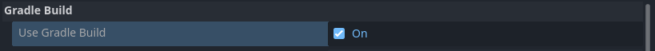
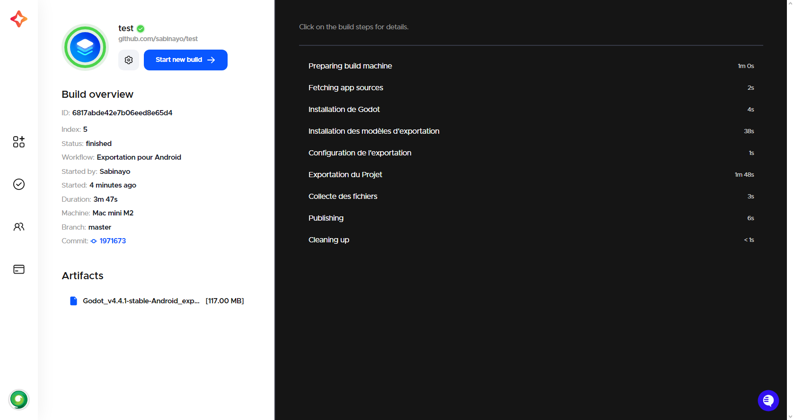

# Android workflow

<br>

This page presents a use case for using Codemagic to export a Godot project for Android. We will not cover writing rules, the composition, or the operation of a `codemagic.yaml` file.

- You can skip the tutorial and grab the yaml files in [Overview](#overview)
- To learn how `codemagic.yaml` files work, see [Creating codemagic.yaml](https://docs.codemagic.io/partials/quickstart/create-yaml-intro/).
- To better understand what we'll do here, take a look at [Workflow Configuration](./workflow-configuration.md) if its not already done.
- To learn how to configure your Godot project and repository, see [Process Overview](../process-overview.md).


Image by Codemagic, used under [CC BY-ND 4.0](https://creativecommons.org/licenses/by-nd/4.0/) license. See [gallery](https://codemagic.io/gallery/)


## Requirements

- A text editor
- Workflow configuration file. (See [Workflow Configuration](./workflow-configuration.md))

<br>

[Android SDK](https://developer.android.com/studio), [Gradle](https://gradle.org/), [Java](https://www.oracle.com/java/technologies/java-se-glance.html) and some other tools required for Godot Android export are pre-installed on all Codemagic machines. Any additional tools or software required will be downloaded to the build machine.

- You can find the full list of tools and software installed on Codemagic machines in [Codemagic Integrations](https://codemagic.io/integrations/).
- Also, check the list of other tools installed on the machine we will be using throughout the tutorials in [Other pre-installed tools on macOS machines](https://docs.codemagic.io/specs-macos/xcode-16-2/#other-pre-installed-tools).


As explained in [Project Configuration](../process-overview.md#project-configuration), you should configure your project for export as if you were exporting it on your local machine.

- Learn more about how to export a Godot project to Android with [Exporting for Android](https://docs.godotengine.org/en/stable/tutorials/export/exporting_for_android.html).


## Configuration

We need to create a new workflow in which we will define its own specific variables. Add the following code to your `codemagic.yaml` file, right after the `definitions` section:

```yaml
workflows:
  godot-android-workflow:
    name: Android Export
    max_build_duration: 120
    instance_type: mac_mini_m2
    working_directory: /Users/builder/Downloads
    
    environment:
      java: 17
      vars:
        <<: *godot_variables
        OUTPUT_FILE: test.apk
        EXPORT_PRESET: Android
```

Make sure your file now looks like this:

```yaml
definitions: ...

workflows: # [!code ++]
  godot-android-workflow: ... # [!code ++]
```

<br>

Do you remember the [Workflow Configuration](./workflow-configuration.md#minimal-configuration) file ?  
We use the `<<` and `*` operators to reuses its sections.  
- Learn more about reusable sections in a `codemagic.yaml` file with [Reusing sections](https://docs.codemagic.io/yaml-basic-configuration/yaml-getting-started/#reusing-sections)
- For more details on the reused variables, see [Minimal Configuration](./workflow-configuration.md#minimal-configuration)

Here a description of variables we defined:

| Variable        | Description
| --------------- | ----------------------------------------------------------------------- |
| OUTPUT_FILE     | The name of the exported file. Format: `<PROJECT_NAME>.<EXTENSION>`. The output file extension should match the one used by the Godot export process. See [Exporting from the command line](https://docs.godotengine.org/en/latest/tutorials/export/exporting_projects.html#exporting-from-the-command-line) |
| EXPORT_PRESET   | The name of the export preset that will be used to export your project. |

- To learn more about environment variables in a `codemagic.yaml` file see [Configuring Environment Variables](https://docs.codemagic.io/yaml-basic-configuration/configuring-environment-variables/)


## Note

**Android requires all APKs to be digitally signed with a certificate before being installed on a device or updated**. We will configure a `debug` and a `release` keystore to sign your APK or AAB file.

- To learn more about apk signing see [Apk Signing](https://source.android.com/docs/security/features/apksigning?hl=en)

Before we create a keystore, we need to complete our `codemagic.yaml' file. Add the following code to the `godot-android-workflow' section:

```yaml
scripts:
  - *install_godot
  - *install_godot_export_templates
  - *export_project
  - *gather_files

artifacts:
  - *zipped_export
```

Then, make sure your workflow now looks like this:

```yaml
workflows:
  godot-android-workflow:
    ...
    environment: ...
    scripts: ... # [!code ++]
    artifacts: ... # [!code ++]
```

And it's done! Now it's time to configure our keystores.  

**Keystore Dashboard**

| Keystore                            | Tutorials                                          |
| ----------------------------------- | -------------------------------------------------- |
| Use a self generated debug keystore | [Jump to tutorial](#self-generated-debug-keystore) |
| Use an existing Debug keystore      | [Jump to tutorial](#debug-keystore)                |
| Use an existing Release keystore    | [Jump to tutorial](#release-keystore)              |


## Self generated debug keystore

We'll create a debug key (`debug keystore`) on the build machine to sign your exported project. Once the process is complete, you will be able to download the debug key along with the exported project.

- Take a look at [Android: Generate Release/Debug Keystores](https://gist.github.com/henriquemenezes/70feb8fff20a19a65346e48786bedb8f) to learn how to create a `debug` and `release` keystore to sign your apk.

Add the following section to the `scripts` field of `flux-godot-android`, before the `&export_du_projet` section:

```yaml
- name: Export Configuration
  script: |
    export DEBUG_KEYSTORE_PATH=$BUILD_DIRECTORY/debug.keystore
    keytool -genkeypair -v \
    -keystore $DEBUG_KEYSTORE_PATH \
    -storepass android \
    -alias androiddebugkey \
    -keypass android \
    -keyalg RSA \
    -validity 10000 \
    -dname "CN=Android Debug, O=Android, C=US"

    echo "GODOT_ANDROID_KEYSTORE_DEBUG_PATH=$DEBUG_KEYSTORE_PATH" >> $CM_ENV
    echo "GODOT_ANDROID_KEYSTORE_DEBUG_USER=androiddebugkey" >> $CM_ENV
    echo "GODOT_ANDROID_KEYSTORE_DEBUG_PASSWORD=android" >> $CM_ENV
    echo "ANDROID_HOME=$ANDROID_SDK_ROOT" >> $CM_ENV
```

Then, make sure your `script` section now looks like this:

```yaml
scripts:
  ...
  - *install_godot_export_templates ...
  - name: Export Configuration ... # [!code ++]
  - *export_project ...
```

<br>

The new section is devided into 2 parts:

- First, we define a variable (`DEBUG_KEYSTORE_PATH`) to reference the path where the debug keystore will be located on this build machine. Then we create a `debug` keystore at this path with `androiddebugkey` as alias and `android` as password. Note that the keystore password and the key password currently have to be the same. See this [article](https://docs.godotengine.org/en/stable/tutorials/export/exporting_for_android.html#exporting-for-google-play-store) and scroll down a bit.
Learn how to create a `debug` and `release` keystore to sign your apk [here](https://gist.github.com/henriquemenezes/70feb8fff20a19a65346e48786bedb8f)

- Second, we register Godot Android export environment variable to the build machine global environment variables to allow Godot to use them. We also register the Android SDK path, but with the name `ANDROID_HOME`, as Godot 4 expects them to be there if they are not specified in the editor settings.  
See [Android Environment Variables](https://docs.godotengine.org/en/stable/tutorials/export/exporting_for_android.html#environment-variables) for more informations about registered variables.  
We didn't specify the Java path because Godot will find it automatically with the `JAVA_HOME` environment variable already defined in all Codemagic build machine.  
Learn more about built-in environment variables in Codemagic [here](https://docs.codemagic.io/yaml-basic-configuration/environment-variables/)

<br>

Nice !, all that's left is to launch a new build to export your project. To do this, you can use Codemagic's interface, or events affecting your repository such as push.

- See [Build Automatically](https://docs.codemagic.io/yaml-running-builds/starting-builds-automatically/) to automate the execution of your Codemagic configuration.
- See also [Build Notifications](https://docs.codemagic.io/yaml-notification/email/) to get a notification informing you of the result of your build.

You can now <a href="/codemagic-godot-pipeline/templates/en/android-workflow-auto-debug-signed.yaml" download="codemagic.yaml">Download the configuration file</a> to export your project with an automatically generated debug key.

If you have a debug keystore and want to use it instead of generating a new keystore on each build, see [Debug Keystore](#debug-keystore). Otherwise, if you want to sign your apk with a release keystore, see [Release Keystore](#release-keystore)  


## Debug keystore

We will use the following variable groups and variables to retrieve your `debug` keystore and sign your Godot project. These variables will be used by Godot to sign your APK.  
- See [Godot Editor Android environment variables](https://docs.godotengine.org/en/stable/tutorials/export/exporting_for_android.html#environment-variables) for more information on some of the variables used.

| Variable name                       |	Variable value                               |	Group               |
| ----------------------------------- | -------------------------------------------- | -------------------- |
| GODOT_ANDROID_KEYSTORE_DEBUG	      | Your debug keystore - [base64](https://en.wikipedia.org/wiki/Base64) encoded | android_credentials |
| GODOT_ANDROID_KEYSTORE_DEBUG_PASSWORD | Contain your key alias password.<br> The keystore password and the key password currently have to be the same. See [Exporting for GooglePlay](https://docs.godotengine.org/en/stable/tutorials/export/exporting_for_android.html#exporting-for-google-play-store) | android_credentials |
| GODOT_ANDROID_KEYSTORE_DEBUG_USER   | Contain your key alias                       | android_credentials |

Add these variables in the Codemagic interface (either as Application or as Team variables), make sure to click Secure to make sensitive data encrypted.
- Learn how to store these variables using the Codemagic interface by watching this video: 


<div style="position: relative; padding-bottom: 56.25%; height: 0; overflow: hidden;">
    <iframe width="897" height="504" src="https://www.youtube.com/embed/7pAxVFe66hI?start=37" title="Environment variables and groups with codemagic.yaml" frameborder="0" allow="accelerometer; autoplay; clipboard-write; encrypted-media; gyroscope; picture-in-picture; web-share" referrerpolicy="strict-
origin-when-cross-origin" style="position: absolute; top:0; left: 0; width: 100%; height: 100%;" allowfullscreen></iframe>
</div>


- To learn more about environment variables in a `codemagic.yaml` file see [Configuring Environment Variables](https://docs.codemagic.io/yaml-basic-configuration/configuring-environment-variables/)
- To learn more about storing binary files with Codemagic, see [Storing Binary files](https://docs.codemagic.io/yaml-basic-configuration/configuring-environment-variables/#storing-binary-files)
- If you don't own a PC, you can use a website like [base64.guru](https://base64.guru/converter/encode/text) or [base64encode](https://www.base64encode.org/) to encode your `keystore` file to base64.

<br>

To use the defined variables in our workflow, we have to add their group(`android_credentials`) to our configuration file(`codemagic.yaml` file). To do so, add the following code to the `environment` section of `godot-android-workflow`:

```yaml
groups:
  - android_credentials
```

Then, make sure your workflow now looks like this:

```yaml
godot-android-workflow:
  ...
  environment:
    groups: # [!code ++]
      - android_credentials # [!code ++]
    ...
```

:::tip
If you already have a `groups` section in your script, simply add the `- android_credentials` line to it.
:::

<br>

Now we have to do the last step: Configure our variables to let Godot find and use them. In the `scripts` section, before the `export_project` field, add the following section:

```yaml
- name: Export Configuration
  script: |
    export DEBUG_KEYSTORE_PATH=/tmp/debug.keystore 
    echo $GODOT_ANDROID_KEYSTORE_DEBUG | base64 --decode > $DEBUG_KEYSTORE_PATH

    echo "GODOT_ANDROID_KEYSTORE_DEBUG_PATH=$DEBUG_KEYSTORE_PATH" >> $CM_ENV
    echo "ANDROID_HOME=$ANDROID_SDK_ROOT" >> $CM_ENV
```

Then, make sure your `scripts` section now looks like this:

```yaml
scripts:
  ...
  - *install_godot_export_templates ...
  - name: Export Configuration ... # [!code ++]
  - *export_project ...
```

<br>

The new section is devided into 2 parts:

- First, we define a variable (`KEYSTORE_PATH`) to reference the path where the `debug` keystore will be located on this build machine. Then we decode your base64 encoded `debug` keystore at this path. (**Your keystore is stored in the temporary folder of the build machine.**)

- Second, we register Godot Android environment variables to the build machine global environment variables to allow Godot to use them. We also register the Android SDK path, but with the name `ANDROID_HOME`, as Godot expects them to be there if they are not specified in the Editor settings.  
We didn't specify the Java path because Godot will find it automatically with the `JAVA_HOME` environment variable already defined in all Codemagic build machine.

<br>

Nice !, all that's left is to launch a new build to export your project. To do this, you can use Codemagic's interface, or events affecting your repository such as push.

- See [Build Automatically](https://docs.codemagic.io/yaml-running-builds/starting-builds-automatically/) to automate the execution of your Codemagic configuration.
- See also [Build Notifications](https://docs.codemagic.io/yaml-notification/email/) to get a notification informing you of the result of your build.


You can now <a href="/codemagic-godot-pipeline/templates/en/android-workflow-debug-signed.yaml" download="codemagic.yaml">Download the configuration file</a> to export a debug signed Godot Android project with a Codemagic build machine.


## Release keystore

The process is very similar to the one described in [Debug Keystore](#debug-keystore), so we won't go over it again in detail.  
Here are the changes you need to make:

<br>

1. Environment variables

We will use the following variable groups and variables to retrieve your `release` keystore and sign your Godot project.

| Variable name                         |	Variable value                               |	Group               |
| ------------------------------------- | -------------------------------------------- | -------------------- |
| GODOT_ANDROID_KEYSTORE_RELEASE	      | Your keystore - `base64 encoded` | android_credentials |
| GODOT_ANDROID_KEYSTORE_RELEASE_USER   | Contain your key alias password.<br> Note that the keystore password and the key password currently have to be the same for Godot. See [this](https://docs.godotengine.org/en/stable/tutorials/export/exporting_for_android.html#exporting-for-google-play-store) and scroll down a bit | android_credentials |
| GODOT_ANDROID_KEYSTORE_RELEASE_USER   | Contain your key alias                       | android_credentials |

<br>

2. Export configuration script

In your `Export Configuration` script, add the following code:

```yaml
export RELEASE_KEYSTORE_PATH=/tmp/release.keystore 
echo $GODOT_ANDROID_KEYSTORE_RELEASE | base64 --decode > $RELEASE_KEYSTORE_PATH

echo "GODOT_ANDROID_KEYSTORE_RELEASE_PATH=$RELEASE_KEYSTORE_PATH" >> $CM_ENV
echo "ANDROID_HOME=$ANDROID_SDK_ROOT" >> $CM_ENV
```

This step is similar to how we used variables to retrieve your debug keystore except here, we use the newly defined variables for your release keystore.

<br>

Nice !, all that's left is to launch a new build to export your project. To do this, you can use Codemagic's interface, or events affecting your repository such as push.

- See [Build Automatically](https://docs.codemagic.io/yaml-running-builds/starting-builds-automatically/) to automate the execution of your Codemagic configuration.
- See also [Build Notifications](https://docs.codemagic.io/yaml-notification/email/) to get a notification informing you of the result of your build.


You can now <a href="/codemagic-godot-pipeline/templates/en/android-workflow-release-signed.yaml" download="codemagic.yaml">Download the configuration file</a> to export a release signed Godot Android project with a Codemagic build machine.


## Gradle builds

<h3>Part 1</h3>

To use gradle build on the build machine make sure to enable gradle build in your local machine.


You should keep the default Gradle build directory (`res://android`), as the configuration we'll use relies on this path.


**You don't need to install the Android build template on your local machine**. It will be automatically handled on the Codemagic build machine.  
However, **if your project uses Android libraries**, make sure to commit the `android/plugins` directory to your repository so your libraries will be available on the build machine.  
If you don't commit them, you'll need to write a script that downloads and installs them into the correct directory during the build process.

<br>

Sometimes, when using a Gradle build, you may need to configure your `AndroidManifest.xml` file, especially when integrating Android modules like AdMob into your Godot project.

- To learn more about android manifest file, see [Android Manifest Introduction](https://developer.android.com/guide/topics/manifest/manifest-intro)

To apply your custom XML configuration on the build machine, we wil use the following environment variable:

:::tip
If you don't plan to use a custom `AndroidManifest.xml` file, you don't need to define this variable.
:::

| Variable name                         |	Variable value                               |	Group               |
| ------------------------------------- | -------------------------------------------- | -------------------- |
| GODOT_ANDROID_MANIFEST	              | Your manifest - [base64](https://en.wikipedia.org/wiki/Base64) encoded | android              |

Add this variable in the Codemagic interface (either as Application or as Team variables), make sure to click Secure to make the data encrypted.
- Learn how to store this variable using the Codemagic interface by watching this video: 

<div style="position: relative; padding-bottom: 56.25%; height: 0; overflow: hidden;">
    <iframe width="897" height="504" src="https://www.youtube.com/embed/7pAxVFe66hI?start=37" title="Environment variables and groups with codemagic.yaml" frameborder="0" allow="accelerometer; autoplay; clipboard-write; encrypted-media; gyroscope; picture-in-picture; web-share" referrerpolicy="strict-
origin-when-cross-origin" style="position: absolute; top:0; left: 0; width: 100%; height: 100%;" allowfullscreen></iframe>
</div>

- To learn more about environment variables in a `codemagic.yaml` file see [Configuring Environment Variables](https://docs.codemagic.io/yaml-basic-configuration/configuring-environment-variables/)
- To learn more about storing binary files with Codemagic, see [Storing Binary files](https://docs.codemagic.io/yaml-basic-configuration/configuring-environment-variables/#storing-binary-files)
- If you don't own a PC, you can use a website like [base64.guru](https://base64.guru/converter/encode/text) or [base64encode](https://www.base64encode.org/) to encode your `keystore` file to base64.

To add the variable group in your workflow, open your `codemagic.yaml` file, locate the `envrironment` section and inside the `godot-android-workflow` section, paste the following section:

```yaml
groups:
  - android
```

Then, make sure your workflow now looks like this:

```yaml
workflows:
  godot-android-workflow:
    ...
    environment:
      groups: # [!code ++]
        - android # [!code ++]
      ...
```

:::tip
If you already have a `groups` section in your script, simply add the `- android_credentials` line to it.
:::

<br>

Before installing an Android build template in your project, we need to prepare our environment. First, we need to determine the exact location of Godot's export templates on the build machine. We'll also need to retrieve the version of the export templates.  
To do this, we'll update the `&install_godot_export_template` section by defining global environment variables to reference the values we're looking for.

Locate the `&install_godot_export_template` section inside the `scripts` field of the `definitions` section at the top of your `codemagic.yaml` file. Add it the following lines:

```yaml
echo "GODOT_EXPORT_TEMPLATES_DIRECTORY=$TEMPLATES_PATH" >> $CM_ENV
echo "GODOT_EXPORT_TEMPLATES_VERSION=$TEMPLATES_VERSION" >> $CM_ENV
```

Then make sure your `&install_godot_export_template` section now looks like this:

```yaml
export TEMPLATES_PATH=${DOSSIER_TEMPLATES}/$TEMPLATES_VERSION
mkdir -p "$TEMPLATES_PATH" && mv templates/* "$TEMPLATES_PATH"
rmdir templates
echo "GODOT_EXPORT_TEMPLATES_DIRECTORY=$TEMPLATES_PATH" >> $CM_ENV # [!code ++]
echo "GODOT_EXPORT_TEMPLATES_VERSION=$TEMPLATES_VERSION" >> $CM_ENV # [!code ++]
```

And it's done, we registered new global environment variables on the build machine.  
- `GODOT_EXPORT_TEMPLATES_DIRECTORY` will allow us to locate where the export templates are stored on this build machine(e.g. `~/Library/Application Support/Godot/export_templates/4.4.stable`).
- `GODOT_EXPORT_TEMPLATES_VERSION` stores the version of your export template. This version will be used by Godot during the build. (e.g. `4.4.1-stable`)

<br>

<h3>Part 2</h3>

Now, we need to install the Android build template on this build machine. Add the following section to the `scripts` section of `godot-android-workflow` before the `&export_project` section:

```yaml
- name: Export Configuration
  script: |
    cd $PROJECT_PATH

    mkdir -p android/build
    unzip -o -d android/build "$GODOT_EXPORT_TEMPLATES_DIRECTORY/android_source.zip"
    touch android/build/.gdignore
    echo "$GODOT_EXPORT_TEMPLATES_VERSION" > android/.build_version
    echo $GODOT_ANDROID_MANIFEST | base64 --decode > android/build/AndroidManifest.xml
```

Then, make sure your `scripts` section now looks like this:

```yaml
scripts:
  ...
  - *install_godot_export_templates ...
  - name: Export Configuration ... # [!code ++]
  - *export_project ..
```
:::tip
If the `Export Configuration` section is already present in your file, simply merge its `script` content into the existing `script` section of your file.
:::

<br>

The new script install the Android build template in your project.  
Plus the script replace the default `AndroidManifest.xml` file with your custom `AndroidManifest.xml` file. If you have not defined the `GODOT_ANDROID_MANIFEST` variable, simply remove the last line of the script.

<br>

And it's done, we've successfully set up your project for Gradle Android builds on this build machine. We did it by installing the Android source template into the `android/build` folder.

Nice !, all that's left is to launch a new build to export your project. To do this, you can use Codemagic's interface, or events affecting your repository such as push.

- See [Build Automatically](https://docs.codemagic.io/yaml-running-builds/starting-builds-automatically/) to automate the execution of your Codemagic configuration.
- See also [Build Notifications](https://docs.codemagic.io/yaml-notification/email/) to get a notification informing you of the result of your build.


You can now <a href="/codemagic-godot-pipeline/templates/en/android-workflow-gradle-build.yaml" download="codemagic.yaml">Download the configuration file</a> to export a Godot Android project with a Codemagic build machine using Gradle Android build.


## Overview

Summary of what we've covered on this page using a Codemagic build machine:
- Exported a Godot project to Android using an automatically generated debug keystore
- Exported a Godot project to Android using your own debug keystore
- Exported a Godot project to Android using your own release keystore
- Exported a Godot project to Android using gradle Android build


**Download Table**

| File      | Content     | Tutorials |
| --------- | ----------- | --------- |
| <a href="/codemagic-godot-pipeline/templates/en/android/android-workflow-auto-debug-signed.yaml" download="codemagic.yaml">Download</a> | Self generated debug keystore configuration | [See tutorial](#self-generated-debug-keystore) |
| <a href="/codemagic-godot-pipeline/templates/en/android/android-workflow-debug-signed.yaml" download="codemagic.yaml">Download</a>      | Debug keystore configuration  | [See tutorial](#debug-keystore) |
| <a href="/codemagic-godot-pipeline/templates/en/android/android-workflow-release-signed.yaml" download="codemagic.yaml">Download</a>    | Release keystore configuration           | [See tutorial](#release-keystore) |
| <a href="/codemagic-godot-pipeline/templates/en/android/android-workflow.yaml" download="codemagic.yaml">Download</a>                   | Debug and Release keystore configuration | [See tutorial](#debug-keystore) |
| <a href="/codemagic-godot-pipeline/templates/en/android/android-workflow-gradle-build.yaml" download="codemagic.yaml">Download</a> | Gradle Android build configuration | [See tutorial](#gradle-builds) |

:::warning Caution !!!
To use these scripts effectively, please refer to the corresponding tutorials.  
The scripts on this site are general and will suit most use cases. However, specific adjustments to your project may be necessary.  
Please note that some scripts depend on environment variables which must be set via the Codemagic interface. Without them, some scripts will not work.
:::

<br>

Optional resources to help refine your configuration:
- [Caching](https://docs.codemagic.io/yaml-notification/email/)
- [Build automatically](https://docs.codemagic.io/yaml-running-builds/starting-builds-automatically/)
- [Build notifications](https://docs.codemagic.io/yaml-notification/email/)
- [Publishing](https://docs.codemagic.io/yaml-publishing/google-play/)
- [Using custom export templates](./using-custom-export-templates.md)




## Getting help and support

If you have a technical question or need help with some particular issue, you can get help in the [GitHub Discussions community](https://github.com/sabinayo/codemagic-godot-pipeline/discussions).