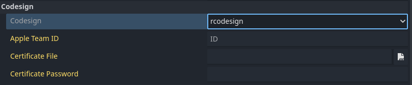
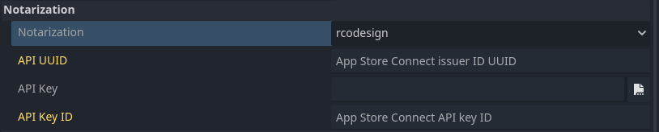

# macOS workflow

<br>

This page presents a use case for using Codemagic to export a Godot project for macOS. We will not cover writing rules, the composition, or the operation of a `codemagic.yaml` file.

- You can skip the tutorial and grab the yaml files in [Overview](#overview)
- To learn how `codemagic.yaml` files work, see [Creating codemagic.yaml](https://docs.codemagic.io/partials/quickstart/create-yaml-intro/).
- To better understand what we'll do here, take a look at [Workflow Configuration](./workflow-configuration.md) if its not already done.
- To learn how to configure your Godot project and repository, see [Process Overview](../process-overview.md).


Image by Codemagic, used under [CC BY-ND 4.0](https://creativecommons.org/licenses/by-nd/4.0/) license. See [gallery](https://codemagic.io/gallery/)


## Requirements

- A text editor
- Workflow Configuration file. (See [Workflow Configuration](./workflow-configuration.md))

As explained in [Project Configuration](../process-overview.md#project-configuration), you should configure your project for export as if you were exporting it on your local machine.

- Learn more about how to export a Godot project to Android with [Exporting for macOS](https://docs.godotengine.org/en/stable/tutorials/export/exporting_for_macos.html).  


## Configuration

We need to create a new workflow in which we will define its own specific variables. Add the following code to your `codemagic.yaml` file, right after the `definitions` section:

```yaml
workflows:
  godot-macos-workflow:
    name: MacOS Export
    max_build_duration: 120
    instance_type: mac_mini_m2
    working_directory: /Users/builder/Downloads
    
    environment:
      vars:
        <<: *godot_variables
        OUTPUT_FILE: test.zip
        EXPORT_PRESET: macOS
```

Make sure your file now looks like this:

```yaml
definitions: ...

workflows: # [!code ++]
  godot-macos-workflow: ... # [!code ++]
```

<br>

Do you remember the [Workflow Configuration](./workflow-configuration.md#minimal-configuration) file ?  
We use the `<<` and `*` operators to reuses its sections.  
- Learn more about reusable sections in a `codemagic.yaml` file with [Reusing sections](https://docs.codemagic.io/yaml-basic-configuration/yaml-getting-started/#reusing-sections)
- For more details on the reused variables, see [Minimal Configuration](./workflow-configuration.md#minimal-configuration)

Here a description of variables we defined:

| Variable        | Description
| --------------- | ----------------------------------------------------------------------- |
| OUTPUT_FILE     | The name of the exported file. Format: `<PROJECT_NAME>.<EXTENSION>`. The output file extension should match the one used by the Godot export process. See [Exporting from the command line](https://docs.godotengine.org/en/latest/tutorials/export/exporting_projects.html#exporting-from-the-command-line) |
| EXPORT_PRESET   | The name of the export preset that will be used to export your project. |

- To learn more about environment variables in a `codemagic.yaml` file see [Configuring Environment Variables](https://docs.codemagic.io/yaml-basic-configuration/configuring-environment-variables/)

<br>

Now we need to configure the export process. Add the following code to your `godot-macos-workflow` section:

```yaml
scripts:
  - *install_godot
  - *install_godot_export_templates
  - *export_project
  - *gather_files

artifacts:
  - *zipped_export
```

Then make sure your workflow now looks like this:

```yaml
workflows:
  godot-macos-desktop-workflow:
    ...
    environment: ...
    scripts: ... # [!code ++]
    artifacts: ... # [!code ++]
```

And that's it, all that's left is to configure your credentials to export your project. If you don't plan to sign your exported project, you can simply start the build. Your project will be available for download in .zip format once the process is complete.
To start a new build, you can use Codemagic's interface, or events affecting your repository such as push.

- See [Build Automatically](https://docs.codemagic.io/yaml-running-builds/starting-builds-automatically/) to automate the execution of your Codemagic configuration.
- See also [Build Notifications](https://docs.codemagic.io/yaml-notification/email/) to get a notification informing you of the result of your build.


## Configure rcodesign

<h3>Part 1</h3>

To use `rcodesign` on the build machine, make sure to enable `rcodesign` in Godot with your local machine.  
You don't need to fullfill the required informations because they won't be saved in your `export_presets.cfg` file. Instead, these informations will be saved to [export_credentials](https://docs.godotengine.org/en/latest/tutorials/export/exporting_projects.html#configuration-files) which should never be commited for security reasons.  


- Learn more about rcodesign in Godot with [Signing Options](https://docs.godotengine.org/en/latest/tutorials/export/exporting_for_macos.html#signing-options)

<br>

The following variable groups and variables will be used to retrieve codesign informations that Godot does not store in the `export_presets.cfg` file.  
- To learn more about some of these variables, see [Godot macOS Environment variables](https://docs.godotengine.org/en/stable/tutorials/export/exporting_for_macos.html#environment-variables) and [EditorExportPlatformMacOS](https://docs.godotengine.org/en/latest/classes/class_editorexportplatformmacos.html#class-editorexportplatformmacos)

| Variable name                                  |	Variable value                                                              |	Group             |
| ---------------------------------------------- | ---------------------------------------------------------------------------- | ----------------- |
| CERTIFICATE_FILE_NAME  	 | The name of your certificate with the extension.                             | apple_credentials |
| GODOT_MACOS_CODESIGN_CERTIFICATE_FILE	         | Your certificate - [base64](https://en.wikipedia.org/wiki/Base64) encoded.                             | apple_credentials |
| GODOT_MACOS_CODESIGN_CERTIFICATE_PASSWORD      | Password for the certificate file.                                           | apple_credentials |
| PROVISIONING_PROFILE_NAME | The name of your certificate with the extension.                             | apple_credentials |
| GODOT_MACOS_CODESIGN_PROVISIONING_PROFILE      | Provisioning profile file - [base64](https://en.wikipedia.org/wiki/Base64) encoded.                                | apple_credentials |

Add these variables in the Codemagic interface (either as Application or as Team variables), make sure to click Secure to make sensitive data encrypted.
- Learn how to store these variables using the Codemagic interface by watching this video: 

<div style="position: relative; padding-bottom: 56.25%; height: 0; overflow: hidden;">
    <iframe width="897" height="504" src="https://www.youtube.com/embed/7pAxVFe66hI?start=37" title="Environment variables and groups with codemagic.yaml" frameborder="0" allow="accelerometer; autoplay; clipboard-write; encrypted-media; gyroscope; picture-in-picture; web-share" referrerpolicy="strict-
origin-when-cross-origin" style="position: absolute; top:0; left: 0; width: 100%; height: 100%;" allowfullscreen></iframe>
</div>


- To learn more about environment variables in a `codemagic.yaml` file see [Configuring Environment Variables](https://docs.codemagic.io/yaml-basic-configuration/configuring-environment-variables/)
- To learn more about storing binary files with Codemagic, see [Storing Binary files](https://docs.codemagic.io/yaml-basic-configuration/configuring-environment-variables/#storing-binary-files)
- If you don't own a PC, you can use a website like [base64.guru](https://base64.guru/converter/encode/text) or [base64encode](https://www.base64encode.org/) to encode your `keystore` file to base64.

<br>

To use the defined variables in our workflow, we have to add their group(`apple_credentials`) to our configuration file(`codemagic.yaml` file). To do so, add the following code to the `environment` section of `godot-macos-workflow`:

```yaml
groups:
  - apple_credentials
```

Then make sure your workflow now looks like this:

```yaml
godot-macos-workflow:
  ...
  environment:
    groups: # [!code ++]
      - apple_credentials # [!code ++]
    ...
```

:::tip
If you already have a `groups` section in your script, simply add the `- apple_credentials` line to it.
:::

<br>

We now need to configure our variables so that Godot can find and use them. We'll create a new script before the export script (`*export_project`). Add the following lines to the `scripts` section of `godot-macos-workflow`:

```yaml
- name: Export Configuration
  script: |
    export CREDENTIAL_PATH=/tmp/$CERTIFICATE_FILE_NAME
    echo $GODOT_MACOS_CODESIGN_CERTIFICATE_FILE | base64 --decode > $CREDENTIAL_PATH
    echo "GODOT_MACOS_CODESIGN_CERTIFICATE_FILE=$CREDENTIAL_PATH" >> $CM_ENV

    export CREDENTIAL_PATH=/tmp/$PROVISIONING_PROFILE_NAME
    echo $GODOT_MACOS_CODESIGN_PROVISIONING_PROFILE | base64 --decode > $CREDENTIAL_PATH
    echo "GODOT_MACOS_CODESIGN_PROVISIONING_PROFILE=$CREDENTIAL_PATH" >> $CM_ENV
```

Then, make sure your `scripts` section now looks like this:

```yaml
scripts:
  ...
  - *install_godot_export_templates ...
  - name: Export Configuration ... # [!code ++]
  - *export_project ...
```

<br>

What have we done?

For your provisioning profile and certificate file:
- First, we define a variable (`CREDENTIAL_PATH`) to specify the path where your encoded file will be stored on the build machine. Then, we decode your encoded file and save it to that location.
- Next, we update the variable holding the encoded file to point to the decoded file's path, since Godot expects a file path rather than raw encoded data.
- Finally, we register the variable now holding the decoded file path as global environment variables on the build machine, so Godot can access and use it during the build.

<br>

<h3>Part 2</h3>

Now we need to install rcodesign on the build machine. To speed up the process, we'll use a prebuild binary.
- rcodesign binaries can be found on the [GitHub Releases page](https://github.com/indygreg/apple-platform-rs/releases/).
- If your build machine is not a MacOS, check out [PyOxidizer](https://github.com/indygreg/PyOxidizer/releases) instead.

<br>

Inside your `Export Configuration` section, add the following code:

```yaml
export FILE=apple-codesign-0.29.0-macos-universal.tar.gz
export RCODESIGN_URL=https://github.com/indygreg/apple-platform-rs/releases/download/apple-codesign%2F0.29.0/$FILE
curl -L "$RCODESIGN_URL" -o "$FILE" && unzip "$FILE"
rm $FILE
export RCODESIGN_PATH=$(pwd)/$FILE
export SETTINGS_VERSION=$(echo "$GODOT_VERSION" | awk -F'[.-]' '{
    if ($1 == 3) print "3";
    else if ($2 == 0) print $1;
    else print $1"."$2
}')
export GODOT_SETTINGS=${EDITOR_DATA_DIR}/editor_settings-${SETTINGS_VERSION}.tres
cat <<EOF > "$GODOT_SETTINGS"
[gd_resource type="EditorSettings"]

[resource]
export/macos/rcodesign = "$RCODESIGN_PATH"
EOF
```

This script downloads the rcodesign binary and install it on the build machine, then stores the binary path in a variable. At last, the script register the binary path in the Godot settings by creating the settings file where Godot expect it to be.

To create the Godot settings file, we extract the correct file version (`4.<MINOR>.tres` for Godot 4 or `3.tres` for Godot 3) by processing the `GODOT_VERSION` variable using text manipulation tools like [awk](https://www.geeksforgeeks.org/awk-command-unixlinux-examples/).  

- To learn more about text processing with awk, see [Awk command Unix/Linux with examples](https://www.geeksforgeeks.org/awk-command-unixlinux-examples/)

And it's done, you can now use rcodesign ! All that's left is to launch a new build to export your project. To do this, you can use Codemagic's interface, or events affecting your repository such as push.

- See [Build Automatically](https://docs.codemagic.io/yaml-running-builds/starting-builds-automatically/) to automate the execution of your Codemagic configuration.
- See also [Build Notifications](https://docs.codemagic.io/yaml-notification/email/) to get a notification informing you of the result of your build.


You can now <a href="/codemagic-godot-pipeline/templates/en/macos/macos-workflow-rcodesign.yaml" download="codemagic.yaml">Download the configuration file</a> to export your macOS project with rcodesign configured on a Codemagic build machine.


## Configure notarization

**Since notarization requires rcodesign** to be configured, be sure to follow the [Configure rcodesign](#configure-rcodesign) step before proceeding.

To use `Notarization` on the build machine, make sure to enable [Notarisation](https://docs.godotengine.org/fr/4.x/classes/class_editorexportplatformmacos.html#class-editorexportplatformmacos-property-notarization-notarization) in Godot with your local machine.  
You don't need to fullfill the required informations because they won't be saved in your `export_presets.cfg` file. Instead, these informations will be saved to [export_credentials](https://docs.godotengine.org/en/latest/tutorials/export/exporting_projects.html#configuration-files) which should never be commited for security reasons.  


- To learn more about notarization in Godot, see [Notarization Options](https://docs.godotengine.org/en/latest/tutorials/export/exporting_for_macos.html#notarization-options)


We will use the following variable groups and variables to retrieve your notarization informations.  
- See [Godot macOS Environment variables](https://docs.godotengine.org/en/stable/tutorials/export/exporting_for_macos.html#environment-variables) and [EditorExportPlatformMacOS](https://docs.godotengine.org/en/latest/classes/class_editorexportplatformmacos.html#class-editorexportplatformmacos) to learn more about some of these variables.

| Variable name                              |	Variable value                                                              |	Group             |
| ------------------------------------------ | ---------------------------------------------------------------------------- | ----------------- |
| NOTARIZATION_API_KEY_NAME      | The name(plus extension) of your Apple App Store Connect API issuer key file | apple_credentials |
| GODOT_MACOS_NOTARIZATION_API_KEY	         | Apple App Store Connect API issuer key file.`base64-encoded`.                | apple_credentials |
| GODOT_MACOS_NOTARIZATION_API_UUID	         | Apple App Store Connect API issuer UUID.                                     | apple_credentials |
| GODOT_MACOS_NOTARIZATION_API_KEY_ID        | Apple App Store Connect API issuer key ID.                                   | apple_credentials |
| GODOT_MACOS_NOTARIZATION_APPLE_ID_NAME     | Apple ID account name (email address).                                       | apple_credentials |
| GODOT_MACOS_NOTARIZATION_APPLE_ID_PASSWORD | Apple ID app-specific password.                                              | apple_credentials |

Add these variables in the Codemagic interface (either as Application or as Team variables), make sure to click Secure to make sensitive data encrypted.
- Learn how to store these variables using the Codemagic interface by watching this video: 

<div style="position: relative; padding-bottom: 56.25%; height: 0; overflow: hidden;">
    <iframe width="897" height="504" src="https://www.youtube.com/embed/7pAxVFe66hI?start=37" title="Environment variables and groups with codemagic.yaml" frameborder="0" allow="accelerometer; autoplay; clipboard-write; encrypted-media; gyroscope; picture-in-picture; web-share" referrerpolicy="strict-
origin-when-cross-origin" style="position: absolute; top:0; left: 0; width: 100%; height: 100%;" allowfullscreen></iframe>
</div>


- To learn more about environment variables in a `codemagic.yaml` file see [Configuring Environment Variables](https://docs.codemagic.io/yaml-basic-configuration/configuring-environment-variables/)
- To learn more about storing binary files with Codemagic, see [Storing Binary files](https://docs.codemagic.io/yaml-basic-configuration/configuring-environment-variables/#storing-binary-files)
- If you don't own a PC, you can use a website like [base64.guru](https://base64.guru/converter/encode/text) or [base64encode](https://www.base64encode.org/) to encode your `keystore` file to base64.

<br>

Now we have to configure Godot environment variables in order to use your informations. Add the following code to your `Export Configuration` section:

```yaml
export API_FILE_PATH=/tmp/$NOTARIZATION_API_KEY_NAME
echo $GODOT_MACOS_NOTARIZATION_API_KEY | base64 --decode > $API_FILE_PATH
echo "GODOT_MACOS_NOTARIZATION_API_KEY=$API_FILE_PATH" >> $CM_ENV
```

Then, make sure your workflow now looks like this:

```yaml
scripts:
  ...
  - *install_godot_export_templates ...
  - name: Export Configuration
    ...
    EOF
    export API_FILE_PATH=/tmp/$NOTARIZATION_API_KEY_NAME # [!code ++]
    ... # [!code ++]
  - *export_project ...
```

What have we done?

- First, we define a variable (`API_FILE_PATH`) to specify the path where your encoded Apple App Store Connect API issuer key file will be stored on the build machine. Then, we decode your encoded file and save it to that location.
- Next, we update the variable holding the encoded file to point to the decoded file's path, since Godot expects a file path rather than raw encoded data.
- Finally, we register the variable now holding the decoded file path as global environment variables on the build machine, so Godot can access and use it during the build.

<br>

And it's done ! You can now uses Notarization with your build ! Now all we need to do is to export the project. To do this, you can use Codemagic's interface, or events affecting your repository such as push.

- See [Build Automatically](https://docs.codemagic.io/yaml-running-builds/starting-builds-automatically/) to automate the execution of your Codemagic configuration.
- See also [Build Notifications](https://docs.codemagic.io/yaml-notification/email/) to get a notification informing you of the result of your build.


You can now <a href="/codemagic-godot-pipeline/templates/en/macos/macos-workflow-notarization.yaml" download="codemagic.yaml">Download the configuration file</a> to export your Godot macOS project using `notarization` on a Codemagic build machine.


## Overview

Summary of what we've covered on this page using a Codemagic build machine:
- Exported a Godot project to MacOS
- Exported a Godot project to MacOS with rcodesign
- Exported a Godot project to MacOS with notarization


**Download table**

| File               | Content              | Tutorials        |
| ------------------ | -------------------- | ---------------- |
| <a href="/codemagic-godot-pipeline/templates/en/macos/macos-workflow-unsigned.yaml" download="codemagic.yaml">Download</a>     | Unsigned macOS export with your build. | [Jump to tutorial](#configuration) |
| <a href="/codemagic-godot-pipeline/templates/en/macos/macos-workflow-rcodesign.yaml" download="codemagic.yaml">Download</a>    | rcodesign Configuration for Godot macOS Export | [Jump to tutorial](#configure-rcodesign) |
| <a href="/codemagic-godot-pipeline/templates/en/macos/macos-workflow-notarization.yaml" download="codemagic.yaml">Download</a> | Notarization Configuration for Godot macOS Export | [Jump to tutorial](#configure-notarization) |

:::warning Caution !!!
To use these scripts effectively, please refer to the corresponding tutorials.  
The scripts on this site are general and will fit most use cases. However, specific adjustments to your project may be necessary.  
Please note that some scripts depend on environment variables which must be set via the Codemagic interface. Without them, some scripts will not work.
:::

Optional resources to help refine your configuration:
- [Caching](https://docs.codemagic.io/yaml-notification/email/)
- [Build automatically](https://docs.codemagic.io/yaml-running-builds/starting-builds-automatically/)
- [Build notifications](https://docs.codemagic.io/yaml-notification/email/)
- [Publishing](https://docs.codemagic.io/yaml-publishing/google-play/)
- [Using custom export templates](./using-custom-export-templates.md)


## Getting help and support

If you have a technical question or need help with some particular issue, you can get help in the [GitHub Discussions community](https://github.com/sabinayo/codemagic-godot-pipeline/discussions).