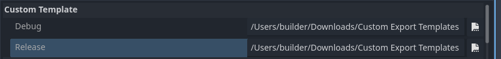

# Using custom export templates

<br>

This page presents a Codemagic use case for exporting a Godot project using custom export templates. We won't go into the writing rules, composition or operation of a `codemagic.yaml` file.

- To learn how `codemagic.yaml` files work, see [Creating codemagic.yaml](https://docs.codemagic.io/partials/quickstart/create-yaml-intro/).


Image by Codemagic, used under [CC BY-ND 4.0](https://creativecommons.org/licenses/by-nd/4.0/) license. See [gallery](https://codemagic.io/gallery/)


## Requirements

To use your own export templates, you'll need to package them in a `zip` file and host them online. We'll use the URL of this file to download and install your templates on the build machine. This will allow your Godot project to be exported using your customized export templates.

**Make sure you package your export templates in a `zip` file and host it online.** 
The `zip` file must contain only the export templates. Once unpacked, only the templates should be obtained, not a folder.  
To host your file, you can use a free file hosting service such as [SwissTransfer](https://www.swisstransfer.com/).


In the export options, make sure to set the path to the custom export templates using: /Users/builder/Downloads/Custom Export Templates. This is the directory where the export templates will be stored on the build machine.




This tutorial assumes that you have a configuration file (`codemagic.yaml`). This file allows you to export a Godot project for a given platform. If you do not have a configuration file, refer to the following table. It may help you find a configuration file suited to your needs:

| Tutoriels 1                                                                  | Turoriels 2                                                                  |
| ---------------------------------------------------------------------------- | ---------------------------------------------------------------------------- |
| [Exporting to Android](../workflows/android-workflow.md)                 | [Exporting to macOS](../workflows/macos-workflow.md)                     |
| [Exporting to iOS](../workflows/ios-workflow.md)                         | [Exporting to Windows Desktop](../workflows/windows-desktop-workflow.md) |
| [Exporting to le Web](../workflows/web-workflow.md)                      | [Exporting to Linux](../workflows/linux-workflow.md)                     |


## Process

We need to fetch and install your custom export templates on the build machine. We'll use an environment variable to retrieve the download URL. In the `environment` section of your workflow, add the following variable:

| Variable name        |	Description                                   |
| -------------------- | ---------------------------------------------- |
| EXPORT_TEMPLATES_URL | The URL where your custom templates are hosted |

- To learn more about environment variables in a `codemagic.yaml` file see [Configuring Environment Variables](https://docs.codemagic.io/yaml-basic-configuration/configuring-environment-variables/)

Make sure your workflow now looks like this:

```yaml
my-workflow:
  environment:
    vars:
      ...
      EXPORT_TEMPLATES_URL: https://download-url # [!code ++]
```

<br>

Additionally, before the script that exports your project, add the following script:

```yaml
- name: Custom Export Templates Configuration
  script: |
    cd ~Downloads
    mkdir "Custom Export Templates"
    export FILE=templates.zip
    curl -L "$CUSTOM_EXPORT_TEMPLATES_URL" -o "$FILE" && unzip "$FILE"
    rm $FILE
```

Then make sure your `scripts` section now looks like this:

```yaml
scripts:
  ...
  - name: Custom Export Templates Configuration ... # [!code ++]
  - *export_project
```

This script download your export templates and unzip them in `/Users/builder/Downloads/Custom Export Templates`.

<br>

And it's done, all we need to do now is to start a new build to export the project. To do this, you can use Codemagic's interface, or events affecting your repository such as push.

Optional resources to help refine your configuration:
- [Caching](https://docs.codemagic.io/yaml-notification/email/)
- [Build automatically](https://docs.codemagic.io/yaml-running-builds/starting-builds-automatically/)
- [Build notifications](https://docs.codemagic.io/yaml-notification/email/)
- [Publishing](https://docs.codemagic.io/yaml-publishing/google-play/)
- [Compiling Godot custom export templates with Codemagic](./compiling.md)


## Note

When using a [Script Encryption Key](https://docs.godotengine.org/en/latest/contributing/development/compiling/compiling_with_script_encryption_key.html), make sure to define `GODOT_SCRIPT_ENCRYPTION_KEY` as an environment variable containing your encryption key.  
This allows Godot to encrypt your data properly when exporting the project on the build machine.

- Learn more about environment variables with Codemagic with [Creating Environment variables](https://docs.codemagic.io/yaml-basic-configuration/configuring-environment-variables/)
- Learn more about script encryption in Godot with [Compiling with Script encryption key](https://docs.godotengine.org/en/latest/contributing/development/compiling/compiling_with_script_encryption_key.html)


## Getting help and support

If you have a technical question or need help with some particular issue, you can get help in the [GitHub Discussions community](https://github.com/sabinayo/codemagic-godot-pipeline/discussions).