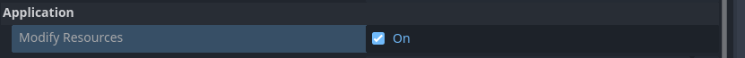
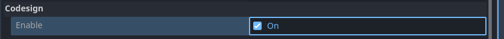
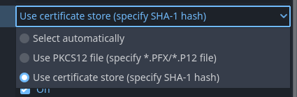

# Windows Desktop workflow

<br>

This page presents a use case for using Codemagic to export a Godot project for Windows Desktop. We will not cover the syntax, structure, or functionality of a `codemagic.yaml` file.

- You can skip the tutorial and grab the yaml files in [Overview](#overview)
- To learn how `codemagic.yaml` files work, see [Creating codemagic.yaml](https://docs.codemagic.io/partials/quickstart/create-yaml-intro/).
- To better understand what we'll do here, take a look at [Workflow Configuration](./workflow-configuration.md) if its not already done.
- To learn how to configure your Godot project and repository, see [Process Overview](../process-overview.md).


Image by Codemagic, used under [CC BY-ND 4.0](https://creativecommons.org/licenses/by-nd/4.0/) license. See [gallery](https://codemagic.io/gallery/)


## Requirements

- A text editor
- Workflow Configuration file. (See [Workflow Configuration](./workflow-configuration.md)

As explained in [Project Configuration](../process-overview.md#project-configuration), you should configure your project for export as if you were exporting it on your local machine.

- Learn more about how to export a Godot project to Windows with [Exporting for Windows](https://docs.godotengine.org/en/stable/tutorials/export/exporting_for_windows.html).


## Minimal configuration

We need to create a new workflow in which we will define its own specific variables. Add the following code to your `codemagic.yaml` file, right after the `definitions` section:

```yaml
workflows:
  godot-windows-desktop-workflow:
    name: Windows Desktop Export
    max_build_duration: 120
    instance_type: mac_mini_m2
    working_directory: /Users/builder/Downloads
    
    environment:
      vars:
        <<: *godot_variables
        OUTPUT_FILE: test.exe
        EXPORT_PRESET: Windows Desktop
        RCEDIT_URL: https://github.com/electron/rcedit/releases/download/v2.0.0/rcedit-x64.exe
```

Make sure your file now looks like this:

```yaml
definitions: ...

workflows: # [!code ++]
  godot-windows-desktop-workflow: ... # [!code ++]
```

<br>

Do you remember the [Workflow Configuration](./workflow-configuration.md#minimal-configuration) file ?  
We use the `<<` and `*` operators to reuses its sections.  
- Learn more about reusable sections in a `codemagic.yaml` file with [Reusing sections](https://docs.codemagic.io/yaml-basic-configuration/yaml-getting-started/#reusing-sections)
- For more details on the reused variables, see [Minimal Configuration](./workflow-configuration.md#minimal-configuration)

Here a description of variables we defined:

| Variable        | Description
| --------------- | ----------------------------------------------------------------------- |
| OUTPUT_FILE     | The name of the exported file. Format: `<PROJECT_NAME>.<EXTENSION>`. The output file extension should match the one used by the Godot export process. See [Exporting from the command line](https://docs.godotengine.org/en/latest/tutorials/export/exporting_projects.html#exporting-from-the-command-line) |
| EXPORT_PRESET   | The name of the export preset that will be used to export your project. |
| RCEDIT_URL      | rcedit download url  |

- To learn more about environment variables in a `codemagic.yaml` file see [Configuring Environment Variables](https://docs.codemagic.io/yaml-basic-configuration/configuring-environment-variables/)

<br>

Now we need to complete our configuration file. Add the following code to your `godot-windows-desktop-workflow` section:

```yaml
scripts:
  - *install_godot
  - *install_godot_export_templates
  - *export_project
  - *gather_files

artifacts:
  - *zipped_export
```

Then, make sure your workflow now looks like this:

```yaml
workflows:
  godot-windows-desktop-workflow:
    ...
    environment: ...
    scripts: ... # [!code ++]
    artifacts: ... # [!code ++]
```

Nice !, all that's left is to launch a new build to export your project. To do this, you can use Codemagic's interface, or events affecting your repository such as push.

- See [Build Automatically](https://docs.codemagic.io/yaml-running-builds/starting-builds-automatically/) to automate the execution of your Codemagic configuration.
- See also [Build Notifications](https://docs.codemagic.io/yaml-notification/email/) to get a notification informing you of the result of your build.


You can now <a href="/codemagic-godot-pipeline/templates/en/windows/windows-desktop-workflow-simple-export.yaml" download="codemagic.yaml">Download the configuration file</a> to export your Windows Desktop project with a Codemagic build machine.


## Additional configuration

The following configurations (rcedit and Windows code signing) both require a modification of the Godot editor settings file. Therefore, we'll configure a basic script for both of these configurations.
This script must run before the export script (`*export_project`). Otherwise, it won't be able to influence the export process.
Add the following code to the `scripts` section of `godot-windows-desktop-workflow`:

```yaml
- name: Export Configuration
  script: |
    export SETTINGS_VERSION=$(echo "$GODOT_VERSION" | awk -F'[.-]' '{
        if ($1 == 3) print "3";
        else if ($2 == 0) print $1;
        else print $1"."$2
    }')
    export GODOT_SETTINGS=${EDITOR_DATA_DIR}/editor_settings-${SETTINGS_VERSION}.tres
    cat <<EOF > "$GODOT_SETTINGS"
    [gd_resource type="EditorSettings"]

    [resource]
    EOF
```

Make sure your scripts section now looks like this:

```yaml
scripts:
  ...
  - *install_godot_export_templates ...
  - name: Export Configuration ... # [!code ++]
  - *export_project ...
```

This script generates the Godot editor settings file.  
To do this, it extracts the version of the file used by Godot (`4.<MINOR_VERSION>.tres` for Godot 4 or `3.tres` for Godot 3). The settings file version is extracted from the `GODOT_VERSION` variable, using a word processing tool like [awk](https://www.geeksforgeeks.org/awk-command-unixlinux-examples/).  
Second, the script stores the settings file in the location where Godot expects to find it.

- Learn more about word processing with `awk` with [awk Command in Unix/Linux with Examples](https://www.geeksforgeeks.org/awk-command-unixlinux-examples/)


## rcedit configuration

rcedit is not required for exporting to Windows with Godot. rcedit is a program that allows you to edit an exe file's resources, such as the icon and metadata.
- See [Changing the Application Icon for Windows](https://docs.godotengine.org/en/4.x/tutorials/export/changing_application_icon_for_windows.html#changing-the-file-icon) to learn more about using rcedit in Godot.

Before continuing, make sure you have the [Additional Configuration](#additional-configuration) in your configuration file. Also make sure you have enabled the [Modify Resources](https://docs.godotengine.org/en/4.x/classes/class_editorexportplatformwindows.html#class-editorexportplatformwindows-property-application-modify-resources) option in the export preset.



<br>

To install rcedit, we'll add a few lines to our `Export Setup` script. Right at the beginning of the script, add the following lines:

```yaml
softwareupdate --install-rosetta --agree-to-license
brew install --cask wine-stable
curl -L "$URL_RCEDIT" -o "rcedit-x64.exe"
chmod +x rcedit-x64.exe
export RCEDIT_PATH=$(pwd)/rcedit-x64.exe
export WINE_PATH=$(which wine)
```

Then make sure your script now looks like this:

```yaml
softwareupdate --install-rosetta --agree-to-license ... # [!code ++]
export SETTINGS_VERSION=$(echo "$GODOT_VERSION" | awk -F'[.-]' '{ ...
```

What do the new lines do?  
Since we're using a Mac and [rcedit](https://github.com/electron/rcedit) is a Windows executable, we download it (`curl -L "$URL_RCEDIT" -o "rcedit-x64.exe"`) and run it with [Wine](https://www.winehq.org/) (installed via `brew install --cask wine-stable`). We then ensure that rcedit is executable on this build machine via `chmod +x rcedit-x64.exe`.  
As wine-stable is built for Intel macOS, it requires [Rosetta 2](https://fr.wikipedia.org/wiki/Rosetta_(software)). So we install Rosetta on the build machine via `softwareupdate --install-rosetta --agree-to-license`.  
We then define the `RCEDIT_PATH` and `WINE_PATH` environment variables. These variables will be used to enable Godot to locate and use rcedit.

To enable Godot to use `RCEDIT_PATH` and `WINE_PATH`, we need to complete Godot's editor parameter file. Add the following lines below the `[resource]` part of the script:

```yaml
export/windows/rcedit = "$RCEDIT_PATH"
export/windows/wine = "$WINE_PATH"
```

Then, make sure your `[resource]` section now looks like this:

```yaml
[resource]
export/windows/rcedit = "$RCEDIT_PATH" # [!code ++]
export/windows/wine = "$WINE_PATH" # [!code ++]
EOF
```

These two lines are equivalent to the options in Godot's editor interface. They specify the path to `rcedit` and `wine` on the build machine.

Nice !, all that's left is to launch a new build to export your project. To do this, you can use Codemagic's interface, or events affecting your repository such as push.

- See [Build Automatically](https://docs.codemagic.io/yaml-running-builds/starting-builds-automatically/) to automate the execution of your Codemagic configuration.
- See also [Build Notifications](https://docs.codemagic.io/yaml-notification/email/) to get a notification informing you of the result of your build.

You can now <a href="/codemagic-godot-pipeline/templates/en/windows/windows-desktop-workflow-rcedit-config.yaml" download="codemagic.yaml">Download the configuration file</a> to export your Windows project with rcedit configured on a Codemagic build machine.

<h3>Notice</h3>

**Please don't worry if you see Wine error messages during the export process. These errors are common when running Windows tools in a headless environment and only indicate missing graphical components, which are unnecessary for CLI operations. They do not affect the functionality or outcome of the process.**

::: details Click to see errors message samples
rcedit (/Users/builder/Downloads/builds/windows/test.tmp): wine: created the configuration directory '/Users/builder/.wine'
002c:fixme:actctx:parse_depend_manifests Could not find dependent assembly L"Microsoft.Windows.Common-Controls" (6.0.0.0)
004c:fixme:actctx:parse_depend_manifests Could not find dependent assembly L"Microsoft.Windows.Common-Controls" (6.0.0.0)
0054:fixme:actctx:parse_depend_manifests Could not find dependent assembly L"Microsoft.Windows.Common-Controls" (6.0.0.0)
004c:err:winediag:nodrv_CreateWindow Application tried to create a window, but no driver could be loaded.
004c:err:winediag:nodrv_CreateWindow L"The explorer process failed to start."
004c:err:systray:initialize_systray Could not create tray window
004c:err:ole:StdMarshalImpl_MarshalInterface Failed to create ifstub, hr 0x80004002
004c:err:ole:CoMarshalInterface Failed to marshal the interface {6d5140c1-7436-11ce-8034-00aa006009fa}, hr 0x80004002
004c:err:ole:apartment_get_local_server_stream Failed: 0x80004002
002c:err:winediag:nodrv_CreateWindow Application tried to create a window, but no driver could be loaded.
002c:err:winediag:nodrv_CreateWindow L"The graphics driver is missing. Check your build!"
0054:err:winediag:nodrv_CreateWindow Application tried to create a window, but no driver could be loaded.
0054:err:winediag:nodrv_CreateWindow L"The graphics driver is missing. Check your build!"
0054:err:ole:apartment_createwindowifneeded CreateWindow failed with error 1400
0054:err:ole:apartment_createwindowifneeded CreateWindow failed with error 1400
0054:err:ole:apartment_createwindowifneeded CreateWindow failed with error 1400
0054:err:ole:StdMarshalImpl_MarshalInterface Failed to create ifstub, hr 0x80070578
0054:err:ole:CoMarshalInterface Failed to marshal the interface {6d5140c1-7436-11ce-8034-00aa006009fa}, hr 0x80070578
0054:err:ole:apartment_get_local_server_stream Failed: 0x80070578
0054:err:ole:start_rpcss Failed to open RpcSs service
0044:err:winediag:nodrv_CreateWindow Application tried to create a window, but no driver could be loaded.
0044:err:winediag:nodrv_CreateWindow L"The graphics driver is missing. Check your build!"
0094:err:winediag:nodrv_CreateWindow Application tried to create a window, but no driver could be loaded.
0094:err:winediag:nodrv_CreateWindow L"The graphics driver is missing. Check your build!"
0094:err:setupapi:SetupDefaultQueueCallbackW copy error 1812 L"@C:\\windows\\system32\\drivers\\wineusb.sys,-1" -> L"C:\\windows\\inf\\wineusb.inf"
0094:fixme:file:NtLockFile I/O completion on lock not implemented yet
0094:fixme:ntdll:NtQuerySystemInformation info_class SYSTEM_PERFORMANCE_INFORMATION
009c:err:environ:init_peb starting L"Z:\\Applications\\Wine Stable.app\\Contents\\Resources\\wine\\share\\wine\\mono\\wine-mono-9.4.0\\support\\removeuserinstalls-x86.exe" in experimental wow64 mode
00a4:err:environ:init_peb starting L"Z:\\Applications\\Wine Stable.app\\Contents\\Resources\\wine\\share\\wine\\mono\\wine-mono-9.4.0\\support\\installinf-x86.exe" in experimental wow64 mode
0094:fixme:msi:internal_ui_handler internal UI not implemented for message 0x0b000000 (UI level = 1)
0094:fixme:msi:internal_ui_handler internal UI not implemented for message 0x0b000000 (UI level = 1)
00fc:err:environ:init_peb starting L"C:\\windows\\syswow64\\rundll32.exe" in experimental wow64 mode
00fc:fixme:msg:pack_message msg 14 (WM_ERASEBKGND) not supported yet
00fc:err:winediag:nodrv_CreateWindow Application tried to create a window, but no driver could be loaded.
00fc:err:winediag:nodrv_CreateWindow L"The graphics driver is missing. Check your build!"
0104:err:environ:init_peb starting L"C:\\windows\\syswow64\\iexplore.exe" in experimental wow64 mode
002c:err:setupapi:do_file_copyW Unsupported style(s) 0x10
0118:err:ntoskrnl:ZwLoadDriver failed to create driver L"\\Registry\\Machine\\System\\CurrentControlSet\\Services\\winebth": c00000e5
002c:err:setupapi:SetupDiInstallDevice Failed to start service L"winebth" for device L"ROOT\\WINE\\WINEBTH", error 1359.
002c:err:setupapi:SetupDiInstallDevice Failed to control service L"winebth" for device L"ROOT\\WINE\\WINEBTH", error 1062.
002c:err:setupapi:do_file_copyW Unsupported style(s) 0x10
0140:err:setupapi:do_file_copyW Unsupported style(s) 0x10
0140:err:setupapi:do_file_copyW Unsupported style(s) 0x10
014c:err:hid:handle_DeviceMatchingCallback Ignoring HID device 0x7fa19780a150 (vid 05ac, pid 8106): not a joystick or gamepad
014c:err:hid:handle_DeviceMatchingCallback Ignoring HID device 0x7fa197809410 (vid 05ac, pid 8105): not a joystick or gamepad
0024:fixme:kernelbase:AppPolicyGetProcessTerminationMethod FFFFFFFFFFFFFFFA, 000000000011FE80
:::


## Code signing

Before continuing, make sure you have [Additional configuration](#additional-configuration) in your configuration file.
Also make sure you've enabled the [Code signing](https://docs.godotengine.org/en/latest/classes/class_editorexportplatformwindows.html#class-editorexportplatformwindows-property-codesign-enable) option in the export preset.


To sign your project, we need to set up a [Code Signing](https://en.wikipedia.org/wiki/Code_signing) tool. We'll be using a Mac for this tutorial. To sign a Windows application with Godot on a non-Windows operating system, we need to use [osslsigncode](https://github.com/mtrojnar/osslsigncode). If you're using Codemagic's Windows compiler, use [SignTool](https://learn.microsoft.com/en-us/dotnet/fr/amework/tools/signtool-exe) instead.
- To learn how to create a certificate for your Windows application, see [Create a package signing certificate](https://learn.microsoft.com/en-us/windows/msix/package/create-certificate-package-signing)
- Learn more about signing code for Windows in Godot with [Windows Application Signing](https://docs.godotengine.org/en/latest/tutorials/export/exporting_for_windows.html#code-signing)

Add the following line at the top of your `Export Configuration` section:

```yaml
brew install osslsigncode
export SIGN_TOOL_PATH=$(which osslsigncode)
```

Then make sure your section now looks like this:

```yaml
brew install osslsigncode # [!code ++]
export SIGN_TOOL_PATH=$(which osslsigncode) # [!code ++]
export SETTINGS_VERSION=$(echo "$GODOT_VERSION" | awk -F'[.-]' '{ ...
```

The 2 new lines install osslsigncode on the build machine and store the path to osslsigncode in a variable named `SIGN_TOOL_PATH`. To complete osslsigncode installation, we now need to add the osslsigncode path to the Godot Editor settings file. To do so, add the following line below the `[resource]` part of the script:

```yaml
export/windows/signtool = "$SIGN_TOOL_PATH"
```

Then, make sure your `[resource]` section now looks like this:

```yaml
[resource]
export/windows/signtool = "$SIGN_TOOL_PATH" # [!code ++]
EOF
```

Nice !, all that's left is to setup your code signing cerfiticate on the build machine.

<br>

We will use the following variables to retrieve your signing certificate and sign your Godot project. These variables will be used by Godot to sign your application.
- Learn more about some of these variables in [Godot 4 Windows environment variable](https://docs.godotengine.org/en/stable/tutorials/export/exporting_for_windows.html#environment-variables

| Variable name                        |	Variable value                                 |	Group                  |
| ------------------------------------ | ----------------------------------------------- | ----------------------- |
| CERTIFICATE_FILE_NAME	   | The name of your certificate with the extension.(e.g. `cert.pfx`) | windows_credentials |
| GODOT_WINDOWS_CODESIGN_IDENTITY	     | Your certificate - [base64](https://en.wikipedia.org/wiki/Base64) encoded | windows_credentials |
| GODOT_WINDOWS_CODESIGN_IDENTITY_TYPE | Type of identity to use(`0`, `1` or `2`).       | windows_credentials |
| GODOT_WINDOWS_CODESIGN_PASSWORD      | Contain your certificate password               | windows_credentials |

For `GODOT_WINDOWS_CODESIGN_IDENTITY_TYPE`, `0`, `1` and `2` refers to `Select automatically`, `Use PKC12 file (specify *.PFX/*.P12 file)` and `Use certificate store (specify SHA-1 hash)` respectively.


Add these variables in the Codemagic interface (either as Application or as Team variables), make sure to click Secure to make sensitive data encrypted.
- Learn how to store these variables using the Codemagic interface by watching this video: 

<div style="position: relative; padding-bottom: 56.25%; height: 0; overflow: hidden;">
    <iframe width="897" height="504" src="https://www.youtube.com/embed/7pAxVFe66hI?start=37" title="Environment variables and groups with codemagic.yaml" frameborder="0" allow="accelerometer; autoplay; clipboard-write; encrypted-media; gyroscope; picture-in-picture; web-share" referrerpolicy="strict-
origin-when-cross-origin" style="position: absolute; top:0; left: 0; width: 100%; height: 100%;" allowfullscreen></iframe>
</div>


- To learn more about environment variables in a `codemagic.yaml` file see [Configuring Environment Variables](https://docs.codemagic.io/yaml-basic-configuration/configuring-environment-variables/)
- To learn more about storing binary files with Codemagic, see [Storing Binary files](https://docs.codemagic.io/yaml-basic-configuration/configuring-environment-variables/#storing-binary-files)
- If you don't own a PC, you can use a website like [base64.guru](https://base64.guru/converter/encode/text) or [base64encode](https://www.base64encode.org/) to encode your `keystore` file to base64. 

<br>

To use the defined variables in our workflow, we have to add their group(`windows_credentials`) to our configuration file(`codemagic.yaml` file). To do so, add the following code to the `environment` section of `godot-windows-desktop-workflow`:

```yaml
groups:
  - windows_credentials
```

Then make sure your workflow now looks like this:

```yaml
godot-windows-desktop-workflow:
  ...
  environment:
    groups: # [!code ++]
      - windows_credentials # [!code ++]
    ...
```

:::tip
If you already have a `groups` section in your script, simply add the `- windows_credentials` line to it.
:::

<br>

We now need to configure our variables so that Godot can find and use them. In the `Export configuration` section, add the following lines:

```yaml
export CERTIFICATE_PATH=/tmp/$GODOT_WINDOWS_CODESIGN_FILE_NAME
echo $GODOT_WINDOWS_CODESIGN_IDENTITY | base64 --decode > $CERTIFICATE_PATH
echo "GODOT_WINDOWS_CODESIGN_IDENTITY=$CERTIFICATE_PATH" >> $CM_ENV
```

Then, make sure your `scripts` section now looks like this:

```yaml
scripts:
  ...
  - *install_godot_export_templates ...
  - name: Export Configuration
    ...
    EOF
    export CERTIFICATE_PATH=/tmp/$GODOT_WINDOWS_CODESIGN_FILE_NAME # [!code ++]
    ... # [!code ++]
  - *export_project ...
```

<br>

What have we done?

- First, we define a variable (`CERTIFICATE_PATH`) to specify the path where your certificate will be stored on the build machine. Then, we decode your base64-encoded file and save it to that location.
- Next, we update the variable holding the encoded file to point to the decoded file's path, since Godot expects a file path rather than raw encoded data.
- Finally, we register the variable now holding the certificate path as global environment variables on the build machine, so Godot can access and use it during the build.

<br>

Nice !, all that's left is to launch a new build to export your project. To do this, you can use Codemagic's interface, or events affecting your repository such as push.

- See [Build Automatically](https://docs.codemagic.io/yaml-running-builds/starting-builds-automatically/) to automate the execution of your Codemagic configuration.
- See also [Build Notifications](https://docs.codemagic.io/yaml-notification/email/) to get a notification informing you of the result of your build.

You can now <a href="/codemagic-godot-pipeline/templates/en/windows/windows-desktop-workflow-signed.yaml" download="codemagic.yaml">Download the configuration file</a> to export a signed Godot Windows project with a Codemagic build machine.


## Overview

Summary of what we've covered on this page using a Codemagic build machine:
- Exported a Godot project to Windows
- Exported a Godot project to Windows using resource editing with rcedit
- Exported a Godot project to a signed Windows application.


**Download Table**

| File                  | Content          | Tutorials          |
| --------------------- | ---------------- | ------------------ |
| <a href="/codemagic-godot-pipeline/templates/en/windows/windows-desktop-workflow-simple-export.yaml" download="codemagic.yaml">Download</a> | Unsigned Godot Windows Export Configuration | [Jump to tutorial](#minimal-configuration) |
| <a href="/codemagic-godot-pipeline/templates/en/windows/windows-desktop-workflow-rcedit-config.yaml" download="codemagic.yaml">Download</a>   | rcedit Configuration for Godot Windows Export  | [Jump to tutorial](#rcedit-configuration)   |
| <a href="/codemagic-godot-pipeline/templates/en/windows/windows-desktop-workflow-signed.yaml" download="codemagic.yaml">Download</a>   | Code Signing Configuration for Godot Windows Export | [Jump to tutorial](#code-signing)   |

:::warning Caution !!!
To use these scripts effectively, please refer to the corresponding tutorials.  
The scripts on this site are general and will suit most use cases. However, specific adjustments to your project may be necessary.  
Please note that some scripts depend on environment variables which must be set via the Codemagic interface. Without them, some scripts will not work.
:::

Optional resources to help refine your configuration:
- [Caching](https://docs.codemagic.io/yaml-notification/email/)
- [Build automatically](https://docs.codemagic.io/yaml-running-builds/starting-builds-automatically/)
- [Build notifications](https://docs.codemagic.io/yaml-notification/email/)
- [Publishing](https://docs.codemagic.io/yaml-publishing/google-play/)
- [Using custom export templates](./using-custom-export-templates.md)


## Getting help and support

If you have a technical question or need help with some particular issue, you can get help in the [GitHub Discussions community](https://github.com/sabinayo/codemagic-godot-pipeline/discussions).
