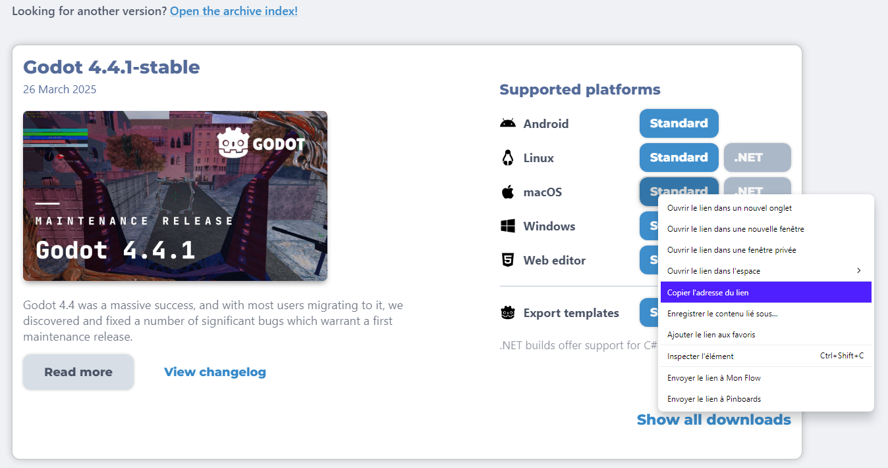

# Workflow configuration

<br>

This page outlines the creation of a reusable configuration file for exporting Godot projects with Codemagic. This file will be used across all upcoming workflows. It will help speed up development and prevent duplication in the configuration. We will not discuss how to write a `codemagic.yaml` file or the rules associated with it.

- You can skip the tutorial and download the YAML file from [Overview](#overview).
- To understand how `codemagic.yaml` files work, see [Creating codemagic.yaml](https://docs.codemagic.io/partials/quickstart/create-yaml-intro/).
- To configure your Godot project and repository, refer to [Process Overview](../process-overview.md).
- To learn more about reusable sections in a `codemagic.yaml` file, check [Reusing Sections](https://docs.codemagic.io/yaml-basic-configuration/yaml-getting-started/#reusing-sections).


Image by Codemagic, used under [CC BY-ND 4.0](https://creativecommons.org/licenses/by-nd/4.0/) license. See [gallery](https://codemagic.io/gallery/)


## Requirements

- A text editor


## Minimal configuration

To make our script reusable and clean, we'll use environment variables to reference some data.  
- To learn more about environment variables in a `codemagic.yaml` file see [Configuring Environment Variables](https://docs.codemagic.io/yaml-basic-configuration/configuring-environment-variables/)

:::tip
Note: The variable names used in this guide are arbitrary.  
Feel free to ren/ame them to suit your project.
:::

Open a text editor, create a file called `codemagic.yaml`, and paste in the following code:

```yaml
definitions:
  environment:
    godot_environment:
      vars: &godot_variables
        GODOT_VERSION: 4.4.1-stable
        EXPORT_TYPE: debug
        BUILD_DIRECTORY: /Users/builder/Downloads/builds/
        GODOT_URL: https://github.com/godotengine/godot-builds/releases/download
        GODOT: Godot.app/Contents/MacOS/Godot
        PROJECT_PATH: /Users/builder/clone
        EDITOR_DATA_DIRECTORY: /Users/builder/Library/Application Support/Godot
        EXPORT_TEMPLATES_DIRECTORY: $EDITOR_DATA_DIRECTORY/export_templates
```

All of our workflows are based on this structure. Any section defined under `definitions` will be reused in other workflows.  
- To learn more about the `definitions` section, check out [Codemagic yaml Cheatsheet](https://docs.codemagic.io/codemagic-yaml-cheatsheet.html)

<br>

Here a description of variables we have defined.

| Variable             | Description                                                             |
| -------------------- | ----------------------------------------------------------------------- |
| GODOT_VERSION        | The version of Godot your project uses.                                 |
| EXPORT_TYPE          | The type of export. Either `debug`, `release` or `pack`. See [Exporting from the command line](https://docs.godotengine.org/en/latest/tutorials/export/exporting_projects.html#exporting-from-the-command-line) |
| BUILD_DIRECTORY      | The path where exported project will be located on this build machine.  |
| GODOT_URL            | Godot download URL                                                      |
| GODOT                | The path where Godot is located once its archive is unzipped.           |
| PROJECT_PATH         | The path where your repository is located on the build machine.         |
| EDITOR_DATA_DIRECTORY      | The directory where Godot stores editor data on this build machine. See [Editor data](https://docs.godotengine.org/en/latest/tutorials/io/data_paths.html#editor-data-paths) |
| EXPORT_TEMPLATES_DIRECTORY | The directory where Godot stores export templates on this build machine. See [Editor data](https://docs.godotengine.org/en/latest/tutorials/io/data_paths.html#editor-data-paths) |

- To learn more about environment variables with Codemagic [here](https://docs.codemagic.io/yaml-basic-configuration/configuring-environment-variables/)

:::tip
If you have defined some of these variables using the Codemagic interface, be sure to delete their definition in the script. Otherwise, the variables in the script will replace those defined via the Codemagic interface.
:::

<br>

When using Godot 3, it can be risky to add your `export_preset.cfg` file to your repository. This file can sometimes contain sensitive information such as passwords or API keys. In this case, we'll use Codemagic's interface to secure your data.  
You won't need to place the `export_preset.cfg` file in your repository. We'll encrypt it and transfer it to the build machine via an environment variable. Your file will be decrypted when necessary. This way, no one will have access to your data.
 
- Learn how to store files in environment variables, with [Storing binary files](https://docs.codemagic.io/yaml-basic-configuration/configuring-environment-variables/#storing-binary-files).
- To learn more about environment variables in Codemagic, check [Configuring environment variables](https://docs.codemagic.io/yaml-basic-configuration/configuring-environment-variables/).
- If you don't own a PC, you can use a website like [base64.guru](https://base64.guru/converter/encode/text) or [base64encode](https://www.base64encode.org/) to encode your `export_preset.cfg` file to base64.  


## Install Godot

Now that we have our environment setted, we now need to add the automation process.  
- Learn more about scripts in `codemagic.yaml` file [Getting Started with scripts](https://docs.codemagic.io/yaml-basic-configuration/yaml-getting-started/#scripts)

Open your `codemagic.yaml` file and add the following code to the `definitions` section:

```yaml
scripts:
  - &install_godot
    name: Godot Installation
    script: |
      export FILE=Godot_v${GODOT_VERSION}_macos.universal.zip
      export URL=${GODOT_URL}/${GODOT_VERSION}/${FILE}
      curl -L "$URL" -o "$FILE" && unzip "$FILE"
      rm "$FILE"
      echo "$FILE" was downloaded from "$URL".
```

Make sure your workflow now looks like this:

```yaml
definitions:
  environment: ...
  scripts: ... # [!code ++]
```

<br>

What are we doing ?

We're creating two variables: `FILE` and `URL`.  
`FILE` points to the Godot Editor binary located at `GODOT_URL` for the given `GODOT_VERSION` and for this build machine(macos.universal.zip).  
`URL` points to the url where the Godot archive can be found on internet.  
Then we download the archive, unzip it, and remove it because we won't use it anymore.  
Finally, we show in the build machine console which file has been downloaded and where it was downloaded.

- To find the file you have to donwload for your build machine, visit the [Godot archive](https://godotengine.org/download/archive/).  
Then, select the version you want to download, right-click on the file, and copy the file URL.



## Install export templates

We need to install Godot's export templates on the build machine. Without them, Godot won't be able to export your project. Add the following code to your `scripts` section:

```yaml
- &install_godot_export_templates
  name: Export templates installation
  script: |
    export FILE=Godot_v${GODOT_VERSION}_export_templates.tpz
    export URL=${GODOT_URL}/${GODOT_VERSION}/${FILE}
    curl -L "$URL" -o "$FILE" && unzip "$FILE"
    rm "$FILE"

    export TEMPLATES_VERSION=$(echo "$GODOT_VERSION" | sed 's/-/./')
    export TEMPLATES_PATH=${DOSSIER_TEMPLATES}/$TEMPLATES_VERSION
    mkdir -p "$TEMPLATES_PATH" && mv templates/* "$TEMPLATES_PATH"
    rmdir templates
    
    mkdir -p "$BUILD_DIRECTORY"
    echo "$BUILD_DIRECTORY" was created at $(pwd)
    echo "Export templates installed at: " $TEMPLATES_PATH
    echo "$FILE" was downloaded from "$URL".
```

Then, make sure your `scripts` section now looks like this:

```yaml
scripts:
  - &install_godot ...
  - &install_godot_export_templates ... # [!code ++]
```

<br>

Let's break this script down!  
This script is devided in 3 parts:

1. First, as before, we define 2 variables `FILE` and `URL` to locate and download the necessary file. `FILE` points to the Godot Export Templates located at `GODOT_URL` for the given `GODOT_VERSION`. `URL` points to the url where the Godot archive can be found on internet.

2. Second, we retrieve the name of the export templates folder. We then create this folder and we move the template files to this folder as it is where Godot expects them to be.

3. Finally, we create the build directory where the exported project will be on this build machine, and we show a summary of what we did in the build machine's console.


## Export project

Now that the export templates have been installed, we need to configure the export script. This script will export your project to Godot from the command line. The command-line instructions in Godot 4 are different from those in Godot 3. For all tutorials, we'll be using Godot 4.

- Learn more about using Godot from the command line in the [Godot 4 command line tutorial](https://docs.godotengine.org/en/latest/tutorials/editor/command_line_tutorial.html) and the [Godot 3 command line tutorial](https://docs.godotengine.org/en/3.6/tutorials/editor/command_line_tutorial.html).

Add the following section into your `scripts` section:

```yaml
- &export_project
  name: Project export
  script: |
    export EXPORT_PATH=$BUILD_DIRECTORY/$OUTPUT_FILE
    "$GODOT" --headless --path "$PROJECT_PATH" --export-$EXPORT_TYPE "$EXPORT_PRESET" "$EXPORT_PATH"
    echo "command: " $GODOT "--headless --path" $PROJECT_PATH "--export-"$EXPORT_TYPE "$EXPORT_PRESET" $EXPORT_PATH
```

<br>

If you have encrypted your `export_presets.cfg` file, this is the right place to decrypt it.  
Simply add the following command at the top of the `script` section of `&export_project`:(assuming your file is stored in the `GODOT_EXPORT_PRESETS` variable)
:

```yaml
echo $GODOT_EXPORT_PRESETS | base64 --decode > $PROJECT_PATH/export_presets.cfg
```
This command will decypt your file inside your project directory.

<br>

Make sure your `scripts` section now looks like this:

```yaml
scripts:
  ...
  - &install_godot_export_templates ...
  - &export_project ... # [!code ++]
```

The `export_project` script creates a variable called `EXPORT_PATH` which points to the path where your project will be exported.  
It then exports the project using the configuration you have defined, which is your `EXPORT_TYPE` and your `EXPORT_PRESET`.(`OUTPUT_FILE` and `EXPORT_PRESET` will be defined later for each workflow).  
At the very end, the script displays the complete command used to export your project to the console of the machine currently in use.


## Collect exported files

We can move on to the final reusable script: the 'collect files' script.  
Without this script, you won't be able to download your exported project. To collect exported files, add the following code to your `scripts` section:

```yaml
- &gather_files
  name: File collection
  script: |
    zip -r "$BUILD_DIRECTORY/Godot_v${GODOT_VERSION}-${EXPORT_PRESET}_export.zip" $BUILD_DIRECTORY
```

Then, make sure your `scripts` section now looks like this:

```yaml
scripts:
  ...
  - &export_project ...
  - &gather_files ... # [!code ++]
```

This script collects all the export files generated by godot and packs them into a zip file.  
The resulting zip file will be named using your Godot version and your export preset name. (e.g. `Godot_v4.4.1-stable-Android_export.zip`)  
To download this file, we need to do one more thing: **register it as a downloadable artifact.**.

<br>

Add the following section to your `definitions` section:

```yaml
artifacts:
  - &zipped_export $BUILD_DIRECTORY/*.zip
```

Then make sure your file content now looks like this:

```yaml
definitions:
  environment: ...
  scripts: ...
  artifacts: ... # [!code ++]
```

And that's it, we're all set! You now have a solid and reusable `codemagic.yaml` file tailored for exporting Godot projects. You'll quickly realize how powerful and time-saving this setup is!


## Overview

Summary of what we've covered on this page:
- Created a reusable `codemagic.yaml` file to automate Godot project exports on the Codemagic Mac M2 build machine.

You can now <a href="/codemagic-godot-pipeline/templates/en/workflow-configuration.yaml" download="codemagic.yaml">Download the workflow configuration file</a>.


## Sample Workflows

Here are some links that could help you achieve your goals with Codemagic build machines:

| Tutorials 1                                                        | Tutorials 2                                                         |
| ------------------------------------------------------------------ | ------------------------------------------------------------------- |
| [Android Export](../workflows/android-workflow.md)                 | [MacOS Export](../workflows/macos-workflow.md)                      |
| [iOS Export](../workflows/ios-workflow.md)                         | [All in one workflow](../workflows/all-in-one-workflow.md)          |
| [Web Export](../workflows/web-workflow.md)                         | [Using custom export templates](./using-custom-export-templates.md) |
| [Windows Desktop Export](../workflows/windows-desktop-workflow.md) | [Compiling Godot and custom export templates](./compiling.md)       |
| [Linux Export](../workflows/linux-workflow.md)                     | ...                                                                 |

